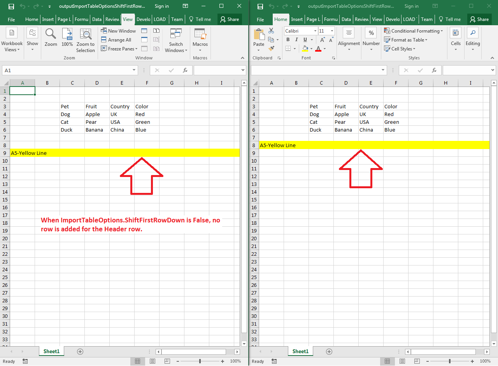

## **Possible Usage Scenarios**
Aspose.Cells allows you to shift the first row down when inserting a table into the worksheet. This document explains how you may accomplish the task using Aspose.Cells APIs.
## **Shift First Row down when inserting Cells Data Table Rows**
The following sample code illustrates how to shift the first row down when inserting a table into the worksheet. We use a simple template Excel file in code to demonstrate the feature. You can exercise the feature by setting the boolean [ImportTableOptions.ShiftFirstRowDown](https://apireference.aspose.com/net/cells/aspose.cells/importtableoptions/properties/shiftfirstrowdown)** **attribute to **True**/**False** to better understand it. Please see the [sample Excel file](attachments/44860310/45056031.xlsx), [output Excel False file](attachments/44860310/45056032.xlsx), and [output Excel True file](attachments/44860310/45056033.xlsx) for your reference.
## **Screenshot**

## **Sample Code**

