{}

Sometimes you need to insert some necessary shapes into the worksheet.You may need to insert the same shape in different positions of the worksheet.Or you need to batch insert shapes in the worksheet.

Do not worry! [Aspose.Cells](https://products.aspose.com/cells/) supports all these operations.

{}

The shapes in excel are mainly divided into the following types:
- **Lines**
- **Rectangles**
- **Basic Shapes**
- **Block Arrows**
- **Equation Shapes**
- **FlowCharts**
- **Stars and Banners**
- **Callouts**

This guide document will select one or two shapes from each type to make samples.Through these examples, you will learn how to use [Aspose.Cells](https://products.aspose.com/cells/) to insert the specified shape into the worksheet.

## **Inserting a Line to Worksheet**

The shape of line belongs to the **lines** category.

***In Microsoft Excel (for example 2007):***

- Select the cell where you want to insert the line
- Click the Insert menu and click Shapes.
- Then,select the line from 'Recently Used Shapes' or 'Lines'

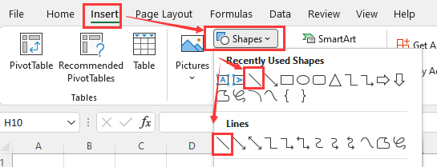

***Using Aspose.Cells***

You can use the following method to insert a line in the worksheet.


  
  

    

[public LineShape AddLine(
	int upperLeftRow,
	int top,
	int upperLeftColumn,
	int left,
	int height,
	int width
)](https://apireference.aspose.com/cells/net/aspose.cells.drawing/shapecollection/methods/addline)

The method returns a [LineShape](https://apireference.aspose.com/cells/net/aspose.cells.drawing/lineshape) object.

    

  

  
  
  

    

[public Shape addShape(int type, int upperLeftRow, int top, int upperLeftColumn, int left, int height, int width)](https://apireference.aspose.com/cells/java/com.aspose.cells/shapecollection#addShape(int,%20int,%20int,%20int,%20int,%20int,%20int))

The method returns a [Shape](https://apireference.aspose.com/cells/java/com.aspose.cells/Shape) object.

    

  

  


The following example shows how to insert line to a worksheet.


  
  

    

      


    

  

  
  
  

    

      


    

  

  


Execute the above code, you will get the following results:

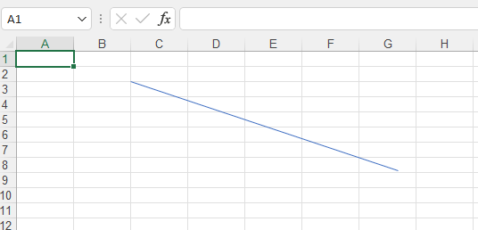

## **Inserting a line arrow to Worksheet**

The shape of line arrow belongs to the **Lines** category.It is a special case of line.

***In Microsoft Excel (for example 2007):***

- Select the cell where you want to insert the line arrow
- Click the Insert menu and click Shapes.
- Then,select the line arrow from 'Recently Used Shapes' or 'Lines'

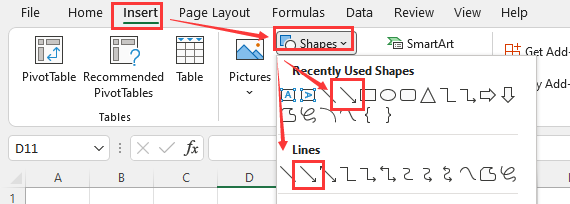

***Using Aspose.Cells***

You can use the following method to insert a line arrow in the worksheet.


  
  

    

[public LineShape AddLine(
	int upperLeftRow,
	int top,
	int upperLeftColumn,
	int left,
	int height,
	int width
)](https://apireference.aspose.com/cells/net/aspose.cells.drawing/shapecollection/methods/addline)

The method returns a [LineShape](https://apireference.aspose.com/cells/net/aspose.cells.drawing/lineshape) object.

    

  

  
  
  

    

[public Shape addShape(int type, int upperLeftRow, int top, int upperLeftColumn, int left, int height, int width)](https://apireference.aspose.com/cells/java/com.aspose.cells/shapecollection#addShape(int,%20int,%20int,%20int,%20int,%20int,%20int))

The method returns a [Shape](https://apireference.aspose.com/cells/java/com.aspose.cells/Shape) object.

    

  

  


The following example shows how to insert line arrow to a worksheet.


  
  

    

      


    

  

  
  
  

    

      


    

  

  


Execute the above code, you will get the following results:

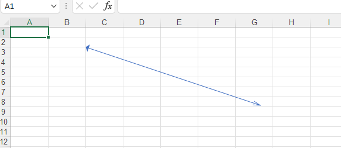

## **Inserting a Rectangle to Worksheet**

The shape of rectangle belongs to the **Rectangles** category.

***In Microsoft Excel (for example 2007):***

- Select the cell where you want to insert the rectangle
- Click the Insert menu and click Shapes.
- Then,select the rectangle from 'Recently Used Shapes' or 'Rectangles'

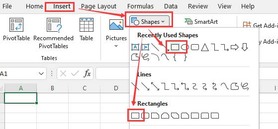

***Using Aspose.Cells***

You can use the following method to insert a rectangle in the worksheet.


  
  

    

[public RectangleShape AddRectangle(
	int upperLeftRow,
	int top,
	int upperLeftColumn,
	int left,
	int height,
	int width
)](https://apireference.aspose.com/cells/net/aspose.cells.drawing/shapecollection/methods/addrectangle)

The method returns a [RectangleShape](https://apireference.aspose.com/cells/net/aspose.cells.drawing/rectangleshape) object.

    

  

  
  
  

    

[public Shape addShape(int type, int upperLeftRow, int top, int upperLeftColumn, int left, int height, int width)](https://apireference.aspose.com/cells/java/com.aspose.cells/shapecollection#addShape(int,%20int,%20int,%20int,%20int,%20int,%20int))

The method returns a [Shape](https://apireference.aspose.com/cells/java/com.aspose.cells/Shape) object.

    

  

  


The following example shows how to insert rectangle to a worksheet.


  
  

    

      


    

  

  
  
  

    

      


    

  

  


Execute the above code, you will get the following results:

## **Inserting a Cube to Worksheet**

The shape of cube belongs to the **Basic Shapes** category.

***In Microsoft Excel (for example 2007):***

- Select the cell where you want to insert the cube
- Click the Insert menu and click Shapes.
- Then,select the Cube from **Basic Shapes**

***Using Aspose.Cells***

You can use the following method to insert a cube in the worksheet.


  
  

    

[public Shape AddAutoShape(
	AutoShapeType type,
	int upperLeftRow,
	int top,
	int upperLeftColumn,
	int left,
	int height,
	int width
)](https://apireference.aspose.com/cells/net/aspose.cells.drawing/shapecollection/methods/addautoshape)

The method returns a [Shape](https://apireference.aspose.com/cells/net/aspose.cells.drawing/shape) object.

    

  

  
  
  

    

[public Shape addAutoShape(int type, int upperLeftRow, int top, int upperLeftColumn, int left, int height, int width)](https://apireference.aspose.com/cells/java/com.aspose.cells/shapecollection#addAutoShape(int,%20int,%20int,%20int,%20int,%20int,%20int))

The method returns a [Shape](https://apireference.aspose.com/cells/java/com.aspose.cells/Shape) object.

    

  

  


The following example shows how to insert cube to a worksheet.


  
  

    

      


    

  

  
  
  

    

      


    

  

  


Execute the above code, you will get the following results:

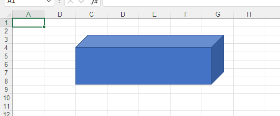

## **Inserting a callout quad arrow to Worksheet**

The shape of callout quad arrow belongs to the **Block Arrows** category.

***In Microsoft Excel (for example 2007):***

- Select the cell where you want to insert the callout quad arrow
- Click the Insert menu and click Shapes.
- Then,select the callout quad arrow from **Block Arrows**

***Using Aspose.Cells***

You can use the following method to insert a callout quad arrow in the worksheet.


  
  

    

[public Shape AddAutoShape(
	AutoShapeType type,
	int upperLeftRow,
	int top,
	int upperLeftColumn,
	int left,
	int height,
	int width
)](https://apireference.aspose.com/cells/net/aspose.cells.drawing/shapecollection/methods/addautoshape)

The method returns a [Shape](https://apireference.aspose.com/cells/net/aspose.cells.drawing/shape) object.

    

  

  
  
  

    

[public Shape addAutoShape(int type, int upperLeftRow, int top, int upperLeftColumn, int left, int height, int width)](https://apireference.aspose.com/cells/java/com.aspose.cells/shapecollection#addAutoShape(int,%20int,%20int,%20int,%20int,%20int,%20int))

The method returns a [Shape](https://apireference.aspose.com/cells/java/com.aspose.cells/Shape) object.

    

  

  


The following example shows how to insert callout quad arrow to a worksheet.


  
  

    

      


    

  

  
  
  

    

      


    

  

  


Execute the above code, you will get the following results:

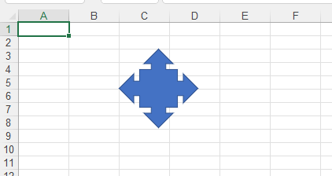

## **Inserting a multiplication sign to Worksheet**

The shape of multiplication sign belongs to the **Equation Shapes** category.

***In Microsoft Excel (for example 2007):***

- Select the cell where you want to insert the multiplication sign
- Click the Insert menu and click Shapes.
- Then,select the multiplication sign from **Equation Shapes**

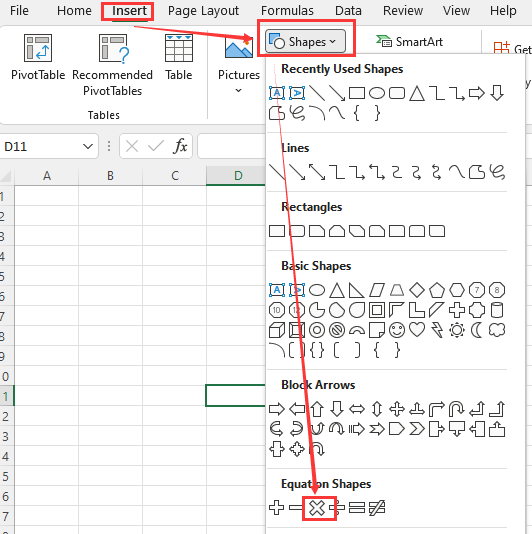

***Using Aspose.Cells***

You can use the following method to insert a multiplication sign in the worksheet.


  
  

    

[public Shape AddAutoShape(
	AutoShapeType type,
	int upperLeftRow,
	int top,
	int upperLeftColumn,
	int left,
	int height,
	int width
)](https://apireference.aspose.com/cells/net/aspose.cells.drawing/shapecollection/methods/addautoshape)

The method returns a [Shape](https://apireference.aspose.com/cells/net/aspose.cells.drawing/shape) object.

    

  

  
  
  

    

[public Shape addAutoShape(int type, int upperLeftRow, int top, int upperLeftColumn, int left, int height, int width)](https://apireference.aspose.com/cells/java/com.aspose.cells/shapecollection#addAutoShape(int,%20int,%20int,%20int,%20int,%20int,%20int))

The method returns a [Shape](https://apireference.aspose.com/cells/java/com.aspose.cells/Shape) object.

    

  

  


The following example shows how to insert multiplication sign to a worksheet.


  
  

    

      


    

  

  
  
  

    

      


    

  

  


Execute the above code, you will get the following results:

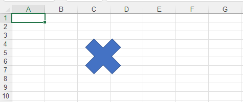

## **Inserting a multidocument to Worksheet**

The shape of multidocument belongs to the **FlowCharts** category.

***In Microsoft Excel (for example 2007):***

- Select the cell where you want to insert the multidocument
- Click the Insert menu and click Shapes.
- Then,select the multidocument from **FlowCharts**

***Using Aspose.Cells***

You can use the following method to insert a multidocument in the worksheet.


  
  

    

[public Shape AddAutoShape(
	AutoShapeType type,
	int upperLeftRow,
	int top,
	int upperLeftColumn,
	int left,
	int height,
	int width
)](https://apireference.aspose.com/cells/net/aspose.cells.drawing/shapecollection/methods/addautoshape)

The method returns a [Shape](https://apireference.aspose.com/cells/net/aspose.cells.drawing/shape) object.

    

  

  
  
  

    

[public Shape addAutoShape(int type, int upperLeftRow, int top, int upperLeftColumn, int left, int height, int width)](https://apireference.aspose.com/cells/java/com.aspose.cells/shapecollection#addAutoShape(int,%20int,%20int,%20int,%20int,%20int,%20int))

The method returns a [Shape](https://apireference.aspose.com/cells/java/com.aspose.cells/Shape) object.

    

  

  


The following example shows how to insert multidocument to a worksheet.


  
  

    

      


    

  

  
  
  

    

      


    

  

  


Execute the above code, you will get the following results:

## **Inserting a Five-pointed star to Worksheet**

The shape of Five-pointed star belongs to the **Stars and Banners** category.

***In Microsoft Excel (for example 2007):***

- Select the cell where you want to insert the Five-pointed star
- Click the Insert menu and click Shapes.
- Then,select the Five-pointed star from **Stars and Banners**

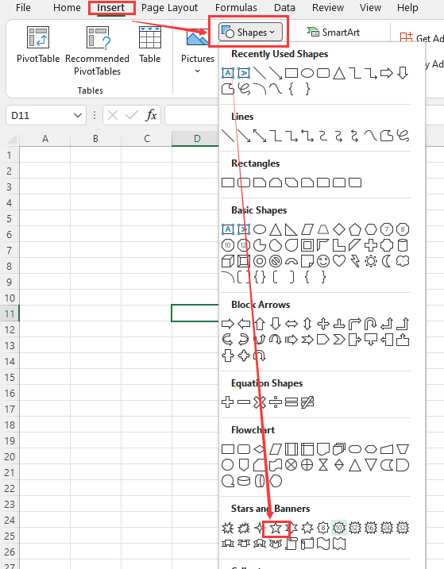

***Using Aspose.Cells***

You can use the following method to insert a Five-pointed star in the worksheet.


  
  

    

[public Shape AddAutoShape(
	AutoShapeType type,
	int upperLeftRow,
	int top,
	int upperLeftColumn,
	int left,
	int height,
	int width
)](https://apireference.aspose.com/cells/net/aspose.cells.drawing/shapecollection/methods/addautoshape)

The method returns a [Shape](https://apireference.aspose.com/cells/net/aspose.cells.drawing/shape) object.

    

  

  
  
  

    

[public Shape addAutoShape(int type, int upperLeftRow, int top, int upperLeftColumn, int left, int height, int width)](https://apireference.aspose.com/cells/java/com.aspose.cells/shapecollection#addAutoShape(int,%20int,%20int,%20int,%20int,%20int,%20int))

The method returns a [Shape](https://apireference.aspose.com/cells/java/com.aspose.cells/Shape) object.

    

  

  


The following example shows how to insert Five-pointed star to a worksheet.


  
  

    

      


    

  

  
  
  

    

      


    

  

  


Execute the above code, you will get the following results:

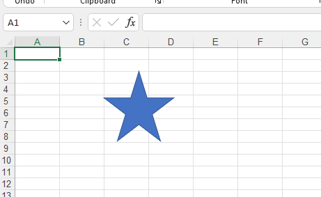

## **Inserting a thought bubble cloud to Worksheet**

The shape of thought bubble cloud belongs to the **Callouts** category.

***In Microsoft Excel (for example 2007):***

- Select the cell where you want to insert the thought bubble cloud
- Click the Insert menu and click Shapes.
- Then,select the thought bubble cloud from **Callouts**

***Using Aspose.Cells***

You can use the following method to insert a thought bubble cloud in the worksheet.


  
  

    

[public Shape AddAutoShape(
	AutoShapeType type,
	int upperLeftRow,
	int top,
	int upperLeftColumn,
	int left,
	int height,
	int width
)](https://apireference.aspose.com/cells/net/aspose.cells.drawing/shapecollection/methods/addautoshape)

The method returns a [Shape](https://apireference.aspose.com/cells/net/aspose.cells.drawing/shape) object.

    

  

  
  
  

    

[public Shape addAutoShape(int type, int upperLeftRow, int top, int upperLeftColumn, int left, int height, int width)](https://apireference.aspose.com/cells/java/com.aspose.cells/shapecollection#addAutoShape(int,%20int,%20int,%20int,%20int,%20int,%20int))

The method returns a [Shape](https://apireference.aspose.com/cells/java/com.aspose.cells/Shape) object.

    

  

  


The following example shows how to insert thought bubble cloud to a worksheet.


  
  

    

      


    

  

  
  
  

    

      


    

  

  


Execute the above code, you will get the following results:

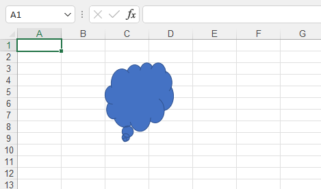
