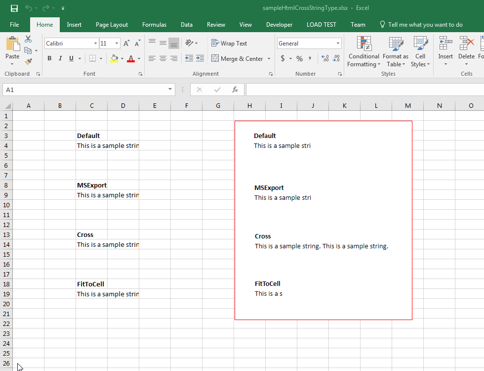

## **Possible Usage Scenarios**

When cell contains text or string but it is larger than the width of the cell, then the string overflows if the next cell in next column is null or empty. When you save your Excel file into HTML, you can control this overflow by specifying the cross type using the [**HtmlCrossType**](https://apireference.aspose.com/cells/net/aspose.cells/htmlcrosstype) enumeration. It has the following values

- **HtmlCrossType.Default**: Display like MS Excel, depends on the next cell. If the next cell is null, the string will cross or it will be truncated.

- **HtmlCrossType.MSExport**: Display the string like MS Excel exporting HTML.

- **HtmlCrossType.Cross**: Display HTML cross string, the performance for creating large HTML files will be more than ten times faster than setting the value to Default or FitToCell.

- **HtmlCrossType.FitToCell**: Only displaying the string within the width of cell.

## **Specify how to cross string in output HTML using HtmlCrossType**

The following sample code loads the [sample Excel file](51740732.xlsx) and saves it to HTML format by specifying different [**HtmlCrossType**](https://apireference.aspose.com/cells/net/aspose.cells/htmlcrosstype). Please download the [output HTMLs](51740734.zip) generated with this code. The sample Excel file contains the image bordered with red color as shown in this screenshot that shows the effect of the [**HtmlCrossType**](https://apireference.aspose.com/cells/net/aspose.cells/htmlcrosstype) values on output HTML.

## **Sample Code**


