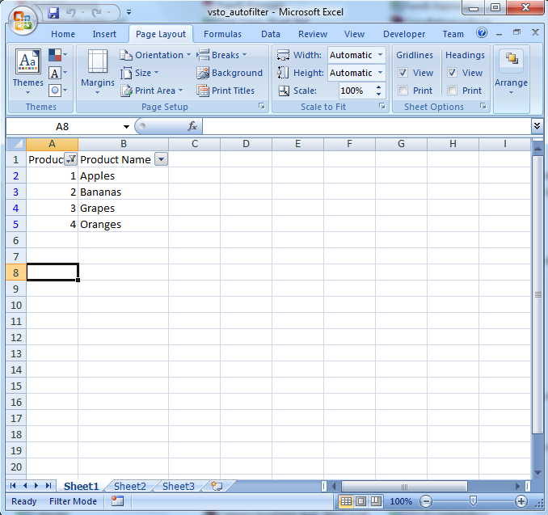
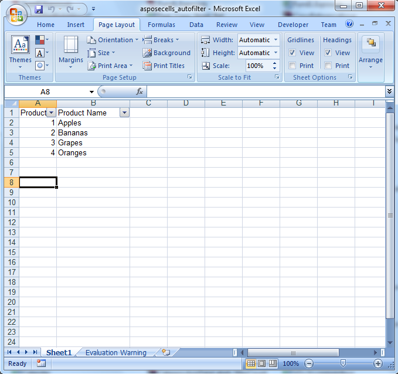

{} 

To get an understanding of what data is in a range, it is often easier to sort and filter the data than to look at columns of unordered data. Sorting organizes data in either ascending or descending order, making it easier to find specific values. Filtering the data, allows you to show only certain values. It helps focus in on particular items in sales records, for example.

Users of Microsoft Excel can apply auto-filtering to columns. Auto-filtering adds a menu to the top of the column, from which you can sort of filter column data. This feature is also available to developers who work with Excel spreadsheets, either through VSTO or Aspose.Cells for .NET.

{} 
### **Auto Filtering Data**
To apply auto-filtering to a column:

1. Create a workbook.
1. Get a worksheet.
1. Add sample data.
1. Apply auto-filter.
1. Auto-fit columns to make the display attractive.
1. Save the spreadsheet.

The code samples in this article show how to perform these steps using [VSTO](/cells/net/auto-filter-data-html/) with either C# or Visual Basic, or using [Apose.Cells](/cells/net/auto-filter-data-html/), again with either C# or Visual Basic.
#### **Auto-filtering Data with VSTO**
[**C#**](/pages/createpage.action?spaceKey=cellsnet&title=C&linkCreation=true&fromPageId=5017443)



 using Microsoft.VisualStudio.Tools.Applications.Runtime;

using Excel = Microsoft.Office.Interop.Excel;

using Office = Microsoft.Office.Core;

using System.Reflection;.........//Instantiate the Application object.

Excel.ApplicationClass ExcelApp = new Excel.ApplicationClass();

//Add a Workbook.

Excel.Workbook objBook = ExcelApp.Workbooks.Add(System.Reflection.Missing.Value);

//Get the First sheet.

Excel.Worksheet sheet = (Excel.Worksheet)objBook.Sheets["Sheet1"];

//Add data into A1 and B1 Cells as headers.

sheet.Cells[1, 1] = "Product ID";

sheet.Cells[1, 2] = "Product Name";

//Add data into details cells.

sheet.Cells[2, 1] = 1;

sheet.Cells[3, 1] = 2;

sheet.Cells[4, 1] = 3;

sheet.Cells[5, 1] = 4;

sheet.Cells[2, 2] = "Apples";

sheet.Cells[3, 2] = "Bananas";

sheet.Cells[4, 2] = "Grapes";

sheet.Cells[5, 2] = "Oranges";

//Enable Auto-filter.           

sheet.EnableAutoFilter = true;

//Create the range.

Excel.Range range = sheet.get_Range("A1", "B5");

//Auto-filter the range.

range.AutoFilter("1", "<>", Microsoft.Office.Interop.Excel.XlAutoFilterOperator.xlOr, "", true);

//Auto-fit the second column.

sheet.get_Range("B1", "B5").EntireColumn.AutoFit();

//Save the copy of workbook as .xlsx file.

objBook.SaveCopyAs("e:\\test2\\vsto_autofilter.xlsx");



**Auto-filter applied with VSTO** 

#### **Auto-filtering Data with Aspose.Cells for .NET**
[**C#**](/pages/createpage.action?spaceKey=cellsnet&title=C&linkCreation=true&fromPageId=5017443)



 //Instantiate a new Workbook.

Workbook objBook = new Workbook();

//Get the First sheet.

Worksheet sheet = objBook.Worksheets["Sheet1"];

//Add data into A1 and B1 Cells as headers.

sheet.Cells[0, 0].PutValue("Product ID");

sheet.Cells[0, 1].PutValue("Product Name");

//Add data into details cells.

sheet.Cells[1, 0].PutValue(1);

sheet.Cells[2, 0].PutValue(2);

sheet.Cells[3, 0].PutValue(3);

sheet.Cells[4, 0].PutValue(4);

sheet.Cells[1, 1].PutValue("Apples");

sheet.Cells[2, 1].PutValue("Bananas");

sheet.Cells[3, 1].PutValue("Grapes");

sheet.Cells[4, 1].PutValue("Oranges");

//Auto-filter the range.

sheet.AutoFilter.Range = "A1:B5";

//Auto-fit the second column.

sheet.AutoFitColumn(1,0,4);

//Save the copy of workbook as .xlsx file.

objBook.Save("e:\\test2\\aspose-cells_autofilter.xlsx");



**Auto-filter applied with Aspose.Cells for .NET** 

