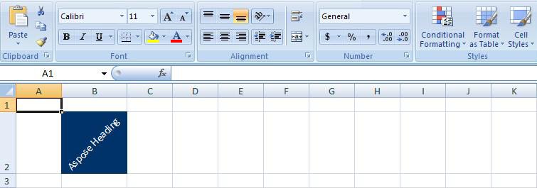

{} 

Sometimes, a column header is much wider than the data in the cells below. This can cause unnecessary whitespace on the page. One solution is to rotate the text vertically so that it takes less horizontal space. In Microsoft Excel, rotating text is easy. Luckily, it is possible to rotate text programmatically too, so that developers can rotate labels in the spreadsheets they create within their applications.

This article looks at how to rotate text in cells using [Aspose.Cells for .NET](/cells/net/rotating-cell-text-html/) compared to doing the same thing with [VSTO](/cells/net/rotating-cell-text-html/).

{} 
### **Rotating Text in Cells**
To rotate text in a cell on a worksheet, take the following steps:

1. Create a workbook and get a worksheet.
1. Add samples text.
1. Format the text: rotate, add background colour.
1. Save the file.

The code samples that follow show how to perform these steps first in [VSTO](/cells/net/rotating-cell-text-html/), using either C# or Visual Basic, and then in [Aspose.Cells](/cells/net/rotating-cell-text-html/), again using either C# or Visual Basic.

The code examples in this article give the output shown below.
**A cell with rotated text.** 

#### **Rotating Text with VSTO**
[**C#**](/pages/createpage.action?spaceKey=cellsnet&title=C&linkCreation=true&fromPageId=5017469)



 using Microsoft.VisualStudio.Tools.Applications.Runtime;

using Excel = Microsoft.Office.Interop.Excel;

using Office = Microsoft.Office.Core;

using System.Reflection;.........//Instantiate the Application object.

Excel.ApplicationClass ExcelApp = new Excel.ApplicationClass();

//Add a Workbook.

Excel.Workbook objBook = ExcelApp.Workbooks.Add(System.Reflection.Missing.Value);

//Get the First sheet.

Excel.Worksheet objSheet = (Excel.Worksheet)objBook.Sheets["Sheet1"];

//Put some text into cell B2.

objSheet.Cells[2, 2] = "Aspose Heading";

//Define a range object(B2).

Excel.Range _range;

_range = objSheet.get_Range("B2", "B2");

//Specify the angle of rotation of the text.

_range.Orientation = 45;

//Set the background color.

_range.Interior.Color = System.Drawing.ColorTranslator.ToWin32(Color.FromArgb(0, 51, 105));

//Set the font color of cell text

_range.Font.Color = System.Drawing.ColorTranslator.ToOle(System.Drawing.Color.White);

//Save the excel file.

objBook.SaveCopyAs("c:\\VSTO_RotateText_test.xlsx");

//Quit the Application.

ExcelApp.Quit();


#### **Rotating Text with Aspose.Cells for .NET**
[**C#**](/pages/createpage.action?spaceKey=cellsnet&title=C&linkCreation=true&fromPageId=5017469)



 // Instantiate a new Workbook.Workbook objworkbook = new Workbook();

// Get the First sheet.

Worksheet objworksheet = objworkbook.Worksheets[0];

// Get Cells.

Cells objcells = objworksheet.Cells;// Get a particular Cell.

Cell objcell = objcells["B2"];// Put some text value.

objcell.PutValue("Aspose Heading");

// Get associated style object of the cell.

Style objstyle = objcell.GetStyle();

// Specify the angle of rotation of the text.

objstyle.RotationAngle = 45;

// Set the custom fill color of the cells.

objstyle.ForegroundColor = Color.FromArgb(0, 51, 105);

// Set the background pattern for fillment color.

objstyle.Pattern = BackgroundType.Solid;

// Set the font color of cell text

objstyle.Font.Color = Color.White;

// Assign the updated style object back to the cell

objcell.SetStyle(objstyle);

// Save the work book

objworkbook.Save("c:\\RotateText_test.xlsx");


