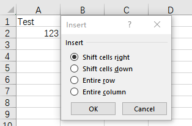

## **Introduction**

In Excel, you can select a range, then insert a range and shift other data right or down.

****

## **Insert Ranges Using Aspose.Cells**

Aspose.Cells provides [Cells.InsertRange](https://reference.aspose.com/cells/net/aspose.cells/cells/insertrange/) method to insert a range.

## **Insert Ranges And Shift Cells Right**

Insert a ranage and shift cells right as the following codes with Aspose.Cells:



## **Insert Ranges And Shift Cells Down**

Insert a ranage and shift cells down as the following codes with Aspose.Cells:



