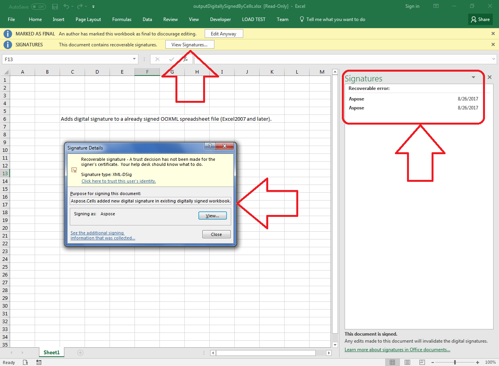

## **Possible Usage Scenarios**

Aspose.Cells provides the [**Workbook.AddDigitalSignature(DigitalSignatureCollection digitalSignatureCollection)**](https://apireference.aspose.com/cells/net/aspose.cells/workbook/methods/adddigitalsignature) method that you can use to add digital signature to an already signed Excel file.

{}

Please note while adding a digital signature to an already signed Excel document, if the original document is Aspose.Cells generated document, it works well. But if the original document is generated by other engines (e.g. Microsoft Excel etc.), Aspose.Cells cannot keep the file same after loading and re-saving it, this will make the original signature to be invalid.

{}

## **Add Digital Signature to an already signed Excel file**

The following sample code demonstrated how to make use of [**Workbook.AddDigitalSignature(DigitalSignatureCollection digitalSignatureCollection)**](https://apireference.aspose.com/cells/net/aspose.cells/workbook/methods/adddigitalsignature) method to add digital signature to already signed Excel file. Please check the [sample Excel file](50528280.xlsx) used in this code. This file is already digitally signed. Please check the [output Excel file](50528281.xlsx) generated by the code. We have used the demo certificate named [AsposeDemo.pfx](50528279.pfx) in this code which has a password **aspose**. The screenshot shows the effect of the sample code on the sample Excel file after execution.

## **Sample Code**


