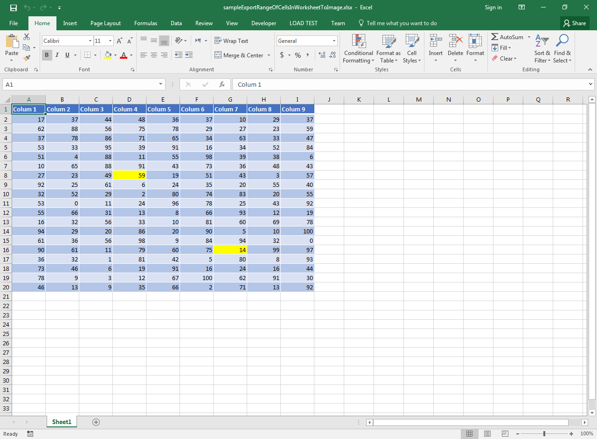

## **Possible Usage Scenarios**
You can make an image of a worksheet using Aspose.Cells. However, sometimes you need to export only a range of cells in a worksheet to an image. This article explains how to achieve this.
## **Export Range of Cells in a Worksheet to Image**
To take an image of a range, set the print area to the desired range and then set all margins to 0. Also set [ImageOrPrintOptions.OnePagePerSheet](https://apireference.aspose.com/net/cells/aspose.cells.rendering/imageorprintoptions/properties/onepagepersheet) to **true**. The following code takes an image of the range D8:G16. Below is a screenshot of the [sample Excel file](attachments/5017499/47153160.xlsx) used in the code. You can try the code with any Excel file.
## **Screenshot of Sample Excel File and its Exported Image**
****

Executing the code creates an image of the range D8:G16 only.

****
## **Sample Code**

