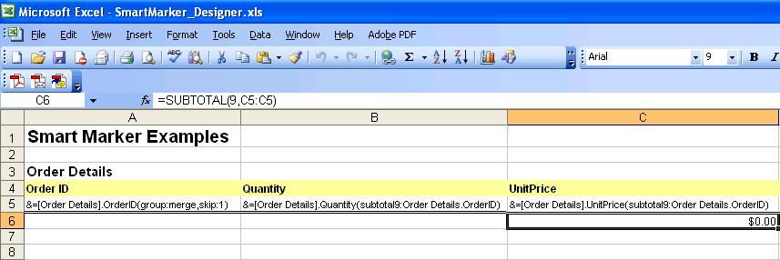
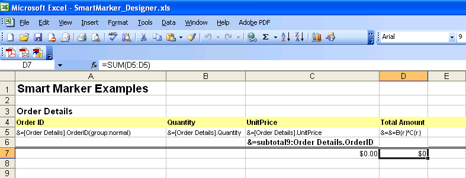

## **Introduction**
**Smart markers** are used to let Aspose.Cells know what information to place in a Microsoft Excel designer spreadsheet. Smart markers allow you to create templates that contain only specific information and formatting.
## **Designer Spreadsheet & Smart Markers**
Designer spreadsheets are standard Excel files that contain visual formatting, formulas and smart markers. They can contain smart markers that reference one or more data source, such as information from a project and information for related contacts. Smart markers are written into the cells where you want the information.

All smart markers start with &=. An example of a data marker is &=Party.FullName. If the data marker results in more than one item, for example, a complete row, then the following rows are moved down automatically to make room for the new information. Thus sub-totals and totals can be placed on the row immediately after the data marker to make calculations based on the inserted data. To make calculations on the inserted rows, use **dynamic formulas**.

Smart markers consist of the **data source** and **field name** parts for most information. Special information may also be passed with variables and variable arrays. Variables always fill only one cell whereas variable arrays may fill several. Only use one data marker per cell. Unused smart markers are removed.

Smart marker may also contain parameters. Parameters allow you to modify how the information is laid out. They are appended to the end of the smart marker in parenthesis as a comma separated list.
### **Smart Marker Options**
&=DataSource.FieldName 
&=[Data Source].[Field Name] 
&=$VariableName 
&=$VariableArray 
&==DynamicFormula 
&=&=RepeatDynamicFormula
### **Parameters**
The following parameters are allowed:

- **noadd** - Do not add extra rows to fit data.
- **skip:n** - Skip n number of rows for each row of data.
- **ascending:n** or **descending:n** - Sort data in smart markers. If n is 1, then the column is the first key of the sorter. The data is sorted after processing the data source. For example: &=Table1.Field3(ascending:1).
- **horizontal** - Write data left-to-right, instead of top-to-bottom.
- **numeric** - Convert text to number if possible.
- **shift** - Shift down or right, creating extra rows or columns to fit data. The shift parameter works the same way as in Microsoft Excel. For example in Microsoft Excel, when you select a range of cells, right-click and select **Insert** and specify **shift cells down**, **shift cells right** and other options. In short, the **shift** parameter fills the same function for vertical/normal (top to bottom) or horizontal (left to right) smart markers.
- **copystyle** - Copy the base cell's style to all the cells in that column.

The parameters noadd and skip can be combined to insert data on alternating rows. Because the template is processed from bottom to top, you should add noadd on the first row to avoid extra rows from being inserted before the alternate row.

If you have multiple parameters, separate them with a commas, but no space: parameterA,parameterB,parameterC

The following screenshots show how to insert data on every other row.

|**Template File**|**Output File**|
| :- | :- |
|||
### **Dynamic Formulas**
Dynamic formulas allow you to insert Excel formulas into cells even when the formula references rows that will be inserted during the export process. Dynamic formulas can repeat for each inserted row or use only the cell where the data marker is placed.

Dynamic formulas allow the following additional options:

- r - Current row number.
- 2, -1 - Offset to current row number.

For example:



 &=&=B{-1}/C{-1}~(skip:1)



In the dynamic formula marker, "-1" denotes the offset to the current row in B and C columns respectively which will be set for division operation, the skip parameter is one row. Moreover, we should specify the following char:



 "~"



as a separator character to apply further parameters in dynamic formulas.

The following screenshots illustrate a repeating dynamic formula and the resulting Excel worksheet.

|**Template File**|**OutPut File**|
| :- | :- |
|||
Cell "C1" contains the formula **= A1*B1**, cell "C2" contains **= A2*B2** and cell "C3" contains **= A3*B3**.

It's very easy to process the smart markers. What follows are two code snippets, one in C# and one in VB, that shows how it is done.


## **Using Variable Arrays**
Following example code shows on how to use variable arrays in Smart Markers. We place a variable array marker into A1 cell of the first worksheet of the workbook dynamically which contains string of values which we set for the marker, process the markers to fill data into the cells against the marker. Finally we save the Excel file.


## **Grouping Data**
In some Excel reports you might need to break the data into groups to make it easier to read and analyze. One of the primary purposes for breaking data into groups is to run calculations (perform summary operations) on each group of records.

Aspose.Cells smart markers allow you to group data by fields and place summary rows in between data sets or data groups. For example, if grouping data by Customers.CustomerID, you can add a summary record every time the group changes.
### **Parameters**
Following are some of the smart marker parameters used for grouping data.
#### **group:normal/merge/repeat**
We support three types of group that you can choose between.

- **normal** - The group by field(s) value is not be repeated for the corresponding records in the column; instead they are printed once per data group.
- **merge** - The same behavior as for the normal parameter, except that it merges the cells in the group by field(s) for each group set.
- **repeat** - The group by field(s) value is repeated for the corresponding records.

For example: &=Customers.CustomerID(group:merge)
#### **skip**
Skips a specified number of rows after each group.

For example, &=Employees.EmployeeID(group:normal,skip:1)
#### **subtotalN**
Performs a summary operation for a specified field data related to a group by field. The N represents numbers between 1 and 11 which specify the function used when calculating subtotals within a list of data. (1=AVERAGE, 2=COUNT, 3=COUNTA, 4=MAX, 5=MIN,...9=SUM etc.) Refer to the Subtotal reference in Microsoft Excel's help for further details.

The format actually states as:
subtotalN:Ref where Ref refers to the group by column.

For example,

- &=Products.Units(subtotal9:Products.ProductID) specifies summary function upon **Units** field with respect to the **ProductID** field in the **Products** table.
- &=Tabx.Col3(subtotal9:Tabx.Col1) specifies summary function upon the **Col3** field group by **Col1** in the table **Tabx**.
- &=Table1.ColumnD(subtotal9:Table1.ColumnA&Table1.ColumnB) specifies summary function upon **ColumnD** field group by **ColumnA** and **ColumnB** in the table **Table1**.

This example shows some of the grouping parameters in action. It uses the Northwind.mdb Microsoft Access database and extract data from the table named "Order Details". We create a designer file called SmartMarker_Designer.xls in Microsoft Excel and put smart markers into various cells in worksheets. The markers are processed to fill the worksheets. The data is placed and organized by a group field.

The designer file has two worksheets. In the first we put smart markers with grouping parameters as shown in the screenshot below. Three smart markers (with grouping parameters) are placed:
&=[Order Details].OrderID(group:merge,skip:1),
&=[Order Details].Quantity(subtotal9:Order Details.OrderID), and
&=[Order Details].UnitPrice(subtotal9:Order Details.OrderID) go into A5, B5 and C5 respectively.

|**The first worksheet in the SmartMarker_Designer.xls file, complete with smart markers**|
| :- |
||
In the second worksheet of the designer file, we put some more smart markers as shown in the figure below. We place the following smart markers:
&=[Order Details].OrderID(group:normal),
&=[Order Details].Quantity,
&=[Order Details].UnitPrice,
&=&=B(r)*C(r), and
&=subtotal9:Order Details.OrderID into A5, B5, C5, D5 and C6 respectively.

|**The second worksheet of the SmartMarker_Designer.xls file, showing mixed smart markers.**|
| :- |
||
Here is the source code used in the example.



{} 

If you need to add your own custom labels to the Summary rows or you want to concatenate the field's name with a label, e.g "Subtotal of Orders", Aspose.Cells provides you Label and LabelPosition attributes, so you may place your custom labels in the Smart Markers while concatenating with the Subtotal rows in grouping data. See the document on how to Add Custom Labels to Concatenate with the Subtotal Rows in Smart Markers for your reference.

{} 
## **Using Anonymous Types or Custom Objects**
Aspose.Cells also supports anonymous types or custom objects in smart markers. The example that follows shows how this works.For importing data from dynamic objects using Smart Markers, visit the following article:

[Importing from dynamic object as data source](/cells/net/import-data-into-worksheet/#importdataintoworksheet-importingfromdynamicobjectasdatasource)


## **Image Markers**
Aspose.Cells smart markers support image markers too. This section shows you how to insert pictures using smart markers.
### **Image Parameters**
Smart marker parameters for managing images.

- **Picture:FitToCell** - Auto-fit the image to the cell’s row height and column width.
- **Picture:ScaleN** - Scale height and width to N percent.
- **Picture:Width:Nin&Height:Nin** - Render the image N inches high and N inches wide. You can also specify Left and Top positions (in points).

Here is the source code used in the example.


## **Using Nested Objects**
Aspose.Cells supports nested objects in smart markers, the nested objects should be simple. We use a simple template file. See the designer spreadsheet that contains some nested smart markers.

|**The first worksheet of the SM_NestedObjects.xlsx file showing nested smart markers.**|
| :- |
||
The example that follows shows how this works.


## **Using Generic List as Nested Object**
Aspose.Cells now also supports using generic list as a nested object. Please check the screenshot of the output excel file generated with the following code. As you can see in the screenshot a Teacher object contains multiple nested Student objects.

||
| :- |


## **Using HTML property of Smart Markers**
The following sample code explains the use of HTML property of the Smart Markers. When it will be processed, it will show "World" in "Hello World" as bold because of HTML <b> tag.


## **Getting Notifications while Merging Data with Smart Markers**
Sometimes, it may be required to get the notifications about the cell reference or the particular Smart Marker being processed before the completion. This can be achieved using the WorkbookDesigner.CallBack property and ISmartMarkerCallBack
