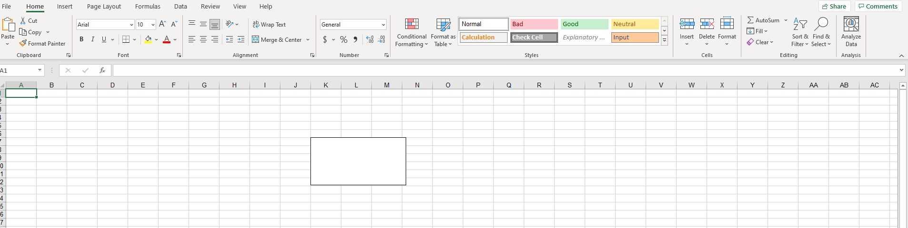

## Add Text Box to Worksheet in Aspose.Cells

If you need to use [Aspose.Cells](https://products.aspose.com/cells/) to add text boxes in an Excel file, then this document can provide you with some help.If you need to use the Excel program for manual operation, please refer to [Add Text Box to Worksheet](/cells/net/add-text-box-to-worksheet/).

The following sample code creates a text box.

### C#



You will get a file similar to [result file](result.xlsx).In the file, you will see the following:

