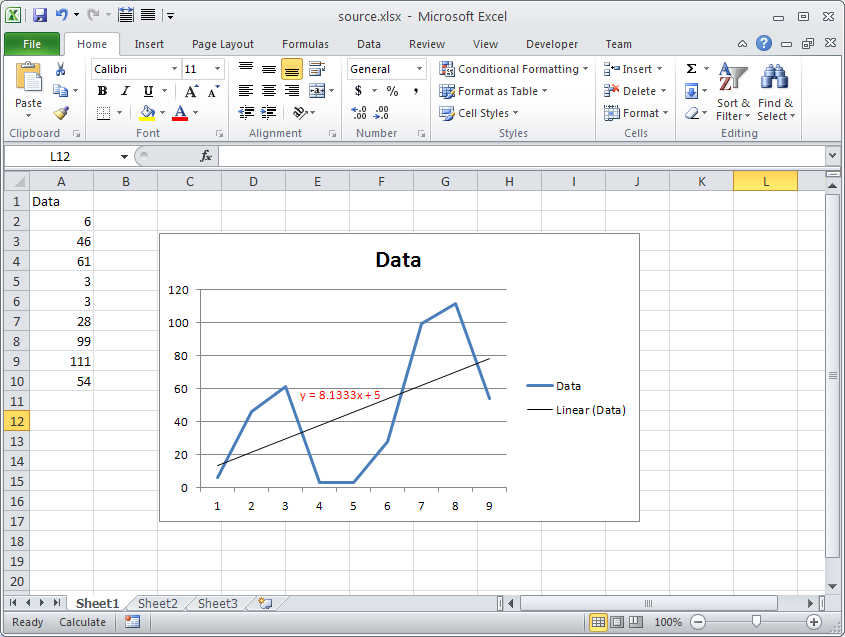

{} 

You can retrieve the Equation Text of Chart Trendline using Aspose.Cells. Aspose.Cells provides [Trendline.DataLabels.Text](https://apireference.aspose.com/net/cells/aspose.cells.charts/datalabels/properties/text) property which returns the Equation Text of chart trendline. To make use of this property, you will first have to call [Chart.Calculate()](https://apireference.aspose.com/net/cells/aspose.cells.charts/chart/methods/calculate) method.

{} 

The following screenshot shows the Chart with a Trendline and its Equation Text is shown in Red color. We will retrieve this text using the [Trendline.DataLabels.Text](https://apireference.aspose.com/net/cells/aspose.cells.charts/datalabels/properties/text) property in the following sample code.


## **Output**
This is the console output of the above sample code.



 Equation Text: y = 8.1333x + 5


