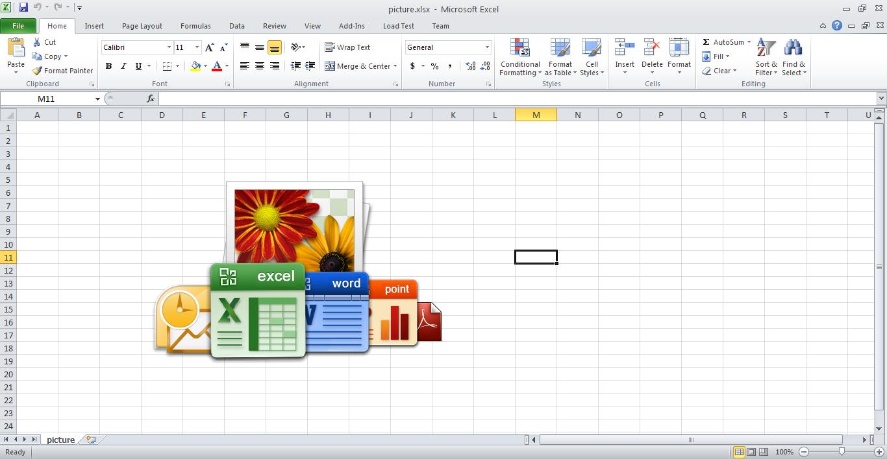

{}

Sometimes, you need to combine workbooks with various content like images, charts and data into a single workbook. Aspose.Cells supports this feature. This article shows how to create a console application in Visual Studio and combine workbooks with a few, simple lines of code using Aspose.Cells.

{}

## **Combining Workbooks with Images and Charts**

The example code combines two workbooks into a single workbook using Aspose.Cells. The code loads the source workbooks, uses the [**Workbook.combine()**](https://apireference.aspose.com/cells/net/aspose.cells/workbook/methods/combine) method to combine them and saves the output workbook.

### **Source Workbooks**

- [charts.xlsx](5473097.xlsx)
- [picture.xlsx](5473096.xlsx)

### **Output Workbooks**

- [combined.xlsx](5473095.xlsx)

### **Screenshots**

Below are screenshots of the source and output workbooks.

{}

You can use any source workbooks. These images are just for illustration purposes.

{}

**The first worksheet of the charts workbook - stacked** 

**Second worksheet of charts workbook - line** 

**First worksheet of the picture workbook - picture** 

**All three worksheets in the combined workbook - stacked, line, picture** 


