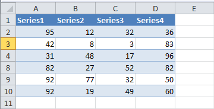
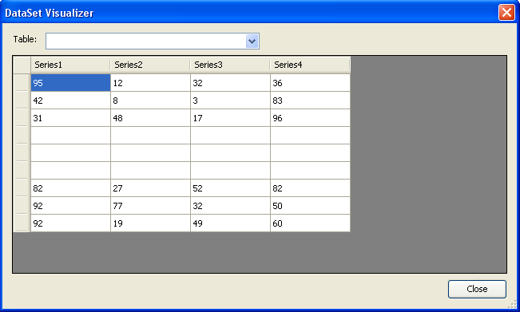

{}

You can export data from worksheets into data tables using Aspose.Cells. Sometimes you want to export the data of visible rows only. Aspose.Cells provides a way to achieve this. Use the [**ExportTableOptions.PlotVisibleRows**](https://apireference.aspose.com/cells/net/aspose.cells/exporttableoptions/properties/plotvisiblerows) to specify that you want to export visible rows data only.

{}

This example shows how to export data from the following worksheet. Rows 5, 6 and 7 are hidden.

|**Sample data in worksheet, rows 5, 6 and 7 are hidden**|
| :- |
||

Once the data is exported to a data table using the [**Worksheet.Cells.ExportDataTable()**](https://apireference.aspose.com/cells/net/aspose.cells/cells/methods/exportdatatable/index) method with the [**ExportTableOptions.PlotVisibleRows**](https://apireference.aspose.com/cells/net/aspose.cells/exporttableoptions/properties/plotvisiblerows) option, it will look like this. Hidden rows are plotted as blank rows

|**Hidden rows are exported to the data table as blank rows**|
| :- |
||


