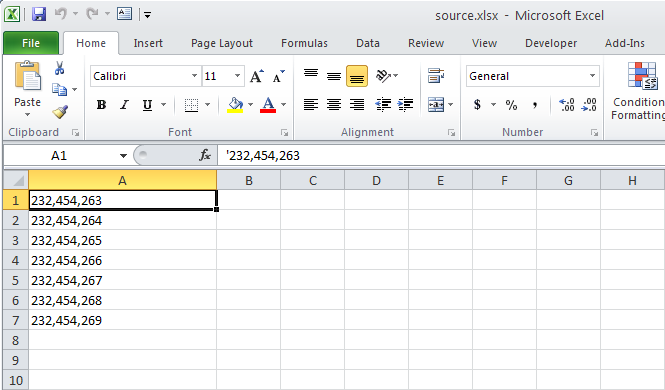

{}

Sometimes, you want to convert numeric data entered as text to numbers. You can enter numbers as text in Microsoft Excel by putting an apostrophe before a number, for example **'12345**. Excel then treats the number as a string. Aspose.Cells allows you to convert strings to numbers.

{}

Aspose.Cells provides the [**Cells.ConvertStringToNumericValue()**](https://apireference.aspose.com/cells/net/aspose.cells/cells/methods/convertstringtonumericvalue) method which can be used to convert all string or text numeric data into numbers.

The following screenshot shows string numbers in cells **A1:A17**. String numbers are aligned to the left.

|**Input file: numbers entered as text strings**|
| :- |
||

These string numbers have been converted to numbers using [**Cells.ConvertStringToNumericValue()**](https://apireference.aspose.com/cells/net/aspose.cells/cells/methods/convertstringtonumericvalue) in the following screenshot. As you can see, they are now right-aligned.

|**Output file: the strings have been converted to numbers**|
| :- |
||

## C# code to convert string numeric data to actual numbers

The following sample code illustrates how to convert all string numeric data to actual numbers in all worksheets.


