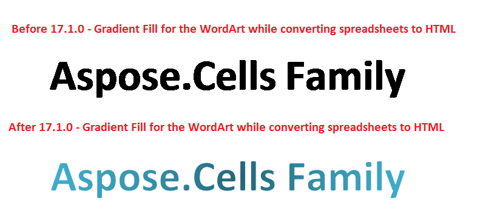

## **Possible Usage Scenarios**
Before Aspose.Cells 17.1, Aspose.Cells did not render gradient fill of the word art when the Excel file was converted to HTML format. Since the release of Aspose.Cells 17.1, word art gradient fill is supported. The following screenshot compares the effect on the gradient fill by converting the excel file using Aspose.Cells 17.1 and the older version.

## **Render Gradient Fill for the WordArt while converting spreadsheets to HTML**
The following sample code converts the [source excel file](attachments/22546716/22774111.xlsx) into [output HTML format](attachments/22546716/22774109.zip). The source excel file contains a word art object with gradient fill as shown in the above screenshot.
## **Sample Code**

