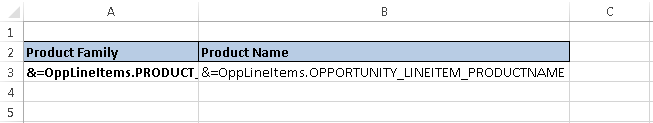

{} 

Aspose.Cells APIs provide the [WorkbookDesigner](https://apireference.aspose.com/net/cells/aspose.cells/workbookdesigner) class to [work with Smart Markers](http://aspose.com/docs/display/cellsnet/Smart+Markers) where the formatting & formulas are placed in the [designer spreadsheets](http://www.aspose.com/docs/display/cellsnet/What+is+a+Designer+Spreadsheet) and then processed with [WorkbookDesigner](https://apireference.aspose.com/net/cells/aspose.cells/workbookdesigner) class to fill up the data according to specified Smart Markers. Sometimes, it may be required to get the notifications about the cell reference or the particular Smart Marker being processed. This can be achieved using the [WorkbookDesigner.CallBack](https://apireference.aspose.com/net/cells/aspose.cells/workbookdesigner/properties/callback) property and [ISmartMarkerCallBack](https://apireference.aspose.com/net/cells/aspose.cells/ismartmarkercallback) interface exposed with the release of Aspose.Cells for .NET 8.6.2.

{} 

The following piece of code demonstrates the usage of [ISmartMarkerCallBack](https://apireference.aspose.com/net/cells/aspose.cells/ismartmarkercallback) interface to define a new class that handles the call back for [WorkbookDesigner.Process](https://apireference.aspose.com/net/cells/aspose.cells/workbookdesigner/methods/process) method.



Rest of the process includes loading designer spreadsheet containing the Smart Markers with [WorkbookDesigner](https://apireference.aspose.com/net/cells/aspose.cells/workbookdesigner) and process it by setting the data source. In order to keep the example simple, we have used a predefined designer spreadsheet containing only two Smart Markers as shown in the below snapshot where the data source is being created dynamically to merge the data according to the specified Smart Markers.

||
| :- |

