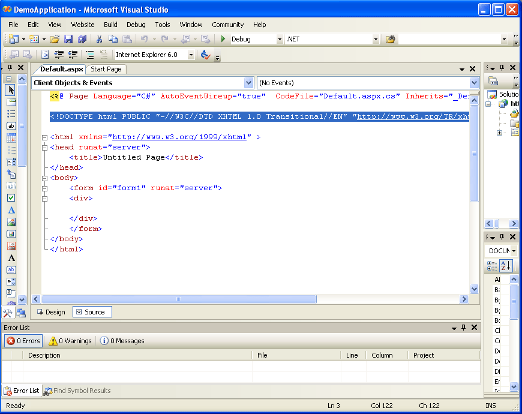

{} 

This article discusses an easiest approach to bind worksheets with database tables in **Visual Studio.Net 2005** using a special tool supplied with Aspose.Cells.GridWeb named as **Worksheets Designer** . This article would definitely make you feel that how easier it is to use data binding feature in Aspose.Cells.GridWeb with the help of **Worksheets Designer** . 

{} 
##### **Binding a Worksheet with Database Using Worksheets Designer in VS.Net 2005**
The purpose of this article is to let all developers learn how you can create a data binding application in **VS.Net 2005** and understand the use & role of **Worksheets Designer** editor. The best way to learn and understand anything is through examples. So, in this article, it would also be best for us to create a sample application for demonstrating the use of **Worksheets Designer** in binding worksheets with database. Let's create an application step by step. 
##### **Step 1: Creating a Sample Database**
First of all we will create a sample database that will be used in this article. We have used MS Access to create a sample database containing **Products** table whose schema is shown below: 

**Figure:** Design information of **Products** table 

Few dummy records are added to the **Products** table as shown below in the figure: 

**Figure:** Records in **Products** table 
##### **Step 2: Designing Sample Application**
An **ASP.NET Web Application** is created and designed in Visual Studio.NET 2005 as shown in the figures below. These screen shots are useful for those developers who are not much familiar using Aspose.Cells.GridWeb in Visual Studio.Net 2005. 

First start VS.Net 2005. 

**Figure:** Starting VS.Net 2005 

Create a new Web Site from the File|New|Web Site... Menu. 

**Figure:** Creating a new WebSite 

After clicking File|New|Web Site... menu option, **New Web Site** dialog is shown. Click the **Browse** button in it. 

**Figure:** New Web Site Dialog 

After clicking the **Browse** button, choose the location folder in the local IIS. You may create a new folder and make it as virtual folder as shown in the figure. 

**Figure:** Creating a new Folder 

After clicking the **Open** button in the **Choose Location** dialog, **New Web Site** dialog will look like. 

**Figure:** Setting Project Location 

Now the project is created 

**Figure:** Created Project 
##### **XHTML and HTML Modes**
**Aspose.Cells.GridWeb** completely supports XHTML Mode which is implemented by default in VS.Net 2005 since the **XhtmlMode** property of the **GridWeb** control is set to **True** by default when you place the control on the web page. But if you want to implement HTML Mode for the control in VS.Net 2005, you may do it quite easily. You have to modify the **<!DOCTYPE>** tag a bit in the source code of the web page and set the **XhtmlMode** property of the **GridWeb** control to **False** . 
#### **In this topic we will use HTML Mode for the control. So follow the steps below**
##### **1. Switch to Source view of the web page and find the following <!DOCTYPE> tag in the source code.**
[**XML**](/pages/createpage.action?spaceKey=cellsnet&title=XML&linkCreation=true&fromPageId=5017582)



 <!DOCTYPE html PUBLIC "-//W3C//DTD XHTML 1.0 Transitional//EN" "http://www.w3.org/TR/xhtml1/DTD/xhtml1-transitional.dtd">



Once you find that tag, select that complete tag in the source code as shown below. 

**Figure:** Selecting **<!DOCTYPE> tag** 

Replace the **<!DOCTYPE>** tag from your source code with the following one. 

[**XML**](/pages/createpage.action?spaceKey=cellsnet&title=XML&linkCreation=true&fromPageId=5017582)



  <!DOCTYPE HTML PUBLIC "-//W3C//DTD HTML 4.0 Transitional//EN"> 



**Figure:** Modifying **<!DOCTYPE> tag** 
##### **2. After you will add the GridWeb control to the web form. You should select the control and choose the XhtmlMode property from the Properties window to set it to False.**
**Adding GridWeb to the WebForm** 

Right-Click on **ToolBox** and select **Choose Items...** from the menu. 

**Figure:** Choosing Items 

Now select **GridWeb** component and click **OK** 

{} 

**Figure:** Selecting **GridWeb** component in the component dialog 

Now the **GridWeb** is added as show in the figure below. 

**Figure:** **GridWeb** is added in the toolbox 

Place the **GridWeb** on the web form as shown below. 

**Figure:** Placing **GridWeb** on the web page 

{} {} 

**Procedure** : Select the control, Now, choose the **XhtmlMode** property from the **Properties** window and set it to **False** value. 

{} 
##### **Step 3: Connecting with Database Using Server Explorer and Setting Connection Object**
First we add the MS Access database to the project which we previously created in **Step 1** . You may see that **db.mdb** file is added to the project. 

**Figure:** Added database to the project folder 

Now, we go to **Component Designer** window of the web form using the web page's right-click menu option. 

**Figure:** Selecting **View Component Designer** option 

The Component Designer window is shown as below. 

**Figure:** Component Designer Window 

Double-Click the **OleDbConnection** component from Data panel to place oleDbConnection1 object to window. 

**Figure:** oleDbConnection1 object 

Now, it's time to connect with the database. We can do it easily by using **Server Explorer** in Visual Studio.NET 2005. Just select **Data Connection** in **Server Explorer** and right click. You will see a context menu appearing in front of you. Select **Add Connection...** option from the menu as shown below in the figure: 

**Figure:** Selecting **Add Connection...** option from menu 

After selecting **Add Connection...** option from menu, **Add Connection** dialog will be opened and **Browse** to select the database file as shown below. 

**Figure:** Selecting the database file 

You may test the Connection. 

**Figure:** Testing the connection 

You may browse the connection to check the table and its fields. 

**Figure:** Checking the table and its fields of the connection 

Now if you select **oleDbConnection1** object in the **Component Designer** window, you may select the connection string related the existing connection which is just created, it is there in the "ConnectionString" property of the **oleDbConnection1** object in the Properties window. 

**Figure:** Selecting the connection string for the object 

Finally the object's modifier is changed to **Protected** for better accessibility. 

**Figure:** Setting the modifier of the object 
##### **Step 4: Configuring Data Adapter Object**
Now, add an **OleDbDataAdapter** component from the Data panel in the toolbox to configure it. Double-Click the **OleDbDataAdapter** in the Data panel of the toolbox, it will start its configuration wizard and select the existing connection as shown in the figure: 

**Figure:** Data Adapter Configuration Wizard 

After clicking **Next** button, click the **Query Builder** to add the **Products** table, select All Columns and click **OK** button. 

**Figure:** Adding Product table 

**Figure:** Query Builder 

Now click **Finish** button to finish the wizard. 

**Figure:** Finishing the Wizard 

After configuring the wizard, the oleDbDataAdapter1 is automatically added to the window as shown below. Also, you may set its modifier to **Protected** . 

**Figure:** Retrieving the OleDbDataAdapter object on the designer window 
##### **Step 5: Generating DataSet**
As we have created database connection and data adapter objects but still we need something where we can store data after connecting with database. A **DataSet** object can store data precisely and we can also generate it easily using VS.NET 2005 IDE. To do so, select **oleDbDataAdaper1** and right click. A context menu would be popped up with some options. Select **Generate** **DataSet...** option from the menu as shown below in the figure. 

**Figure:** Selecting **Generate** **DataSet...** option from menu 

After selecting **Generate** **DataSet...** option from menu, a **Generate DataSet** dialog would be opened. Using this dialog, we can select that what would be the name of the new **DataSet** object to be created and which tables should be added to **DataSet** . Check **Add this dataset to designer** option and click **OK** button as shown below in the figure. 

**Figure:** Clicking **OK** button to generate **DataSet** 

Now, you can see a **dataSet11** object added to designer as shown below in the figure. Set the object modifier to **Protected** . 

**Figure:** **DataSet** generated and added to the designer window 

Certain code is automatically generated in the .cs file related connection, data adapter, dataset object. 

**Figure:** Generated Code 
##### **Step 6: Using Worksheets Designer**
Now, its time to open the secret. Select the control and right click. A context menu would be opened. Select Worksheets Designer... option from the menu as shown below in the figure. 

**Figure:** Selecting **Worksheets Designer...** option from menu 

After that **Worksheet Collection Editor** dialog (also called **Worksheets Designer** ) will be opened, you can see several properties that can be configured to bind the **Sheet1** with any table in the database. Let's select **DataSource** property. Write **dataSet11** in it (that we generated and added to designer window in previous step). Then click on **DataMember** property. Write **Products** as a table name here as shown below in the figure: 

**Figure:** Setting **DataSource** and **DataMember** properties 

Now, you can configure **BindColumns** property. After clicking it, Now you may add the binding columns and set the **Caption** , **DataField** (It should be same as **Products** table fields), and other properties. You can set the **IsAutoCreated** to **true** and apply **Validation** and set the **NumberType** of different fields for your requirements. 

**Figure:** Clicking **BindColumns** property 

**Figure:** **BindColumn Collection Editor** dialog 
##### **Step 7: Adding Some Lines of Code for the Web Page**
We have used **Worksheets Designer** easily and now we just have to add some lines of code 

First we will add **OnInit** event related code to initialize **InitializeComponent** method to initialize and create connection, command, dataadapter and dataset objects. These lines of code are not added with the auto generated code, so we have to add them manually. 

**Figure:** Adding some code1 

**Figure:** Adding some code2 

Now we add some code in the **Page_Load** event handler for filling **dataSet11** object with data from database (using **oleDbDataAdapter1** ) and binding **GridWeb** control with **dataSet11** by calling its **DataBind** method. 

{}   {} 
##### **Example:**
[**C#**](/pages/createpage.action?spaceKey=cellsnet&title=C&linkCreation=true&fromPageId=5017582)



 //Implementing Page_Load event handler

protected void Page_Load(object sender, EventArgs e)

{

    //Checking if there is not any PostBack

    if (!IsPostBack)

    {

        try

        {

            //Filling DataSet with data 

            oleDbDataAdapter1.Fill(dataSet11);

            //Binding GridWeb with DataSet

            GridWeb1.DataBind();

        }

        finally

        {

            //Finally, closing database connection

            oleDbConnection1.Close();

        }

    }

}



[**VB.NET**](/pages/createpage.action?spaceKey=cellsnet&title=VB.NET&linkCreation=true&fromPageId=5017582)



 'Implementing Page_Load event handler

Protected Sub Page_Load(ByVal sender As Object, ByVal e As System.EventArgs) Handles Me.Load

    'Checking if there is not any PostBack

    If Not IsPostBack Then

        Try

            'Filling DataSet with data 

            oleDbDataAdapter1.Fill(dataSet11)

            'Binding GridWeb with DataSet

            GridWeb1.DataBind()

        Finally

            'Finally, closing database connection

            oleDbConnection1.Close()

        End Try

    End If

End Sub



You can also check the code added to **Page_Load** event handler as shown below in the figure: 

**Figure:** Code added to **Page_Load** event handler 

By far, we have built a very useful database application. But, this application only enables you to view the data of the table. Although you can edit data in **GridWeb** control but when you will close your browser window and open your database. You would find that nothing is changed. It means, the changes that you made are not saved to the database. So, there is something that you have to do. 

Now we will add some code to our application so that **GridWeb** may save its changes to actual database. Let's open **Properties** pane and select **SaveCommand** event of the **GridWeb** control from the list of its events. If you double click on **SaveCommand** event then VS.NET 2005 IDE will create **GridWeb1_SaveCommand** event handler for you. Add some code to this event handler for updating database with modified data contained in **DataSet** (bound with the worksheet) using **oleDbDataAdapter1** . 
##### **Example:**
[**C#**](/pages/createpage.action?spaceKey=cellsnet&title=C&linkCreation=true&fromPageId=5017582)



 //Implementing the event handler for SaveCommand event

protected void GridWeb1_SaveCommand(object sender, EventArgs e)

{

    try

    {

        //Getting the modified data of worksheet as a DataSet

        DataSet dataset = (DataSet)GridWeb1.WebWorksheets[0].DataSource;

        //Updating database according to modified DataSet

        oleDbDataAdapter1.Update(dataset);

    }

    finally

    {

        //Closing database connection

        oleDbConnection1.Close();

    }

}



[**VB.NET**](/pages/createpage.action?spaceKey=cellsnet&title=VB.NET&linkCreation=true&fromPageId=5017582)



 'Implementing the event handler for SaveCommand event

Protected Sub GridWeb1_SaveCommand(ByVal sender As Object, ByVal e As System.EventArgs)

  Handles GridWeb1.SaveCommand

    Try

        'Getting the modified data of worksheet as a DataSet

        Dim dataset As DataSet = CType(GridWeb1.WebWorksheets(0).DataSource, DataSet)

        'Updating database according to modified DataSet

        oleDbDataAdapter1.Update(dataset)

    Finally

        'Closing database connection

        oleDbConnection1.Close()

    End Try

End Sub



You can also check the code added to **GridWeb1_SaveCommand** event handler as shown below in the figure: 

**Figure:** Code added to **GridWeb1_SaveCommand** event handler 

Now, if you will save your changes to database using **Save** button of the **GridWeb** , they would definitely be saved. 
##### **Step 8: Running Your Application**
Finally, we can compile and run our application by either pressing **Ctrl+F5** or clicking **Start** button. In the debugging dialog, you may specify appropriate debugging option and click **OK** button as shown below in the figure. 

**Figure:** Running application 

After compilation, **Default.aspx** page of our web application will be opened in a new browser window where we can see all data loaded from database as shown below: 

**Figure:** Data loaded into **GridWeb** control from database 

When data is loaded into **GridWeb** control then you would feel that Aspose.Cells.GridWeb provides an implicit control of data to its users. Let's check that what kind of data manipulation features are offered by **GridWeb** to its users. 
##### **Data Validation**
Aspose.Cells.GridWeb automatically creates appropriate validation rules for all bound columns according to their data types defined in the database. You can see the validation type of a cell by hovering your mouse pointer on it as shown below in the figure: 

**Figure:** Checking validation type of a cell 

In the above figure, we can see that selected cell contains **<INT>** type of validation, which means that users can only enter integer value to it otherwise a validation error will occur. Moreover, **<REQUIRED>** shows that the value of **Product ID** is required to be submitted by user. 
##### **Deleting Rows**
To delete a row, you should first select a row (or any cell of the row) and select **Delete Row** option from right click menu as shown below: 

**Figure:** Selecting **Delete Row** option from menu 

After selecting **Delete Row** from menu, the row is deleted from the **GridWeb** . Now click **save** button of the **GridWeb** to delete that record in the original database table. 

**Figure:** Grid data (after a row is deleted) 
##### **Editing Rows**
You may also edit data in cells or rows and then click **Save** button to save your changes. 

**Figure:** Grid data (Editing Record1) 

**Figure:** Grid data (Editing Record2) 
##### **Adding Rows**
To add a row, select **Add Row** option from right click menu as shown below: 

**Figure:** Selecting **Add Row** option from menu 

A new row will be added to sheet at the end of the rows after selecting **Add Row** option from the menu. At the left of the newly added row, you would notice an **asterisk** mark, indicating that the row is a newly added. 

**Figure:** New row added to Grid 

After input the values in the new row, click **Save** button to confirm the changes in the original database table as shown below 

**Figure:** Saving changes to database table by clicking **Save** button 

{}   {} 
##### **Conclusion**
{} 

**Data Binding** is an important feature of Aspose.Cells.GridWeb . It's really effortless for developers to bind their worksheets with database using **Worksheets Designer** utility offered by Aspose.Cells.GridWeb . Aspose.Cells.GridWeb is very helpful for the developers to save their time and efforts in creating powerful Grid solutions. 

{}
