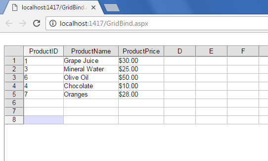

## **Possible Usage Scenarios**
Aspose.Cells.GridWeb provides an easy API that can be used to dynamically bind a DataSet to Worksheet.
## **Binding a Worksheet to DataSet**
The following sample code explains how to bind a Worksheet to a DataSet at runtime.
## **Sample Code**


 // Implementing Page_Load event handler

public partial class GridBind : System.Web.UI.Page

{

    protected void Page_Load(object sender, EventArgs e)

    {

        if (Page.IsPostBack == false && this.GridWeb1.IsPostBack == false)

        {

            // Create Product Data Table

            DataTable prodTbl = new DataTable("Products");

            prodTbl.Columns.Add("ProductID");

            prodTbl.Columns.Add("ProductName");

            prodTbl.Columns.Add("ProductPrice");

            // Add products inside the data table

            prodTbl.Rows.Add(1, "Grape Juice", "$30.00");

            prodTbl.Rows.Add(3, "Mineral Water", "$25.00");

            prodTbl.Rows.Add(6, "Olive Oil", "$50.00");

            prodTbl.Rows.Add(4, "Chocolate", "$10.00");

            prodTbl.Rows.Add(7, "Oranges", "$28.00");

            // Create a DataSet and put both table in it.

            DataSet set = new DataSet();

            set.Tables.Add(prodTbl);

            // Accessing a desired worksheet

            GridWorksheet sheet = GridWeb1.WorkSheets[0];

            // Specifying Data Source for the worksheet

            sheet.DataSource = set;

            // Specifying Products tables as the DataMember

            sheet.DataMember = "Products";

            // Creating data bound columns automatically

            sheet.CreateAutoGenratedColumns();

            // Binding worksheet with DataSet

            sheet.DataBind();

        }

    }

}


## **Output Screenshot**
The following screenshot shows the GridWeb after the execution of the above sample code.

