{} 

This article discusses an easy approach to binding worksheets to database tables in GUI mode using a special tool supplied with Aspose.Cells.GridWeb, the Worksheets Designer. 

{} 
### **Binding a Worksheet with Database Using Worksheets Designer**
#### **Step 1: Creating a Sample Database**
1. First, we create the sample database that will be used in this article. We're using Microsoft Access to create a database that contains a table called Products. It's schema is shown below.
   **Design information of Products table** 

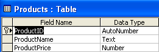

1. A few dummy records are added to the Products table.
   **Records in the Products table** 

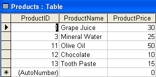
#### **Step 2: Designing Sample Application**
An ASP.NET web application is created and designed in Visual Studio.NET as shown below. 
**Designed sample application** 

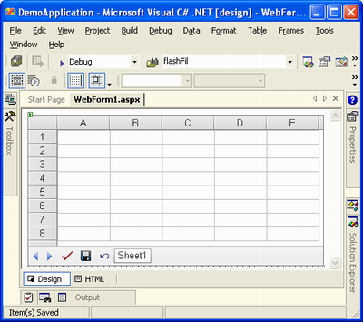
#### **Step 3: Connecting with Database Using Server Explorer**
It's time to connect to the database. We can do it easily using the Server Explorer in Visual Studio.NET. 

1. Select **Data Connection** in **Server Explorer** and right-click.
1. Select **Add Connection** from the menu.
   **Selecting the Add Connection option** 

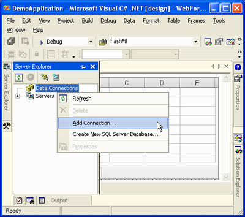

The Data Link Properties dialog is displayed. 
**The Data Link Properties dialog** 

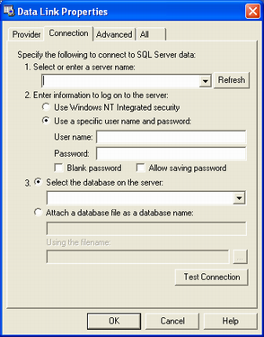

Using this dialog, you can connect to any database. By default, it allows you to connect to an SQL Server database. For this example, we need to connect with a Microsoft Access database. 

1. Click the **Provider** tab.
1. Select **Microsoft Jet 4.0 OLE DB Provider** from the **OLE DB Provider(s)** list.
1. Click **Next**.
   **Clicking Next after selecting an OLE DB provider** 

The **Connection** tab page is opened. 

1. Select the Microsoft Access database file (in our case, db.mdb) and click **OK**.
   **Clicking OK button after selecting database file** 

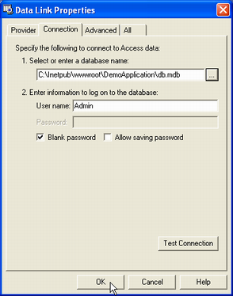

{} 

After clicking **OK**, a database connection to the Microsoft Access database will be created in the **Server Explorer**. Double-click the connection to see all tables, views and stored procedures in the database.

{} 
#### **Step 4: Creating Database Connection Objects Graphically**
1. Browse the tables in the database using the **Server Explorer**.
   There's only one table, Products. 
1. Drag and drop the Products table from the **Server Explorer** to the **Web Form**.
   **Dragging the Products table from Server Explorer and dropping to the web form** 

A dialog may appear.
**Dialog to confirm including database password in connection string** 

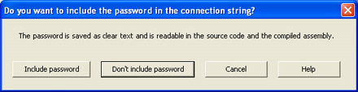

Decide if you want to include a database password in the connection string or not. For this example, we selected **Don't include password**. 
Two database connection objects (oleDbConnection1 and oleDbDataAdapter1) have been created and added.
**Database connection objects (oleDbConnection1 & oleDbDataAdapter1) created and displayed** 

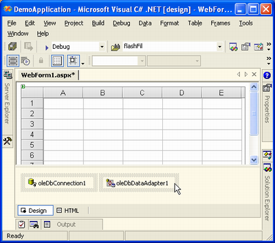

#### **Step 5: Generating DataSet**
So far, we have created database connection objects but still need somewhere to store data after connecting to the database. A DataSet object can store data precisely and we can also generate it easily using VS.NET IDE. 

1. Select **oleDbDataAdaper1** and right-click.
1. Select **Generate DataSet** option from the menu.
   **Selecting the Generate DataSet option** 

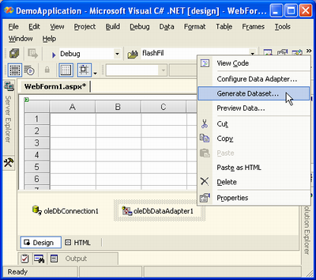

The Generate DataSet dialog is displayed. 
Here, it is possible to select a name for the new DataSet object to be created, and which tables should be added to it. 

1. Select the **Add this dataset to designer** option.
1. Click **OK**.
   **Clicking OK button to generate DataSet** 

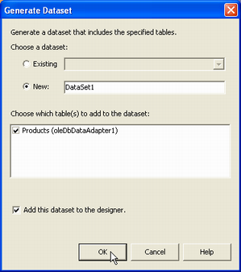

A dataSet11 object is added to the designer.
**DataSet generated and added to designer** 

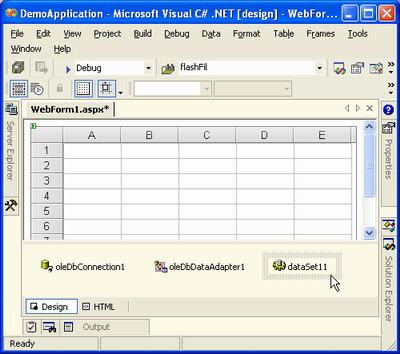
#### **Step 6: Using Worksheets Designer**
Now, its time to open the secret. 

1. Select the GridWeb control and right-click.
1. Select **Worksheets Designer** option from the menu. 

   **Selecting Worksheets Designer option** 

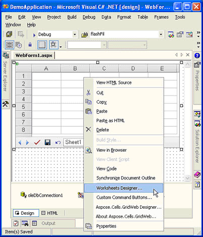

The Worksheet Collection Editor (also called the Worksheets Designer) is displayed. 
**Worksheets Collection Editor dialog** 

The dialog contains several properties that can be configured to bind Sheet1 to any table in the database.

1. Select the **DataSource** property.
   The dataSet11 object generated in the previous step is listed on the menu. 
1. Select dataSet11.
1. Click the **DataMember** property.
   The Worksheets Designer automatically shows a list of tables in dataSet11. There is only one table, Products.
1. Select the Products table.
   **Setting DataSource and DataMember properties** 

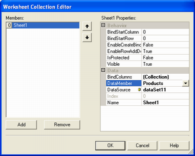

1. Check the **BindColumns** property.
   **Clicking BindColumns property** 

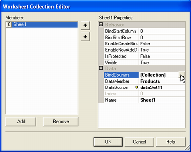

Clicking the **BindColumns** property opens the BindColumn Collection Editor.
**The BindColumn Collection Editor** 

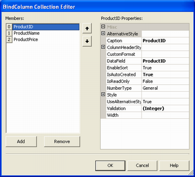

In the BindColumn Collection Editor, all columns of the **Products** table are automatically added to the BindColumns collection. 

1. Select any column and customize its properties.
   For example, you can modify each column caption.
   **Modifying the Caption of ProductID column** 

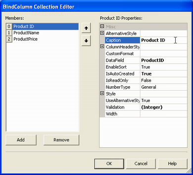

1. After making changes, click **OK**.
1. Close all dialogs by clicking **OK**.
   Finally, you are returned to the WebForm1.aspx page. 
   **Returning to the WebForm1.aspx page after using the Worksheets Designer** 

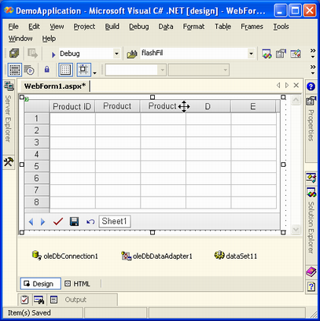

Above, the Products table column name is shown. The width of columns is small so the complete names of some columns are not fully visible. 
#### **Step 7: Adding Code to Page_Load Event Handler**
We have used the Worksheets Designer and now just have to add code to the Page_Load event handler for filling the dataSet11 object with data from the database (using oleDbDataAdapter1) and binding the GridWeb control to dataSet11 by calling its DataBind method. 

1. Add the code: 

**C#**



 //Implementing Page_Load event handler

private void Page_Load(object sender, System.EventArgs e)

{

    //Checking if there is not any PostBack

    if (!IsPostBack)

    {

        try

        {

            //Filling DataSet with data 

            oleDbDataAdapter1.Fill(dataSet11);

            //Binding GridWeb with DataSet

            GridWeb1.DataBind();

        }

        finally

        {

            //Finally, closing database connection

            oleDbConnection1.Close();

        }

    }

}



**VB.NET**



 'Implementing Page_Load event handler

Private Sub Page_Load(ByVal sender As Object, ByVal e As System.EventArgs) Handles MyBase.Load

    'Checking if there is not any PostBack

    If Not IsPostBack Then

        Try

            'Filling DataSet with data 

            oleDbDataAdapter1.Fill(dataSet11)

            'Binding GridWeb with DataSet

            GridWeb1.DataBind()

        Finally

            'Finally, closing database connection

            oleDbConnection1.Close()

        End Try

    End If

End Sub



1. Check the code added to the Page_Load event handler.
   **Code added to the Page_Load event handler** 

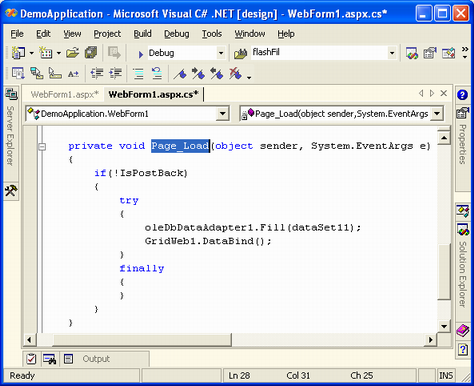
#### **Step 8: Running the Application**
Compile and run the application: either press **Ctrl+F5** or click **Start**. 
**Running the application** 

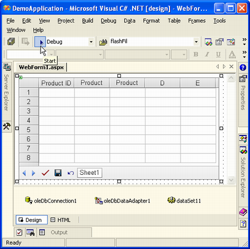

After compilation, the WebForm1.aspx page is opened in a browser window with all the data loaded from the database.
**Data loaded into the GridWeb control from the database** 

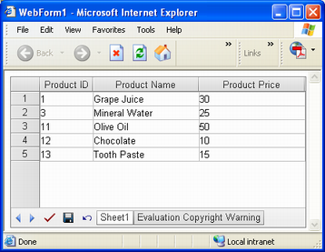
### **Working with the GridWeb Control**
When data is loaded into the GridWeb control it provides users with control over the data. A number of different types of of data manipulation features are offered by the GridWeb. 
#### **Data Validation**
Aspose.Cells.GridWeb automatically creates appropriate validation rules for all bound columns according to the data types defined in the database. See the validation type of a cell by hovering the cursor over it.
**Checking validation type of a cell** 

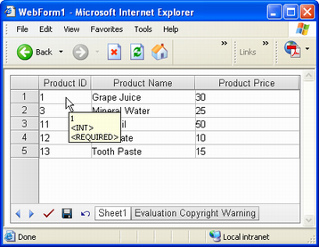

Here, the selected cell contains the **<INT>** validation, which means that users can only enter integer values into it. If they enter another value, a validation error occurs. Moreover, **<REQUIRED>** shows that the value Product ID must be submitted. 
#### **Deleting Rows**
To delete a row, select a row (or any cell in the row), right-click and select **Delete Row**.
**Selecting the Delete Row option from menu** 

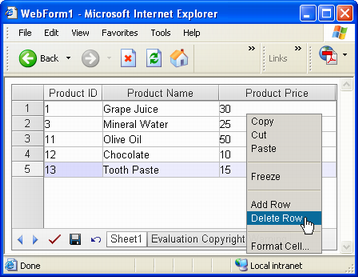

The row would be deleted instantly.
**Grid data (after a row is deleted)** 

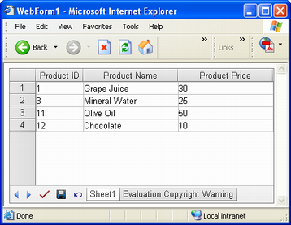
#### **Editing Rows**
Edit data in cells or rows and then click **Save** or **Submit** to save the changes. 
#### **Adding Rows**
1. To add a row, right-click a cell and select **Add Row**.
   **Selecting Add Row option from menu** 

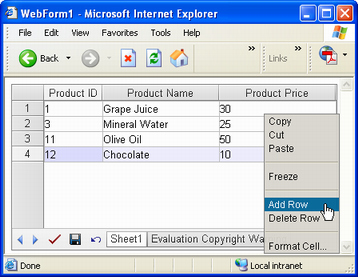

A new row is added to the sheet at the end of other rows.
**New row added to Grid** 

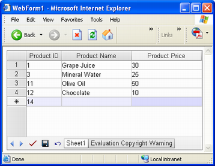

At the left of the new row is an asterisk , indicating that the row is new. 

1. Add values to the new row.
1. Click **Save** or **Submit** to confirm the change.
   **Saving changes to data by clicking *Save** button* 

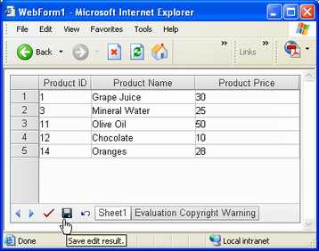
#### **Setting Number Format**
At the moment, the prices in the **Product Price** column are shown as numeric values. It is possible to make them look like currency.

1. Return to Visual Studio.NET.
1. Open the BindColumn Collection Editor.
   The **NumberType** property of the **Product Price** column is set to **General**.
   **The NumberType property set to General** 

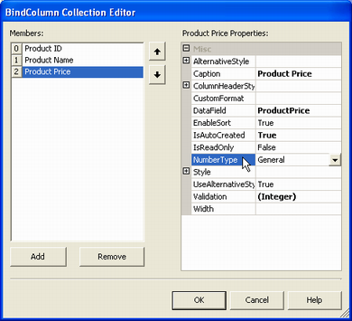

1. Click **DropDownList** and select **Currency4** from the list.
   **The NumberType property changed to Currency4** 

1. Run the application again.
   The values in the **Product Price** column is now currency.
   **Product prices in currency Number Format** 

#### **Editing Data**
The application so far only allows its users to view table data. Users can edit data in the GridWeb control but, when closing the browser and opening the database, nothing has changed. The changes made are not saved to the database. 

The following example adds code to the application so that the GridWeb can save changes to the database. 

1. Open the **Properties** pane and select the GridWeb control's SaveCommand event from the list.
   **Selecting SaveCommand event of GridWeb** 

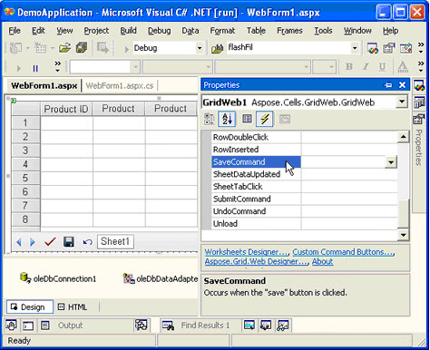

1. Double-click the **SaveCommand** event and VS.NET creates the GridWeb1_SaveCommand event handler.
1. Add code to this event handler that will update the database with any modified data in the DataSet bound to the worksheet using oleDbDataAdapter1. 

**C#**



 //Implementing the event handler for SaveCommand event

private void GridWeb1_SaveCommand(object sender, System.EventArgs e)

{

    try

    {

        //Getting the modified data of worksheet as a DataSet

        DataSet dataset = (DataSet)GridWeb1.WebWorksheets[0].DataSource;

        //Updating database according to modified DataSet

        oleDbDataAdapter1.Update(dataset);

    }

    finally

    {

        //Closing database connection

        oleDbConnection1.Close();

    }

}



**VB.NET**



 'Implementing the event handler for SaveCommand event

Private Sub GridWeb1_SaveCommand(ByVal sender As Object, ByVal e As System.EventArgs) Handles GridWeb1.SaveCommand

    Try

        'Getting the modified data of worksheet as a DataSet

        Dim dataset As DataSet = CType(GridWeb1.WebWorksheets(0).DataSource, DataSet)

        'Updating database according to modified DataSet

        oleDbDataAdapter1.Update(dataset)

    Finally

        'Closing database connection

        oleDbConnection1.Close()

    End Try

End Sub



You can also check the code added to the GridWeb1_SaveCommand event handler
**Code added to the GridWeb1_SaveCommand event handler** 

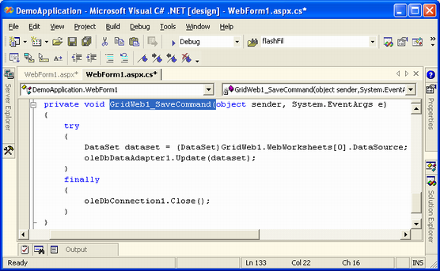

Save changes to the database using the **Save** button now definitely saves them.
##### **Conclusion**
{} 

Data binding is an important feature of Aspose.Cells.GridWeb. It's easy to bind worksheets to a database using the Worksheets Designer utility offered by Aspose.Cells.GridWeb. Aspose.Cells.GridWeb saves time and effort when creating powerful Grid solutions. 

{}
