{} 

This document is designed to provide the necessary information how we can extract data from some data source to a splendid grid like control, paste a chart in it and export the report with graph to MS Excel for making analysis, comparisons and printing.

{} 
## **Overview**
There are certain web scenarios that demand both Reporting and Presentations, a combination of parts or objects that can work together well. The article explains how easy it is to design and generate stylish excel reports dynamically in WYSIWYG manner. It exports data from an XML file (You may also utilize other data sources) to Aspose.Cells.GridWeb control which provides you the real environment that allows you to apply rich and appealing format to data and calculate formula results like MS Excel. It also generates a sophisticated chart based on the Worksheet source data using [Aspose.Cells](https://products.aspose.com/cells/) component and pastes the chart image into the Sales Report. Finally, the excel report with graph attached is saved to disk using Aspose.Cells component.

This article includes the source code and fully featured demo project for such functionality.

It allows the users with a detailed perceptive on how to create a business report to input data into a worksheet of the grid and apply some formatting to the cells in the rows and columns, embed a graph based on the source range of data before saving the excel report to the disk.
## **The Aspose Components**
I use three of [Aspose](http://www.aspose.com/)‘s components to perform the task with ease. [Aspose](http://www.aspose.com/), The .NET and Java Component Publisher, provides a variety of feature-rich components. [Aspose](http://www.aspose.com/) provides a great line of .NET and Java components. Trusted by thousands of customers worldwide, the products include File Format Components, Reporting Products, Visual Components and Utility Components that allow to programmatically open, modify, generate, save, merge, convert etc. documents in various formats including DOC, RTF, WordML, HTML, PDF, XLS, SpreadsheetML, Tab Delimited, CSV, PPT, SWF, EMF,WMF, MPX, MPD and other formats.

I would take this opportunity to introduce three of these components to you which have been used in this quest.
## **Aspose.Cells Grid Controls**
Aspose.Cells Grid Controls are a total grid solution. Aspose.Cells Grid Controls come packaged with two different GUI .NET components (Aspose.Cells.GridDesktop and Aspose.Cells.GridWeb): one to support desktop applications and other to support web applications. Both versions are equally matched in order to make implementing in either platform a snap. Aspose.Cells.GridWeb provides the ability to import from and export to Excel spreadsheets. So anyone familiar with Excel (even end-users) can design the look and feel of a grid. Aspose.Cells.GridWeb also offers an easy to use, feature-rich API which provides developers with complete control over the look, feel and behavior of their grid. To know more about the product, its features and for a programmers guide, please check the summary of Features List, Aspose.Cells.GridWeb Documentation and online featured [Demos](https://aspose.github.io/)
## **Aspose.Cells**
**Aspose.Cells** is an Excel spreadsheet reporting component that enables you to read and write Excel spreadsheets without utilizing Microsoft Excel to be installed either on the client or server side. **Aspose.Cells** is a feature rich component that offers much more than just basic exporting of data. With **Aspose.Cells** developers can export data, format spreadsheets in every detail and at every level, import images, import charts, create charts, manipulate charts, stream Excel data, save in various formats including XLS, CSV, SpreadsheetML, TabDelimited, TXT, XML ([Aspose.Pdf](https://products.aspose.com/pdf/) integrated) and many more.**Aspose.Cells** offers an easy to use, feature-rich **API** for the programmers. It has a huge list of features. To know more about the product, its features and for a programmer's guide, please check the summary of **Features List**, **Aspose.Cells Documentation** and online featured Demos. You may [download](https://downloads.aspose.com/cells) its evaluation version for free.
## **Designing the Interface**
We start creating a new Asp.Net web application in Visual Studio.Net.

I **Add Reference** to the three components i.e.Aspose.Cells.GridWeb.dll, Aspose.Chart.dll and Aspose.Cells.dll to the project first. I place some control on the page and set their properties, i.e. a drop down list, a command button and a label. I then place**Aspose.Cells.GridWeb****control**(**GridWeb**) to it from the toolbox, since after adding references to the three components, the**GridWeb**control is appeared on toolbox. The other two components (**Aspose.Chart**and**Aspose.Cells**) are just libraries, only get referenced to the project.

I also create two folders"file"and"images", add"Products.xml"and"chart.gif"to these folders respectively. The xml file is a data source file from which the data will be extracted to fill the**GridWeb**worksheet. The image file will provide an image for a custom button placed on the**GridWeb**control.

I, now, create a custom command button. I simply right-click on the**GridWeb**control and click"Custom Command Buttons…"option.

It will activate Custom Command Button editor, the editor allows you to create custom command image buttons with tool tip attached. I specify the values for some properties of the button e.g., Command (Name) ->"btnChart", ImageUrl -> give the path to the image file ("chart.gif") and ToolTip -> give the tool tip.

So, the custom command button is added as you may see it (encircled with red color) in the following screen shot.

|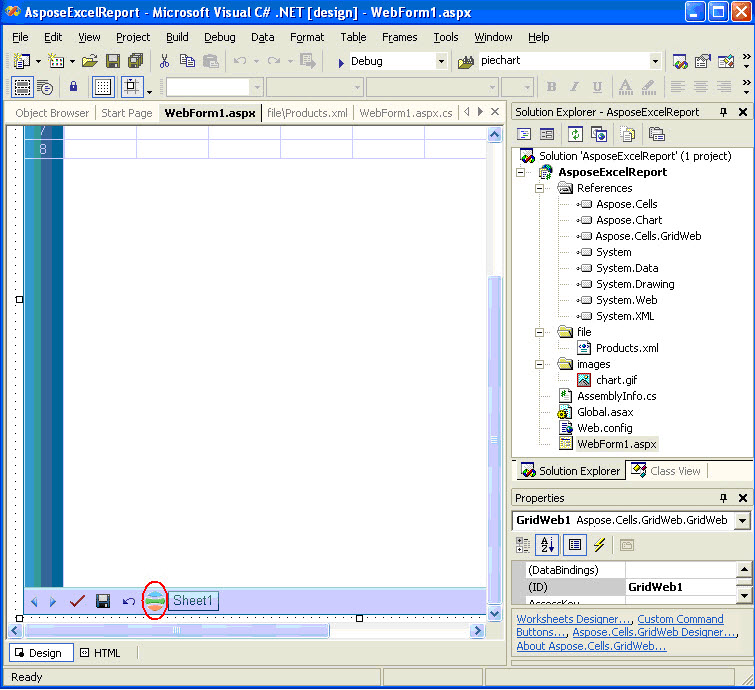|
| :- |

Finally, I set some Font attributes (bold) for the label and command button. I also adjust the size of the controls to get the final look.

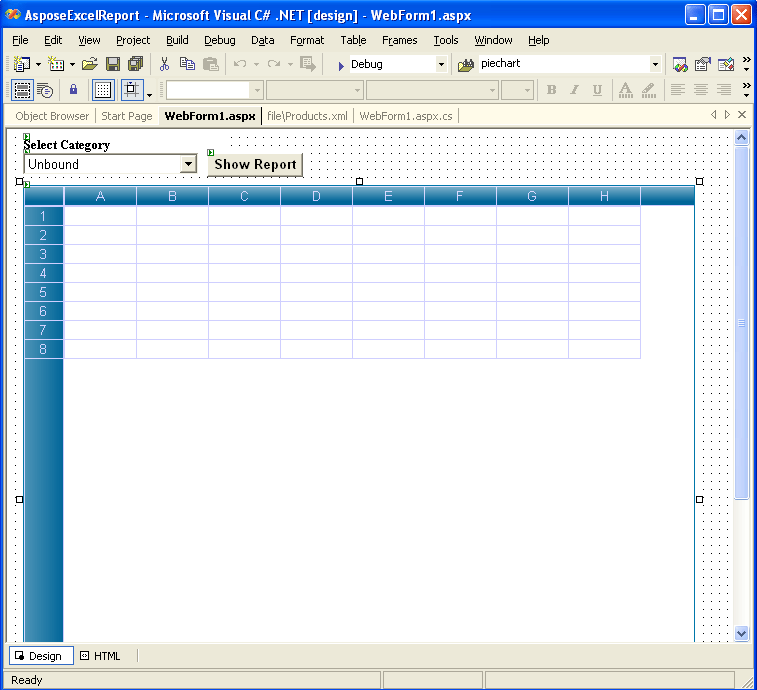
## **Retrieving Data from an XML File**
Following is XML file structure used in the project.
### **XML File Structure**
**XML**



 <?xml version="1.0" standalone="yes"?>

<SalesData>

  <Products>

    <ProductName>Data</ProductName>

    <QuantityPerUnit>Data</QuantityPerUnit>

    <CategoryName>Data</CategoryName>

    <UnitPrice>Data</UnitPrice>

    <Sale>Data</Sale>

  </Products>

 .........

</SalesData>





 private void Page_Load(object sender, System.EventArgs e)

{

if (!IsPostBack)

{

	// Uncomment the code below when you have purchased license

	// for Aspose.Cells.GridWeb, Aspose.Chart and Aspose.Cells. You need

	// to deploy the licenses in the same folder as your executable,

      // alternatively you can add the license files as an embedded

      // resource to your project.

	//

	// Set the license for Aspose.Cells.GridWeb

	// Aspose.Cells.GridWeb.License gridwebLicense = new

	// Aspose.Cells.GridWeb.License();

	// gridwebLicense.SetLicense("Aspose.Grid.lic");

	//

	// // Set the license for Aspose.Chart

	// Aspose.Chart.License chartLicense = new

	// Aspose.Chart.License();

	// chartLicense.SetLicense("Aspose.Chart.lic");

	//

	// // Set the license for Aspose.Cells

	// Aspose.Cells.License cellsLicense = new

	// Aspose.Cells.License();

	// cellsLicense.SetLicense("Aspose.Cells.lic");

	//Create a DataSet object.

	DataSet ds = new DataSet();

	//Get the Virtual Folder Path.

	string path = MapPath(".");

	//Reads XML data from xml file into DataSet object.

	ds.ReadXml(path + "\\file\\Products.xml");

	//Call the custom method to obtain distinct values from

	//CategoryName field and store data into an object array.

	object [] drs = GetDistinctValues(ds.Tables[0],"CategoryName");

	//Fill the drop down list with distinct field items.

	for(int i = 0;i<drs.Length;i++)

	{

		DropDownList1.Items.Add(drs[i].ToString());

	}

}

}

//This method is used to filter distinct values from CategoryName field in the datatable.

private object[] GetDistinctValues(DataTable dtable, string colName)

{

	// Create a Hashtable object.

	Hashtable hTable = new Hashtable();

	// Loop through the datatable rows and add distinct values to

	// Hashtable object minimizing the duplicates in the field.

	foreach (DataRow drow in dtable.Rows)

	if(!hTable.ContainsKey(drow[colName]))

	hTable.Add(drow[colName], string.Empty);

	// Create an object array based on the distinct key values of the Hashtable object.

	object[] objArray = new object[hTable.Keys.Count];

	// Copy the disctinct values to fill the array.

	hTable.Keys.CopyTo(objArray, 0);

	// Return the array object.

	return objArray;

}


## **Filling the Worksheet of the Aspose.Cells.GridWeb control with Data**
I use some API of the**GridWeb**control to fill a worksheet with data from the source XML file. I write code in the command button (labeled"Show Report") 's click event handler. The data report is filtered based on the selected item from drop down list.



 //Clears datasheets of the GridWeb control.

GridWeb1.WebWorksheets.Clear();

//Create a DataSet object.

DataSet ds = new DataSet();

//Get the Virtual Folder path.

string path = MapPath(".");

//Reads XML data from xml file into DataSet object.

ds.ReadXml(path + "\\file\\Products.xml");

//Create a DataView based on the datatable.

DataView dv = new DataView(ds.Tables[0]);

//Filter data in the DataView object based on the selected drop down list item.

dv.RowFilter = "CategoryName ='" + DropDownList1.SelectedItem.Text + "'";

//Importing data from the filtered DataView object to create and

//fill "Products" Worksheet start from A4 cell.

GridWeb1.WebWorksheets.ImportDataView(dv, null, null,"Products",3,0);


## **Formatting Data in the Cells**
To distinguish between different types of information on a worksheet, for the optimal display of the data on your worksheet and to make a worksheet easier to scan, you format the worksheet. A**Format**represents a style and is defined as a set of characteristics, such as fonts and font sizes, number formats, cell borders, cell shading with solid background color or a specific color pattern, indentation, alignment and text orientation in the cells.

I amalgamate some more lines of code to above. I place the title / sub title of the report, do some formatting to title, sub title and detail cells. I also apply number formatting to the two fields (set currency numberformat to UnitPrice and Sale fields) and adjust the height/ width of rows and columns using**Aspose.Cells.GridWeb**API.



 //Create the title cell (A1) in the sheet and apply formattings.

//The following lines input a string value to the cell, specify

//font size, specify horizontal and vertical align settings, set

//foreground and background colors and merge cells (A1:E2).

WebWorksheet sheet = GridWeb1.WebWorksheets[0];

sheet.Cells["A1"].PutValue("Product Sales By Category");

sheet.Cells["A1"].Style.Font.Size = new FontUnit("20pt");

sheet.Cells["A1"].Style.HorizontalAlign = HorizontalAlign.Center;

sheet.Cells["A1"].Style.VerticalAlign = VerticalAlign.Middle;

sheet.Cells["A1"].Style.BackColor = Color.SkyBlue;

sheet.Cells["A1"].Style.ForeColor = Color.Blue;

sheet.Cells.Merge(0, 0, 2, 5);

//Create the subtitle cell (A3) in the sheet and apply formattings.

//The following lines input a string value to the cell, specify

//font size with attributes, specify horizontal and vertical align

//settings, set foreground and background colors and merge cells

//(A3:E3).

sheet.Cells["A3"].PutValue(DropDownList1.SelectedItem.Text);

sheet.Cells["A3"].Style.Font.Size = new FontUnit("13pt");

sheet.Cells["A3"].Style.Font.Bold = true;

sheet.Cells["A3"].Style.Font.Italic = true;

sheet.Cells["A3"].Style.HorizontalAlign = HorizontalAlign.Left;

sheet.Cells["A3"].Style.VerticalAlign = VerticalAlign.Middle;

sheet.Cells["A3"].Style.BackColor = Color.SeaGreen;

sheet.Cells["A3"].Style.ForeColor = Color.Yellow;

sheet.Cells.Merge(2, 0, 1, 5);

//Obtain the last row and column (which contain data) indexes.

int totalrow = sheet.Cells.MaxRow +1;

int totalcol = sheet.Cells.MaxColumn;

//Get the sheet Cells collections

WebCells cells = sheet.Cells;

//Define the Cell object.

WebCell cell;

//Loop through the data in the sheet and format two fields with

//Currency number style.

for (int i = 4;i<=totalrow;i++)

{

	//Format the Sale Column.

	cell = cells[i,totalcol];

	cell.PutValue(cell.StringValue,true);

	cell.NumberType = NumberType.Currency1;

	//Format the UnitPrice Column.

	cell = cells[i,totalcol-1];

	cell.PutValue(cell.StringValue,true);

	cell.NumberType = NumberType.Currency1;

}

//Insert the Total row with data, formula and formatting style.

//It will calculate the total Sales of a Category.

cells[totalrow,0].PutValue( DropDownList1.SelectedItem.Text + " Total" );

cells[totalrow,0].Style.Font.Bold = true;

cells[totalrow,totalcol].Formula = "=SUM(E5:E" + totalrow.ToString() + ")";

cells[totalrow,totalcol].Style.Font.Bold = true;

//Specify some Row and Column formattings. It will set row height

//and column width accordingly.

cells.SetRowHeight(2, new Unit("17pt"));

cells.SetColumnWidth(0, new Unit("157pt"));

cells.SetColumnWidth(1, new Unit("106pt"));

cells.SetColumnWidth(2, new Unit("87pt"));

cells.SetColumnWidth(3, new Unit("56pt"));

cells.SetColumnWidth(4, new Unit("50pt"));


## **Producing the formatted Report (.XLS File) with Graph using Aspose.Cells component**
Now, I will write some code to save the formatted report with graph to disk. I utilize**GridWeb** 's**Save**button, The**GridWeb** 's**SaveCommand**event is fired when you click on the Save button, so, I will handle it. Here, I use**Aspose.Cells**component to export the formatted report to MS Excel, generate chart and embed it into the output excel file. I have not inserted the chart image (created by**Aspose.Chart**component) rather create the similar chart using the API of**Aspose.Cells**, so that you may edit chart in MS Excel for your need.



 //This GridWeb control event is fired when you click on the "Save" button

//of the control. After Clicking this button "File Download" dialog is

//displayed and you may open into MS Excel / save the output excel file //with graph to disk.

private void GridWeb1_SaveCommand(object sender, System.EventArgs e)

{

	//Create MemoryStream object.

	System.IO.MemoryStream ms = new System.IO.MemoryStream();

	//Save the GridWeb's Report to the stream.

	this.GridWeb1.WebWorksheets.SaveToExcelFile(ms);

	//Create a new Workbook.

	Workbook workbook = new Workbook();

	//Open the stream into the Workbook.

	workbook.Open(ms);

	//Call the custom method which creates Chart.

	Workbook book = CellsChart(workbook);

	//Save the excel file displaying "File Download" dialog box.

	book.Save(ms, FileFormatType.Default);

	this.Response.ContentType = "application/vnd.ms-excel";

	this.Response.AddHeader("content-disposition", "attachment; filename=Export.xls");

	this.Response.BinaryWrite(ms.ToArray());

}

//This custom method is used to create the Chart based on the data source

//range in the GridWeb control. In this method we will use Aspose.Cells

//APIs to create the graph which will be saved later into the output //excel file.

private Workbook CellsChart(Workbook workbook)

{

	//Get the first Worksheet.

	Aspose.Cells.Worksheet sheet = workbook.Worksheets[0];

	//Get the Cells collection in the sheet.

	Aspose.Cells.Cells cells = workbook.Worksheets[0].Cells;

	//Get the last row index.

	int maxrow = sheet.Cells.MaxDataRow;

	//Unmerge the cells.

	sheet.Cells.UnMerge(maxrow,0,15,10);

	int chartIndex = 0;

	//Add a new Chart into the sheet's Chart Collection.

chartIndex = sheet.Charts.Add(Aspose.Cells.ChartType.Pie,maxrow,0,maxrow+28,5);

	//Get the Chart object.

	Aspose.Cells.Chart chart = sheet.Charts[chartIndex];

	//Set the Chart Area.

	Aspose.Cells.ChartArea chartarea = chart.ChartArea;

	chartarea.Area.Formatting = FormattingType.Custom;

	chartarea.Border.IsVisible = false;

		chartarea.Area.FillFormat.SetTwoColorGradient(Color.PowderBlue, Color.LightSkyBlue, GradientStyleType.FromCenter,1);

	//Set some properties of Chart Plot Area.

	chart.PlotArea.Area.Formatting = FormattingType.None;

	chart.PlotArea.Border.IsVisible = false;

	//Set properties of Chart Title.

	chart.Title.Text = DropDownList1.SelectedItem.Text + " Sales";

	chart.Title.TextFont.Size = 20;

	//Set properties of NSeries

	int lastdatarow = maxrow-1;

	chart.NSeries.Add("E5:E" + lastdatarow.ToString(), true);

	chart.NSeries.CategoryData = "A5:A" + lastdatarow.ToString();

	//Set the Data Labels in the chart

	Aspose.Cells.DataLabels datalabels;

	for ( int i = 0; i < chart.NSeries.Count ;i ++ )

	{

		datalabels = chart.NSeries[i].DataLabels;

		datalabels.Postion = Aspose.Cells.LabelPositionType.Center;

		datalabels.IsPercentageShown = true;

	}

	//Set the Legend settings.

	Aspose.Cells.Legend legend = chart.Legend;

	legend.Position = Aspose.Cells.LegendPositionType.Bottom;

	legend.Height = 85;

	legend.Width = 330;

	legend.AutoScaleFont = true;

	legend.Border.Color = Color.Blue;

	legend.Area.Formatting = FormattingType.Custom;

	FillFormat fillformat = legend.Area.FillFormat;

	legend.Area.Formatting = FormattingType.None;

	legend.Border.IsVisible = false;

	//Autofit the first column.

	sheet.AutoFitColumn(0);

	//Return the Workbook.

	return workbook;

}


## **Running the Application**
Now, I run the application. The drop down list is filled with the distinct categories.

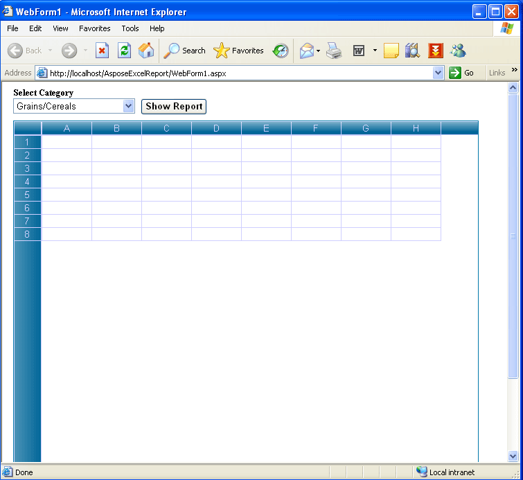

I select a category by which I want to show the sales report and click the"Show Report"button.

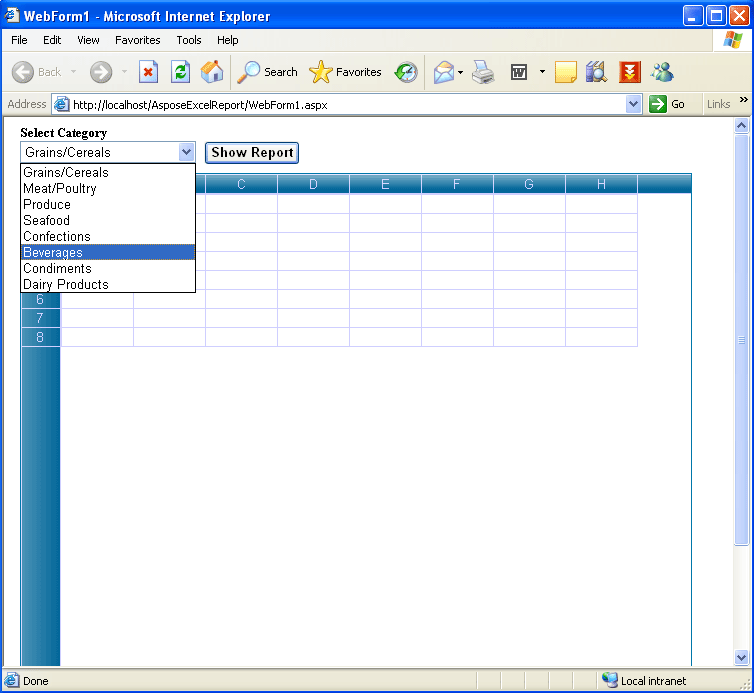

So, the report is shown into the**GridWeb**based on the selected category. The report is formatted by default based on the code (written earlier).

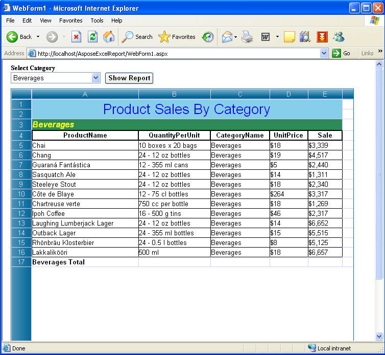

If you want to format data into some of the cells in WYSIWYG manner, you may do it quite easily.**Aspose.Cells.GridWeb**provides**Format Cells**editor, select your desired cell(s) and right-click on it, click the"Format Cell…"option.

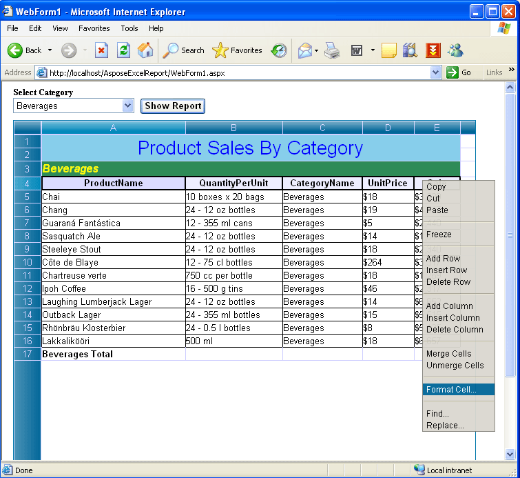

The Format Cell dialog is shown.

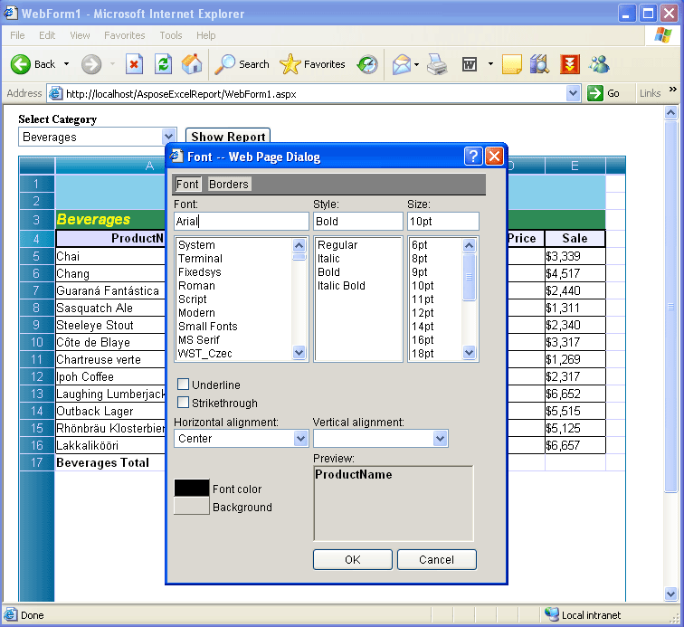

I specify some Font attributes and click OK.

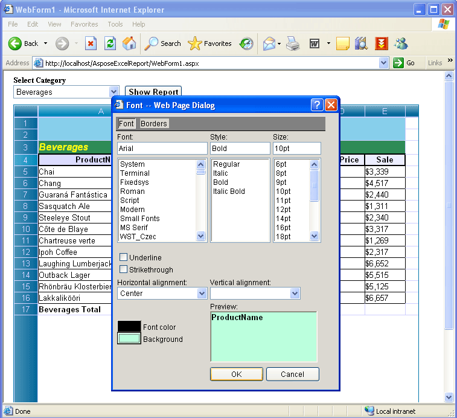

And get the result.

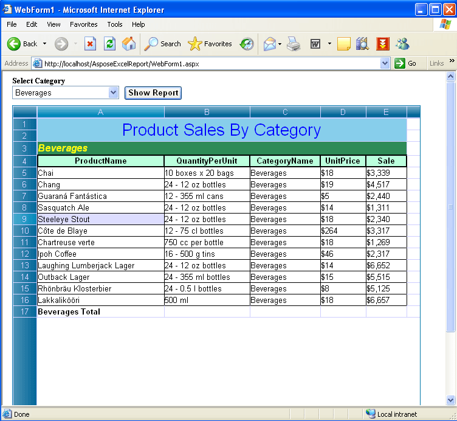

Apart from cells formatting, you can also edit your cell values. Double-click on your desired cell(s) and edit the value.

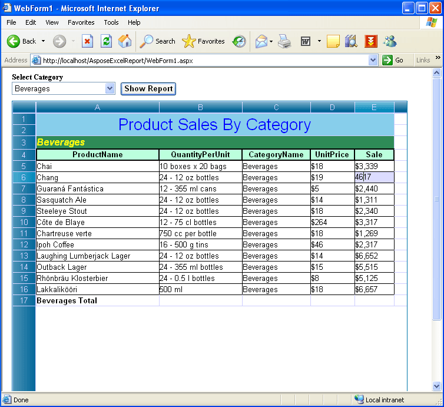

For submitting the edit result and recalculating all the formula, I click the related button (encircled with red color) to update the report.

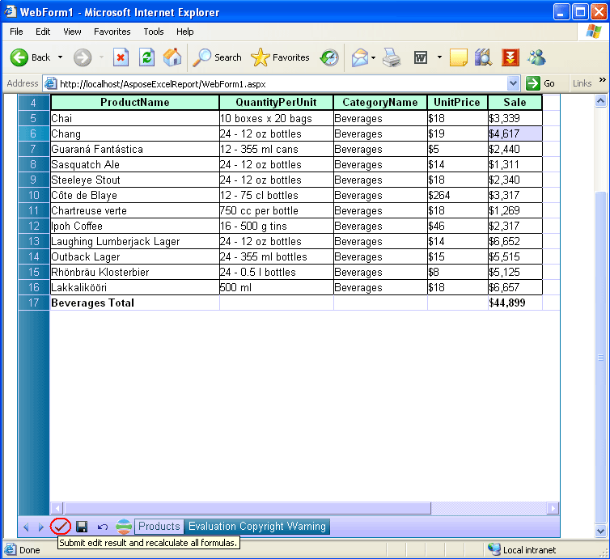

Now I will create the chart and paste it into the control. I click the custom command button (encircled with red color) to create the pie chart based on the data range.

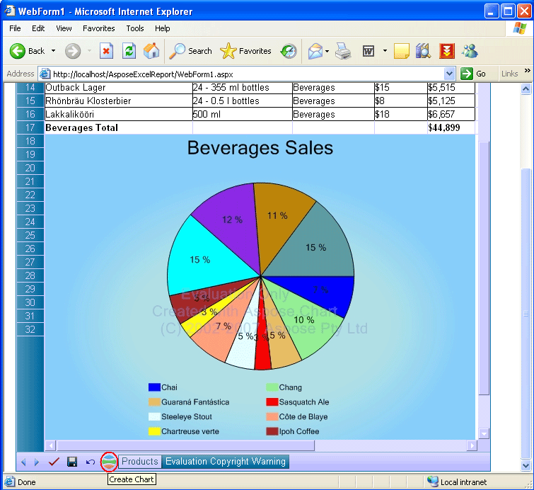

Finally, I will export this data report with graph to MS Excel. I click the**Save**button (encircled with red color). Clicking on the**Save**button will display**File Download**dialog, you may either**Open**the resultant report (output excel file with graph) into MS Excel or Save it to the disk.

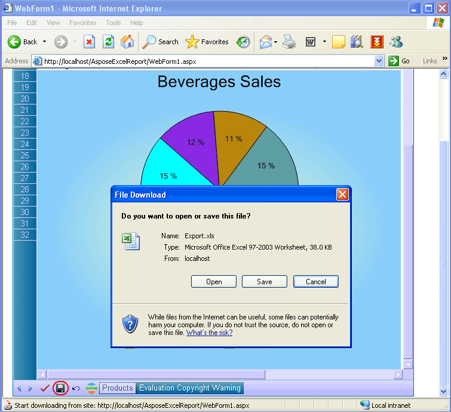

When I click on Open button (File Download dialog), the excel report with graph is exported to MS Excel. The upper portion of the report is shown.

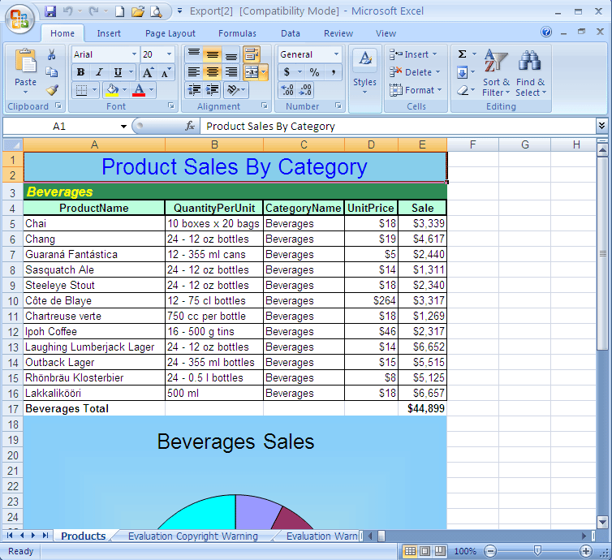

The lower portion of the excel report is shown.

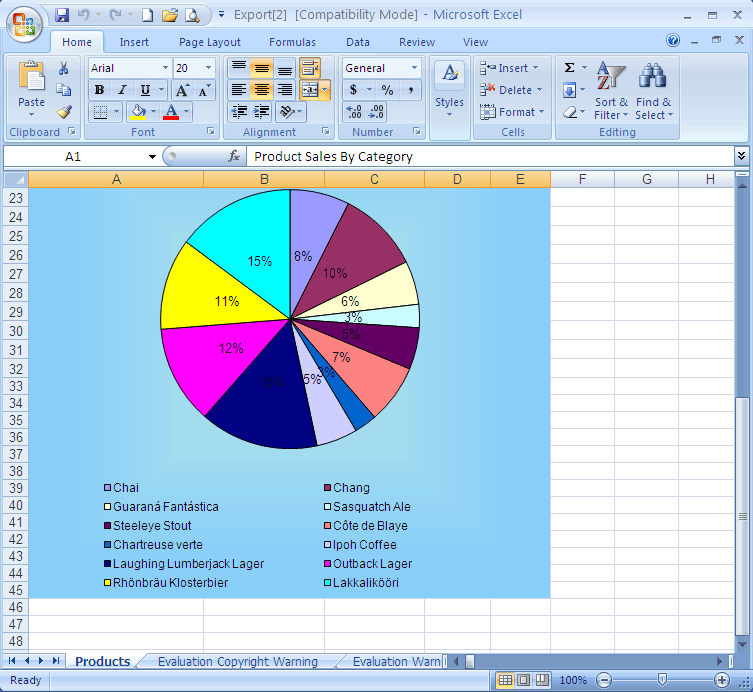
