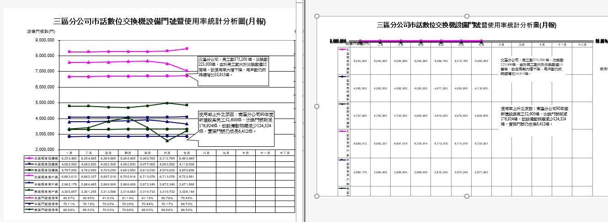
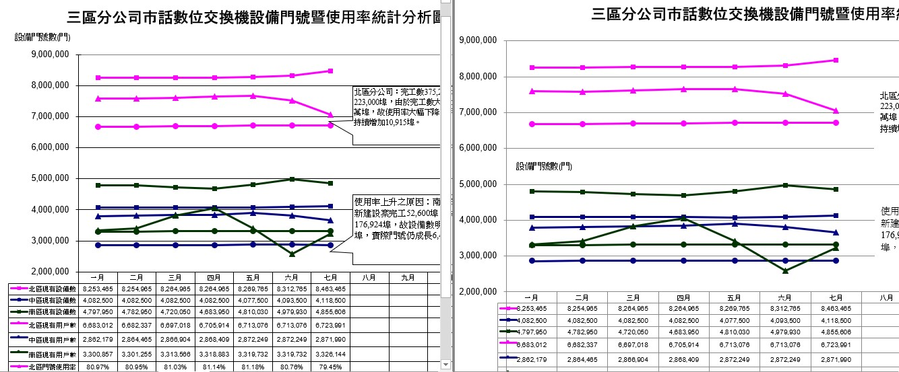

## **Convert XLS to XLSX with Combo Chart**
Sometimes converting XLS file with combo charts generated by older versions of MS Excel to XLSX resulted in the chart being flattened. With the release of Aspose.Cells for .NET 19.7, this issue has been addressed and the charts are rendered correctly. The following screenshots compare the results of XLSX files generated before and after the update.

**The result before the update**

**The result after the update**

****
## **Sample Code**

