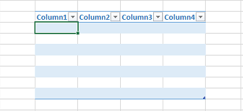

{}

Normally, you add values inside the Table or List Object using [**Cell.PutValue()**](https://apireference.aspose.com/cells/net/aspose.cells/cell/methods/putvalue/index) method. But sometimes, you might need to add values inside the Table or List Object using the row and column offsets.

In order to access Table or List Object from a cell, use the [**Cell.GetTable()**](https://apireference.aspose.com/cells/net/aspose.cells/cell/methods/gettable) method. To add values inside it using the row and column offsets, use the [**ListObject.PutCellValue**](https://apireference.aspose.com/cells/net/aspose.cells.tables/listobject/methods/putcellvalue) method.

{}

The following screenshot shows the source Excel file used inside the code. It contains the empty table and highlights the cell D5 which lies inside the table. We will access this table from cell D5 using [**Cell.GetTable()**](https://apireference.aspose.com/cells/net/aspose.cells/cell/methods/gettable) method and then add the values inside it using both [**Cell.PutValue()**](https://apireference.aspose.com/cells/net/aspose.cells/cell/methods/putvalue/index) and [**ListObject.PutCellValue**](https://apireference.aspose.com/cells/net/aspose.cells.tables/listobject/methods/putcellvalue) methods.

## Example

### Screenshots comparing the source and output files

||
| :- |

The following screenshot shows the output Excel file generated by the code. As you can see cell D5 has a value and cell F6 which is at the offset 2,2 of the table has a value.

||
| :- |

### C# code to access table from cell and to add values inside it using row and column offsets

The following sample code loads the source Excel file as shown in the above screenshot and adds values inside the table and generates the output Excel file as shown above.


