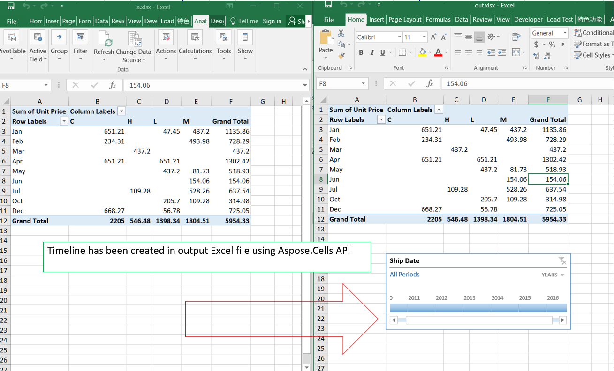

## **Possible Usage Scenarios**

Instead of adjusting filters to show dates, you can use a PivotTable Timeline——a dynamic filter option that lets you easily filter by date/time, and zoom in on the period you want with a slider control. Microsoft Excel allows you to create timeline by selecting a pivot table and then clicking the *Insert > Timeline*. Aspose.Cells also allows you to create timeline using the [**Worksheet.Timelines.Add()**](https://apireference.aspose.com/cells/net/aspose.cells.timelines/timelinecollection/methods/index) method.

## **Create Timeline to a Pivot Table**

Please see the following sample code. It loads the [sample Excel file](input.xlsx) that contains the pivot table. It then creates the timeline based on the first base pivot field. Finally, it saves the workbook in [output XLSX](output.xlsx) format. The following screenshot shows the timeline created by Aspose.Cells in the output Excel file.

### **Sample Code**

