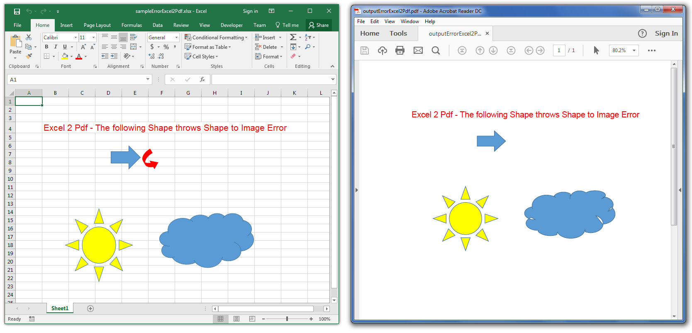

## **Possible Usage Scenarios**

Sometimes when you convert your Excel file to PDF, errors or exceptions occur and the conversion process terminates. You can ignore all such errors during the conversion process by using the [**PdfSaveOptions.IgnoreError**](https://apireference.aspose.com/cells/net/aspose.cells/pdfsaveoptions/properties/ignoreerror) property. This way, the conversion process will complete smoothly without throwing any error or exception but the loss of data may occur. Therefore, please use this property only if the loss of data is not critical for you.

## **Ignore Errors while Rendering Excel to PDF**

The following code loads the [sample Excel file](55541778.xlsx) but the sample Excel file is erroneous and throws an error during [conversion to PDF](55541779.pdf) in 17.11 but since we are using [**PdfSaveOptions.IgnoreError**](https://apireference.aspose.com/cells/net/aspose.cells/pdfsaveoptions/properties/ignoreerror) property, it does not throw an error. However, one *rounded red arrow like shape* as shown in this screenshot is lost.

## **Sample Code**


