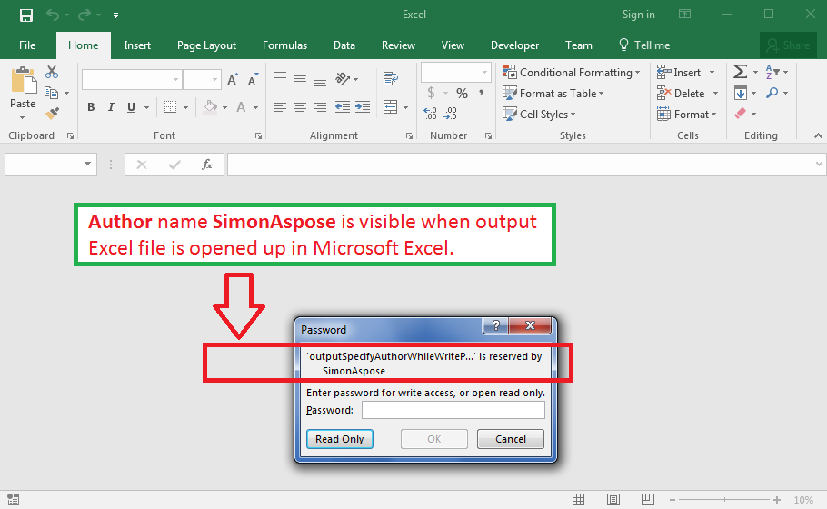

## **Possible Usage Scenarios**

You can specify author name while write protecting your workbook using Aspose.Cells API. Please use [**Workbook.Settings.WriteProtection.Author**](https://apireference.aspose.com/cells/net/aspose.cells/writeprotection/properties/author) property for this purpose.

## **Specify Author while Write Protecting Workbook**

The following sample code explains the usage of [**Workbook.Settings.WriteProtection.Author**](https://apireference.aspose.com/cells/net/aspose.cells/writeprotection/properties/author) property. The code creates an empty workbook, write protects it with a password, specifies the author name and saves it as [output Excel file](67338582.xlsx). The following screenshot illustrates the effect of the sample code on the output Excel file for your reference.

## **Sample Code**


