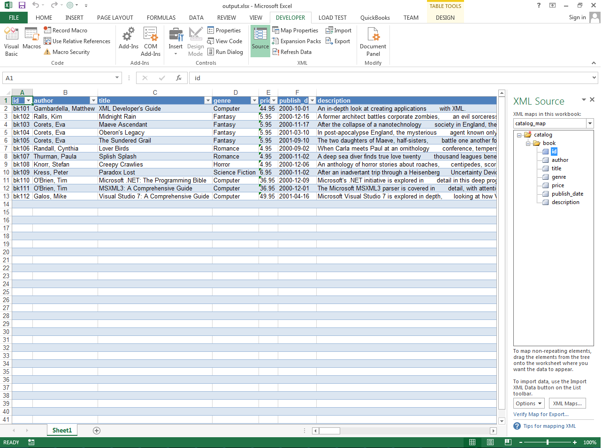

{}

Aspose.Cells allows you to import the XML map inside the workbook using the [**Workbook.ImportXml()**](https://apireference.aspose.com/cells/net/aspose.cells/workbook/methods/importxml/index) method. You can import XML Map using the Microsoft Excel with the following steps

- Select **Developer** tab
- Click **Import** in the XML section and follow the required steps.

You will need to provide your XML data to complete the import. Here is a [sample XML data](5115037.txt) that you can use for testing.

{}

## **Import XML Map using Microsoft Excel**

The following screenshot shows how to import XML Map using Microsoft Excel.

||
| :- |

## **Import XML Map using Aspose.Cells**

The following sample code shows how to make use of the [**Workbook.ImportXml()**](https://apireference.aspose.com/cells/net/aspose.cells/workbook/methods/importxml/index). It generates the [output excel file](5115036.xlsx) as shown in this screenshot.

||
| :- |


