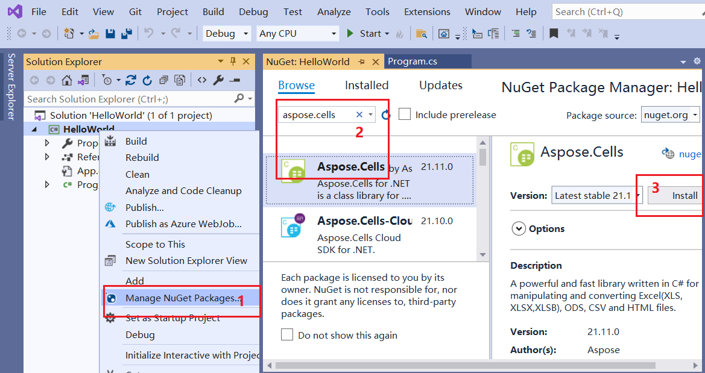
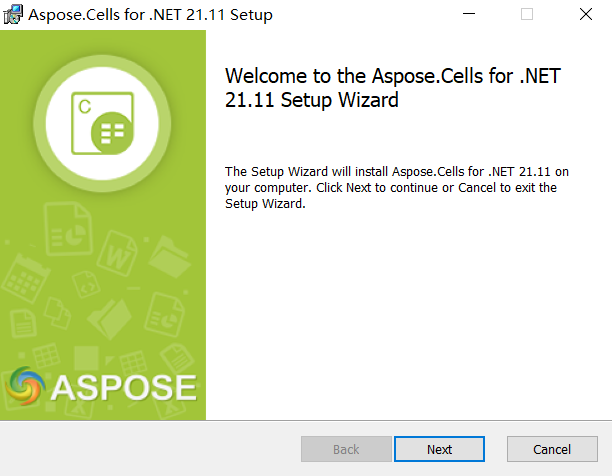

{} 

This page will show you how to install Aspose Cells, and create a Hello World application.

{}

## **How To Install**

### **Install Aspose Cells through NuGet.**

NuGet is the easiest way to download and install Aspose.Cells for .NET. 

1. Open Microsoft Visual Studio and NuGet package manager. 
1. Search "aspose.cells" to find the desired Aspose.Cells for .NET. 
1. Click on "Install", Aspose.Cells for .NET will be downloaded and referenced in your project.

****

You can also download it from the nuget web page for aspose.cells: 
[Aspose.Cells for .NET NuGet Package](https://www.nuget.org/packages/Aspose.Cells/)

[More step for details](/cells/net/installation/)

### **Install Aspose Cells on windows.**

1. Download Aspose.Cells.msi from the following page:
[Download Aspose.Cells.msi](https://downloads.aspose.com/cells/net/)
1. Double-click the Aspose Cells msi and follow the instructions to install it:

****

[More step for details](/cells/net/installing-aspose-cells-on-windows/)

### **How to use Aspose Cells on linux or MAC OS.**

Please install Aspose Cells through nuget, you can use VSCode on linux, and Visual Studio for Mac on MAC OS.

Note: Aspose.Cells For .NetStandard can support your requirement on linux or MAC OS.

Applies to: NetStandard2.0, NetCore2.1, NetCore3.1, Net5.0 and advanced version.

### **How to run Aspose Cells on Docker.**

[How to Run Aspose Cells on Docker](/cells/net/how-to-run-aspose-cells-in-docker/)

## **Creating the Hello World Application**

The steps below creates the Hello World application using the Aspose.Cells API:

1. Create an instance of the [Workbook](https://apireference.aspose.com/cells/net/aspose.cells/workbook) class.
1. If you have a license, then [apply it](/cells/net/licensing/).
   If you are using the evaluation version, skip the license related code lines.
1. Create a new Excel file, or open an existing Excel file.
1. Access any desired cell of a worksheet in the Excel file.
1. Insert the words **Hello World!** into a cell accessed.
1. Generate the modified Microsoft Excel file.

The implementation of the above steps is demonstrated in the examples below.

### **Code Sample: Creating a New Workbook**

The following example creates a new workbook from the scratch, writes Hello World! into cell A1 on the first worksheet and saves the Excel file.



### **Code Sample: Opening an Existing File**

The following example opens an existing Microsoft Excel template file named "Sample.xlsx", inputs "Hello World!" text into the A1 cell in the first worksheet and saves the workbook.


