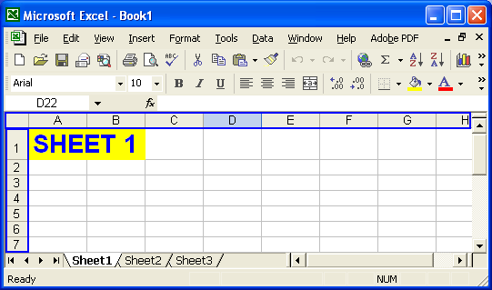
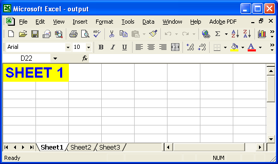

{}

All worksheets in an Excel file are composed of cells that are arranged in rows and columns. All rows and columns have unique values that are used to identify them, and to identify individual cells. For example, rows are numbered – 1, 2, 3, 4, etc. – and columns are ordered alphabetically – A, B, C, D, etc. The row and column values are displayed in the headers. Using Aspose.Cells, developers can control the visibility of these row and column headers.

{}

## **Controlling the Visibility of the Worksheets**

Aspose.Cells provides a class, [**Workbook**](https://reference.aspose.com/cells/net/aspose.cells/workbook), that represents a Microsoft Excel file. The [**Workbook**](https://reference.aspose.com/cells/net/aspose.cells/workbook) class contains a [**Worksheets**](https://reference.aspose.com/cells/net/aspose.cells/workbook/properties/worksheets) collection that allows access to each worksheet in an Excel file.

A worksheet is represented by the [**Worksheet**](https://reference.aspose.com/cells/net/aspose.cells/worksheet) class. The [**Worksheet**](https://reference.aspose.com/cells/net/aspose.cells/worksheet) class provides a wide range of properties and methods for managing worksheets. To control the visibility of row and column headers, use the [**Worksheet**](https://reference.aspose.com/cells/net/aspose.cells/worksheet) class' [**IsRowColumnHeadersVisible**](https://reference.aspose.com/cells/net/aspose.cells/worksheet/properties/isrowcolumnheadersvisible) property. [**IsRowColumnHeadersVisible**](https://reference.aspose.com/cells/net/aspose.cells/worksheet/properties/isrowcolumnheadersvisible) is a Boolean property, which means that it can only store a **true** or **false** value.

A complete example is given below that shows how to use the [**Worksheet**](https://reference.aspose.com/cells/net/aspose.cells/worksheet) class' [**IsRowColumnHeadersVisible**](https://reference.aspose.com/cells/net/aspose.cells/worksheet/properties/isrowcolumnheadersvisible) property to hide row and column headers on the first worksheet in a file.

The screenshot shows Book1.xls, the input file. It contains three worksheets: Sheet1, Sheet2 and Sheet3. Each worksheet is showing row and column headers.

**Book1.xls: worksheet before modification**

Book1.xls is opened by calling the Workbook class' Open method and the row and column headers on the first worksheet are hidden. The modified file is saved as output.xls.

**Output.xls: worksheet after modification** 

**C#**



 //Creating a file stream containing the Excel file to be opened

FileStream fstream = new FileStream("book1.xls", FileMode.Open);

//Instantiating a Workbook object

//Opening the Excel file through the file stream

Workbook workbook = new Workbook(fstream);

//Accessing the first worksheet in the Excel file

Worksheet worksheet = workbook.Worksheets[0];

//Hiding the headers of rows and columns

worksheet.IsRowColumnHeadersVisible = false;

//Saving the modified Excel file

workbook.Save("output.xls");

//Closing the file stream to free all resources

fstream.Close();



## **Download Running Code**
- [GitHub](https://github.com/aspose-cells/Aspose.Cells-for-.NET/tree/master/Plugins/Aspose.Cells%20Vs%20VSTO%20Spreadsheets/Aspose.Cells%20Features%20missing%20in%20VSTO/Display%20or%20Hide%20Row%20Column%20Headers)

## **Download Sample Code**
- [GitHub](https://github.com/aspose-cells/Aspose.Cells-for-.NET/releases/tag/MissingFeaturesAsposeCellsForVSTO1.1)
