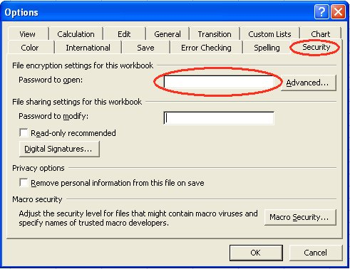
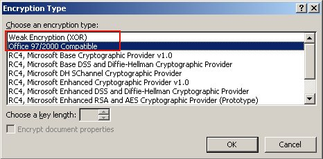

{} 

Complex financial worksheets, especially ones developed in collaboration, can hide the most embarrassing errors. Checking formulas for accuracy and finding the source of an error can be difficult when the formula uses precedent cells and dependent cells.

- **Precedent cells** are cells that are referred to by a formula in another Cell. For example, if cell D10 contains the formula =B5, cell B5 is a precedent to cell D10.
- **Dependent cells** contain formulas that refer to other cells. For example, if cell D10 contains the formula =B5, cell D10 is a dependent of cell B5.

To make the spreadsheet easy to read, you might want to clearly show which cells on a spreadsheet are used in a formula. Similarly, you may want to extract the dependent cells of other cells.

Aspose.Cells allows you to trace cells and find out which are linked.

{} 
## **Tracing Precedent and Dependent Cells: Microsoft Excel**
Formulas may change based on modifications made by a client. For example, if cell C1 is dependent on C3 and C4 containing a formula, and C1 is changed (so the formula is overriden), C3 and C4, or other cells, need to change to balance the spreadsheet based on business rules.

Similarly, suppose C1 contains the formula "=(B1*22)/(M2*N32)". I want to find the cells that C1 depends on, that is the precedent cells B1, M2 and N32.

You might need to trace the dependency of a particular cell to other cells. If business rules are embedded in formulas, we would like to find out the dependency and execute some rules based on it. Similarly if the value of a particular cell is modified, which cells in the worksheet are impacted by that change?

Microsoft Excel allows users to trace precedents and dependents.

1. On the **View Toolbar**, select **Formula Auditing**.
   The Formula Auditing dialog is displayed. 
   **The Formula Auditing dialog** 

1. Trace Precedents:
   1. Select the cell that contains the formula for which you want to find precedent cells.
   1. To display a tracer arrow to each cell that directly provides data to the active cell, click **Trace Precedents** on the **Formula Auditing** toolbar.
1. Trace formulas that reference a particular cell (dependents)
   1. Select the cell for which you want to identify the dependent cells.
   1. To display a tracer arrow to each cell that is dependent on the active cell, click Trace Dependents on the Formula Auditing toolbar.
## **Tracing Precedent and Dependent Cells: Aspose.Cells**
### **Tracing Precedents**
Aspose.Cells makes it easy to get precedent cells. Not only can it retrieve cells that provide data to a simple formula precedents but also find cells that provide data to a complex formula precedents with named ranges.

In the example below, a template excel file, Book1.xls, is used. The spreadsheet has data and formulas on the first Worksheet.

**The input spreadsheet** 

Aspose.Cells provides the Cell class' GetPrecedents method used to trace a cell's precedents. It returns an ReferredAreaCollection. As you can see above, in Book1.xls, cell B7 contains a formula "=SUM(A1:A3)". So cells A1:A3 are the precedent cells to cell B7. The following example demonstrates the tracing precedents feature using the template file Book1.xls.

**C#**



 //Instantiating a Workbook object

Workbook workbook = new Workbook("book1.xls");

Cells cells = workbook.Worksheets[0].Cells;

Aspose.Cells.Cell cell = cells["B7"];

//Tracing precedents of the cell B7.

//The return array contains ranges and cells.

ReferredAreaCollection ret = cell.GetPrecedents();

//Printing all the precedent cells' name.

if(ret != null)

{

  for(int m = 0 ; m < ret.Count; m++)

  {

    ReferredArea area = ret[m];

    StringBuilder stringBuilder = new StringBuilder();

    if (area.IsExternalLink)

    {

        stringBuilder.Append("[");

        stringBuilder.Append(area.ExternalFileName);

        stringBuilder.Append("]");

     }

     stringBuilder.Append(area.SheetName);

     stringBuilder.Append("!");

     stringBuilder.Append(CellsHelper.CellIndexToName(area.StartRow, area.StartColumn));

     if (area.IsArea)

      {

          stringBuilder.Append(":");

          stringBuilder.Append(CellsHelper.CellIndexToName(area.EndRow, area.EndColumn));

      }

      Console.WriteLine(stringBuilder.ToString());

   }

}


### **Tracing Dependents**
Aspose.Cells lets you get dependent cells in spreadsheets. Aspose.Cells can not only can retrieve cells that provide data regarding a simple formula but also find cells that provide data to a complex formula dependents with named ranges.

Aspose.Cells provides the Cell class' GetDependents method used to trace a cell's dependents. For example, in Book1.xlsx there are formulas: "=A1+20" and "=A1+30" in the B2 and C2 cells respectively. The following example demonstrates how to trace the dependents for the A1 cell using the template file Book1.xlsx.

**C#**



 string path = "Book1.xlsx";

Workbook workbook = new Workbook(path);

Worksheet worksheet = workbook.Worksheets[0];

var c = worksheet.Cells["A1"];

var dependents = c.GetDependents(true);

foreach (var dependent in dependents)

{

     Debug.WriteLine(string.Format("{0} ---- {1} : {2}", dependent.Worksheet.Name, dependent.Name, dependent.Value));

}


## **Download Running Code**
- [GitHub](https://github.com/aspose-cells/Aspose.Cells-for-.NET/tree/master/Plugins/Aspose.Cells%20Vs%20VSTO%20Spreadsheets/Aspose.Cells%20Features%20missing%20in%20VSTO/Tracing%20Precedents%20and%20Dependents)
## **Download Sample Code**
- [GitHub](https://github.com/aspose-cells/Aspose.Cells-for-.NET/releases/tag/MissingFeaturesAsposeCellsForVSTO1.1)

