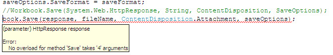

## **Symptom**
"Using Aspose.Cells version, I get this error when I use the Save method when trying to save workbook to Response object. I find this code snippet documented in the online documentation."
### **Screenshot of Error**

### **Solution**
Please use **.NET 2.0** compiled version of the product as it works fine on VS.NET 2008/2010. Actually we provide separate dll's for different environments, project types and systems etc. For reference, please check:<http://www.aspose.com/docs/display/cellsnet/Using+Aspose.Cells+on+32-bit+and+64-bit+Platforms>

Aspose.Cells for .NET is compatible and works fine with all the .NET framework versions i.e. 2.x, 3.x, 4.x etc. for any type of project e.g Asp.NET/Winforms, Web project, Windows/Web Service, console application or other projects etc. We provide different dlls for different .NET framework versions. For more information, read the **readme.txt** file in the "\Bin" folder at your installation directory. But, this **readme.txt** file is present.

When you use our product in a a web application, please use the Aspose.Cells.dll from the **NET 2.0** folder in the "/bin" directory. For your information, the dll in **.NET 3.5 Client Profile** directory is used only for the console application with Net frame client profile as the target framework of VS.NET. Please check your project, it is possible that your project is referencing to this dll.
### **References**
<http://www.aspose.com/community/forums/thread/340654.aspx>
