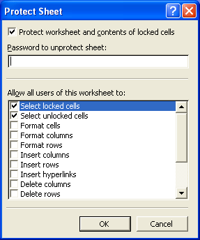

{}

- Delete rows or columns.
- Edit contents, objects or scenarios.
- Format cells, rows or columns.
- Insert rows, columns or hyperlinks.
- Select locked or unlocked cells.
- Use pivot tables and much more.

Aspose.Cells supports all the advanced protection settings offered by Excel XP or later versions.

{}

## **Advanced Protection Settings Using Excel XP and Later Versions**

To view the protection settings available in Excel XP:

1. From the **Tools** menu, select **Protection** followed by **Protect Sheet**.
   A dialog is displayed.

   **Dialog to show protection options in Excel XP**

1. Allow or restrict worksheets features or apply a password.

### **Advanced Protection Settings Using Aspose.Cells**

Aspose.Cells support all of the advanced protection settings.

Aspose.Cells provides a class, [**Workbook**](https://apireference.aspose.com/cells/net/aspose.cells/workbook), that represents a Microsoft Excel file. The [**Workbook**](https://apireference.aspose.com/cells/net/aspose.cells/workbook) class contains a [**Worksheets**](https://apireference.aspose.com/cells/net/aspose.cells/workbook/properties/worksheets) collection that allows access to each worksheet in the Excel file. A worksheet is represented by the [**Worksheet**](https://apireference.aspose.com/cells/net/aspose.cells/worksheet) class.

The [**Worksheet**](https://apireference.aspose.com/cells/net/aspose.cells/worksheet) class provides the [**Protection**](https://apireference.aspose.com/cells/net/aspose.cells/worksheet/properties/protection) property that is used to apply these advanced protection settings. The [**Protection**](https://apireference.aspose.com/cells/net/aspose.cells/worksheet/properties/protection) property is in fact an object of the [**Protection**](https://apireference.aspose.com/cells/net/aspose.cells/protection) class that encapsulates several Boolean properties for disabling or enabling restrictions.

Below is a small example application. It opens an Excel file and uses most of the advanced protection settings supported by Excel XP and later versions.

**C#**



 //Creating a file stream containing the Excel file to be opened

FileStream fstream = new FileStream("book1.xls", FileMode.Open);

//Instantiating a Workbook object

//Opening the Excel file through the file stream

Workbook excel = new Workbook(fstream);

//Accessing the first worksheet in the Excel file

Worksheet worksheet = excel.Worksheets[0];

//Restricting users to delete columns of the worksheet

worksheet.Protection.AllowDeletingColumn = false;

//Restricting users to delete row of the worksheet

worksheet.Protection.AllowDeletingRow = false;

//Restricting users to edit contents of the worksheet

worksheet.Protection.AllowEditingContent = false;

//Restricting users to edit objects of the worksheet

worksheet.Protection.AllowEditingObject = false;

//Restricting users to edit scenarios of the worksheet

worksheet.Protection.AllowEditingScenario = false;

//Restricting users to filter

worksheet.Protection.AllowFiltering = false;

//Allowing users to format cells of the worksheet

worksheet.Protection.AllowFormattingCell = true;

//Allowing users to format rows of the worksheet

worksheet.Protection.AllowFormattingRow = true;

//Allowing users to insert columns in the worksheet

worksheet.Protection.AllowFormattingColumn = true;

//Allowing users to insert hyperlinks in the worksheet

worksheet.Protection.AllowInsertingHyperlink = true;

//Allowing users to insert rows in the worksheet

worksheet.Protection.AllowInsertingRow = true;

//Allowing users to select locked cells of the worksheet

worksheet.Protection.AllowSelectingLockedCell = true;

//Allowing users to select unlocked cells of the worksheet

worksheet.Protection.AllowSelectingUnlockedCell = true;

//Allowing users to sort

worksheet.Protection.AllowSorting = true;

//Allowing users to use pivot tables in the worksheet

worksheet.Protection.AllowUsingPivotTable = true;

//Saving the modified Excel file

excel.Save("output.xls", SaveFormat.Excel97To2003);

//Closing the file stream to free all resources

fstream.Close();



## **Download Running Code**

- [CodePlex](https://archive.codeplex.com/?p=asposecellsnet)
- [CodePlex](https://archive.codeplex.com/?p=asposevsto#Aspose)
- [GitHub](https://github.com/aspose-cells/Aspose.Cells-for-.NET/tree/master/Plugins/Aspose.Cells%20Vs%20VSTO%20Spreadsheets/Aspose.Cells%20Features%20missing%20in%20VSTO/Advanced%20Protection%20Settings)

## **Download Sample Code**

- [CodePlex](https://archive.codeplex.com/?p=asposecellsnet)
- [CodePlex](https://archive.codeplex.com/?p=asposevsto)
- [GitHub](https://github.com/aspose-cells/Aspose.Cells-for-.NET/releases/tag/MissingFeaturesAsposeCellsForVSTO1.1)
