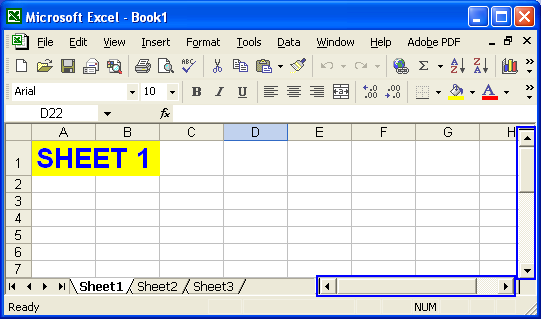

{} 

Scroll bars are very used to navigate the contents of any file. Normally, there are two kinds of scroll bars:

- Vertical scroll bars
- Horizontal scroll bars

Microsoft Excel also provides horizontal and vertical scroll bars so that users can scroll through worksheet contents. Using Aspose.Cells, developers can control the visibility of both types of scroll bars in Excel files.

{} 

Aspose.Cells provides a class, [Workbook](/pages/createpage.action?spaceKey=cellsnet&title=Aspose.Cells.Workbook+class&linkCreation=true&fromPageId=5020762) that represents an Excel file. The Workbook class provides a wide range of properties and methods for managing an Excel file. To control the visibility of scroll bars, use the Workbook class' IsVScrollBarVisible and IsHScrollBarVisible properties. IsVScrollBarVisible and IsHScrollBarVisible are Boolean properties, which means that these properties can only store **true** or **false** values.

Below is a complete code that opens an Excel file, book1.xls, hides both scroll bars and then saves the modified file as output.xls .

The screenshot below shows Book1.xls file containing both scroll bars. The modified file is saved as output.xls file, also shown below.

**Book1.xls: Excel file before any modification**

**output.xls: Excel file after modification**

**C#**



 //Creating a file stream containing the Excel file to be opened

FileStream fstream = new FileStream("book1.xls", FileMode.Open);

//Instantiating a Workbook object

//Opening the Excel file through the file stream

Workbook workbook = new Workbook(fstream);

//Hiding the vertical scroll bar of the Excel file

workbook.Settings.IsVScrollBarVisible = false;

//Hiding the horizontal scroll bar of the Excel file

workbook.Settings.IsHScrollBarVisible = false;

//Saving the modified Excel file

workbook.Save("output.xls");

//Closing the file stream to free all resources

fstream.Close();


## **Download Running Code**
- [CodePlex](https://asposecellsnet.codeplex.com/SourceControl/latest#Plugins/Aspose For VSTO/Aspose.Cells Features missing in VSTO/Display or Hide Scroll Bars/)
- [CodePlex](https://asposevsto.codeplex.com/SourceControl/latest#Aspose Only features Unavailable in VSTO/Aspose.Cells/Display or Hide Scroll Bars/)
- [GitHub](https://github.com/aspose-cells/Aspose.Cells-for-.NET/tree/master/Plugins/Aspose.Cells%20Vs%20VSTO%20Spreadsheets/Aspose.Cells%20Features%20missing%20in%20VSTO/Display%20or%20Hide%20Scroll%20Bars)
- [Code.MSDN](https://code.msdn.microsoft.com/Missing-features-in-VSTO-ac9ea836/view/SourceCode#content)
## **Download Sample Code**
- [CodePlex](https://asposecellsnet.codeplex.com/releases/view/618484)
- [CodePlex](https://asposevsto.codeplex.com/releases/view/618289)
- [GitHub](https://github.com/aspose-cells/Aspose.Cells-for-.NET/releases/tag/MissingFeaturesAsposeCellsForVSTO1.1)
- [Code.MSDN](https://code.msdn.microsoft.com/Missing-features-in-VSTO-ac9ea836#content)
