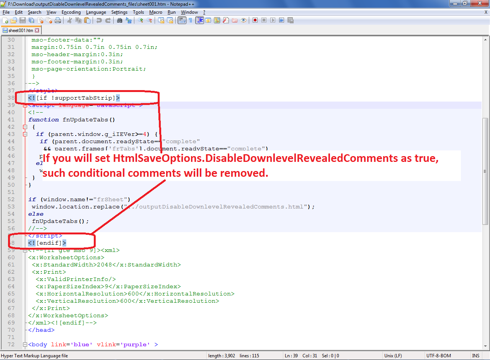

## **Disable Downlevel Revealed Comments while saving to HTML**
When Excel file is converted to HTML, Aspose.Cells adds Downlevel-revealed conditional comments in the output HTML file. These conditional comments are mostly relevant to old versions of Internet Explorer and are irrelevant in the modern browsers. For additional information on Downlevel-revealed conditional comments, please visit the following link

[Conditional comment - Downlevel-revealed conditional comment](https://en.wikipedia.org/wiki/Conditional_comment#Downlevel-revealed_conditional_comment)

To remove Downlevel-revealed conditional comments, Aspose.Cells provides the [HtmlSaveOptions.DisableDownlevelRevealedComments](https://apireference.aspose.com/cells/python/asposecells.api/htmlsaveoptions#DisableDownlevelRevealedComments) property. Setting the [HtmlSaveOptions.DisableDownlevelRevealedComments](https://apireference.aspose.com/cells/python/asposecells.api/htmlsaveoptions#DisableDownlevelRevealedComments) property to **True** will remove the Downlevel-revealed conditional comments in the output HTML file.

The following image shows the Downlevel-revealed conditional comments which will be removed in the output HTML file

## **Sample Code**

