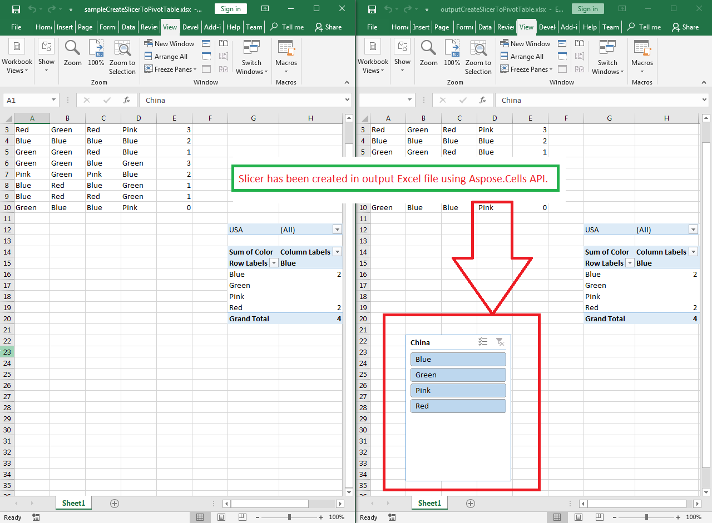

## **Possible Usage Scenarios**
Slicers are used to filter data quickly. They can be used to filter data both in a table or pivot table. Microsoft Excel allows you to create a slicer by selecting a table or pivot table and then clicking the *Insert > Slicer*. Aspose.Cells for Python via Java provides the Worksheet.getSlicers().add() method to create slicer.
## **Create Slicer to a Pivot Table**
The following code snippet loads the [sample Excel file](106364966.xlsx) that contains the pivot table. It then creates the slicer based on the first base pivot field. Finally, it saves the workbook in [output XLSX](106364967.xlsx) format. The following screenshot shows the slicer created by Aspose.Cells in the output Excel file.

## **Sample Code**

