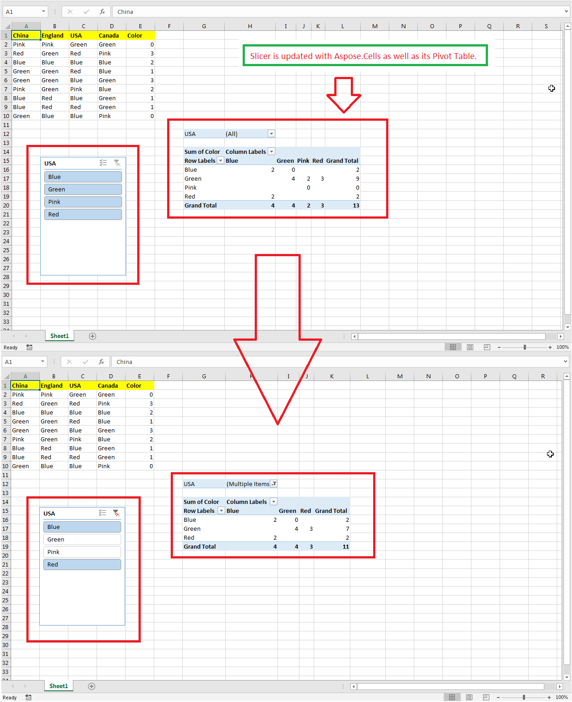

## **Updating Slicer**
Aspose.Cells for Python via Java supports updating slicers. For this, the API provides the Slicer.SlicerCache.SlicerCacheItems property that is used to select or unselect slicer items. The following code snippet loads the [sample Excel file](106365050.xlsx) that contains a slicer.  It unselects the 2nd and 3rd items of the slicer and refreshes the slicer using the Slicer.refresh() method. It then saves the workbook as the [output Excel file](106365051.xlsx). The following screenshot shows the effect of the sample code on the sample Excel file. As you can see in the screenshot, refreshing the slicer with selected items has also refreshed the pivot table accordingly.

## **Sample Code**

