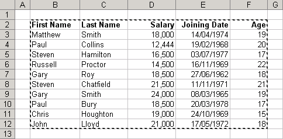
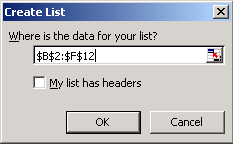

The use of worksheets make is easy to work with different types of lists, for example. phone lists, task lists. etc. Aspose.Cells supports creating and managing lists.

## **Advantages of a List Object**

There are quite a few advantages when you convert a list of data to an actual List Object:

- New rows and columns are automatically included.
- A total row at the bottom of your list can be easily added to display SUM, AVERAGE, COUNT, etc.
- Columns added to the right are automatically incorporated into the List object.
- Charts based on rows and columns will be expanded automatically.
- Named ranges assigned to rows and columns will be expanded automatically.
- The list is protected from accidental row and column deletion.

## **Creating a List Object using Microsoft Excel**

**Selecting data range for creating a list object** 

This displays the Create List dialog.

**Create List dialog** 

Implementing the List object and specifying Total Row (Select **Data**, then **List**, followed by **Total Row**).

**Creating a List object** 

## **Creating a List Object using Aspose.Cells API**

Aspose.Cells provides a class, [**Workbook**](https://apireference.aspose.com/cells/python/asposecells.api/Workbook), that represents a Microsoft Excel file. The [**Workbook**](https://apireference.aspose.com/cells/python/asposecells.api/Workbook) class contains a [**Worksheets**](https://apireference.aspose.com/cells/python/asposecells.api/worksheetcollection) collection that allows access to each worksheet in an Excel file.

A worksheet is represented by the [**Worksheet**](https://apireference.aspose.com/cells/python/asposecells.api/Worksheet) class. The [**Worksheet**](https://apireference.aspose.com/cells/python/asposecells.api/Worksheet) class provides a wide range of properties and methods for managing a worksheet. To create a [**ListObject**](https://apireference.aspose.com/cells/python/asposecells.api/ListObject) in a worksheet, use [**ListObjects**](https://apireference.aspose.com/cells/python/asposecells.api/worksheet#ListObjects) collection property of the [**Worksheet**](https://apireference.aspose.com/cells/python/asposecells.api/Worksheet) class. Each [**ListObject**](https://apireference.aspose.com/cells/python/asposecells.api/ListObject) is, in fact, an object of the [**ListObjectCollection**](https://apireference.aspose.com/cells/python/asposecells.api/ListObjectCollection) class, which further provides the [**add**](https://apireference.aspose.com/cells/python/asposecells.api/listobjectcollection#add(int,%20int,%20int,%20int,%20boolean)) method for adding a List object and specifying a range of cells for the list.

According to the specified range of cells, the List object is created in the worksheet by Aspose.Cells. Use attributes (for example, ShowTotals, ListColumns, etc.) of the [**ListObject**](https://apireference.aspose.com/cells/python/asposecells.api/ListObject) class to control the list.

In the example given below, we have created the same [**ListObject**](https://apireference.aspose.com/cells/python/asposecells.api/ListObject) using Aspose.Cells for Python via Java API as we created using Microsoft Excel in the above section.

## Source Code


