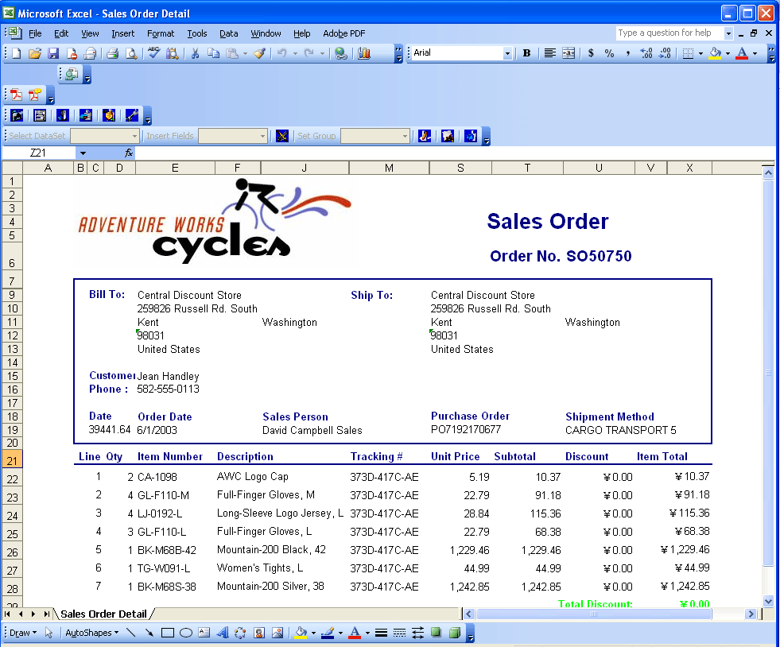

{} 

### **Welcome to the Aspose.Cells for Reporting Services Documentation!**
Aspose.Cells is an award-winning spreadsheet component that allows developers to embed the ability to read, write and manipulate Excel spreadsheets into their own applications without relying on Microsoft Excel.

{} 
### **Product Overview**
Aspose.Cells for Reporting Services is a solution for developers who need to deliver Microsoft Excel reports in Reporting Services. It adds flexible and user friendly features the Reporting Sesrvices through the Aspose.Cells.Report.Designer tool. All tasks related to developing reports in Reporting Services - as setting up data sources, creating queries, designing reports and publishing reports to Report Server - can be performed. Since Aspose.Cells.Report.Designer uses Microsoft Excel as a report template, users can take advantage of the powerful features available in Microsoft Excel.

There are two ways to design reports using Aspose.Cells for Reporting Services component. Get started with an empty Microsoft Excel template and then complete tasks, from setting up data sources to publishing reports to Report Server. Or start with an existing RDL Report in which database queries are available for use. Taking this route, users have to focus on report design only. This way is useful to those users who want to separate report design from query creation. The latter is relatively complex and has to be done by the users with database and SQL skills.

**A sample report rendered using Aspose.Cells for Reporting Services** 

Aspose.Cells for Reporting Services is comprised of two parts.
#### **Aspose.Cells.Report.Designer**
This is a report designer tool that is integrated with Microsoft Excel in Add-Ins form. With Aspose.Cells.Report.Designer users can design a report template in Microsoft Excel instead of Visual Studio. The report template is then embedded into a Reporting Services RDL file and can be published to Report Server. Users can also preview and export the report in Aspose.Cells.Report.Designer.
#### **Aspose.Cells.Renderer for Reporting Services**
Aspose.Cells.Renderer for Reporting Services is an implementation of Microsoft's Reporting Services Rendering Extension. It can render RDL reports designed by both Visual Studio and Aspose.Cells.Report.Designer.
