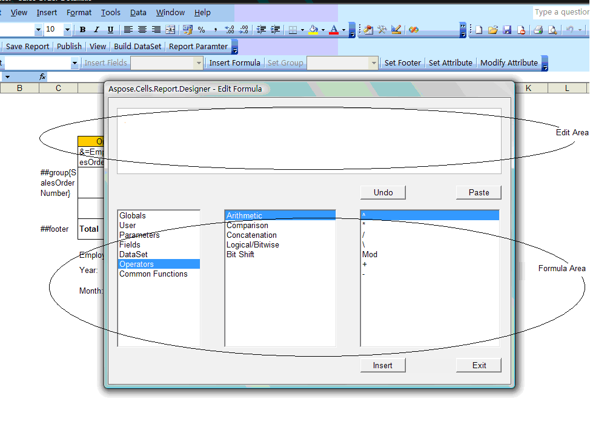

{} 

The Formula Editor lets you create formulas for a report.

{} 

To edit a formula in a Microsoft Excel cell:

1. In Microsoft Excel, select a cell.
1. Open the Edit Formula dialog by clicking **Edit Formula** on the tool bar.
   ([Adding Reporting Services Formulas](/cells/reportingservices/adding-reporting-services-formulas/) walks through an example that edits a formula.)
   The dialog is divided into section: the edit area at the top, and the formula area at the bottom. Use the formula area to populate the edit area.
1. Select a category (user, parameters, fields etc.) from the **Report Fields** list (the left-hand list).
1. Select the type from the **Functions** list (in the middle).
1. Select an option from the **Operators** list (the right-hand list).
1. Click **Insert** to add the expression to the **Edit** area.
1. Click **Insert** when the expression is complete.
   The formula is inserted into the cell.

**The Edit Formula dialog** 

The Edit Formula dialog is divided into sections, described below.
#### **Edit Area**
This is the area where you create or edit a formula. Create a formula by double-clicking on any of the components listed in the **Report Fields**, **Functions** or **Operators** lists. When you choose a component, the required syntax is also inserted. You can also manually enter a formula. 
#### **Formula Area**
The formula area contains three sections, each listing information used to build a formula.

- Report Fields - the left-hand list lists all the database fields accessible for the report. It also lists any formulas or groups already created.
- Functions - the middle list contains functions, pre-built procedures that return values. They perform calculations such as AVERAGE, SUM, COUNT, SIN, UPPERCASE and so on.
- Operators - the “action verbs” used in formulas. Operators describe an operation or an action to take place between two or more values. Examples of operators: add, subtract, less than and greater than etc.
#### **Controls**
The dialog has several controls:

|**Button Name** |**Description** |
| :- | :- |
|Undo |Undoes an action. |
|Paste |Pastes a character string made up of the components listed in the formula area into the edit area. |
|Insert |Takes the value in the edit area and inserts it as a formula into a cell. |
|Exit |Closes the Formula Editor. |
{} 

Related topics:

- [Formula List](/cells/reportingservices/formula-list/) - a list of fields and operators.

{}
