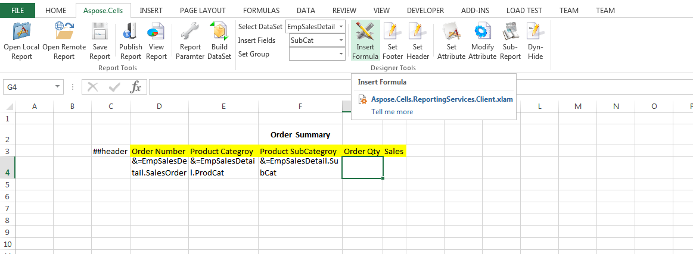

To add Reporting Services Formulas to the table data cell, follow the steps below:

- Make the table data cell selected and Click **Insert Formula** on the Aspose.Cells.Report.Designer toolbar (

).

- Select ”DataSet” in the left panel, select ”EmpSalesDetail” in the middle panel and double click ”Sum(EmpSalesDetail.OrderQty)” in the right panel. A formula expression appears in the top edit box. Click **OK** button to insert the expression into the cell.

- The result will be shown as following.

**The inserted expression** 

- Repeat the above steps to add formula to Sales column, as shown in the following.

**Formula added to the sales column** 

