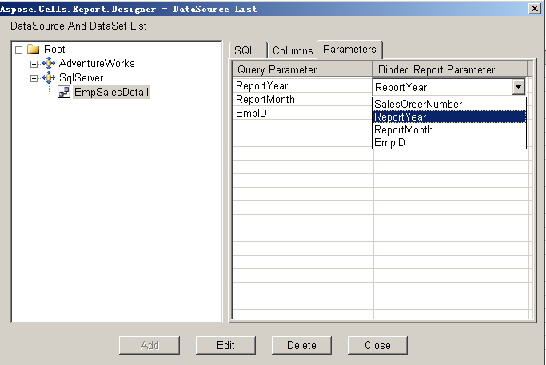

1. Open Microsoft Excel.
1. Click **Build Data Set** on the Aspose.Cells.Report.Designer toolbar (

).

1. Select a data set in the left panel, for example **EmpSalesDetail**. 

   **Selecting a data set** 

1. Click the Parameters tab in the right panel to list the data set's parameters.
1. Click the **Binded Report Parameter** column.
   All the report parameters created in advance are listed. 
1. Select a parameter. 

   **Mapping parameters** 

1. Repeat to map all the query parameters to report parameters. 

   **Mapping complete** 

1. Click **Close**.
