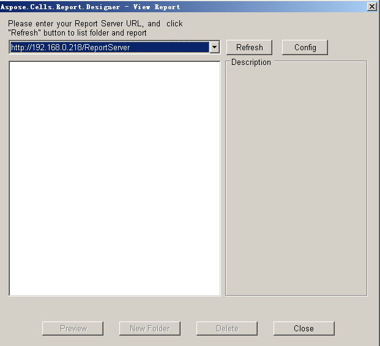
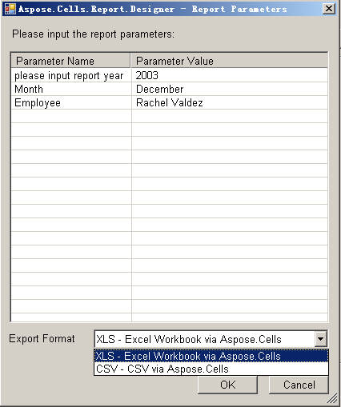

{} 

Previewing a report helps you be sure that it is the report you want.

{} 

To preview a report:

1. Click **View** 

on the Aspose.Cells.Report.Designer toolbar.

1. Enter the URL of Report Server and click the **Refresh** button.

1. Select a report and click the **Preview** button. 

1. In the dialog box, enter the report parameters and select the export file format. Click the **OK** button to export the report.

