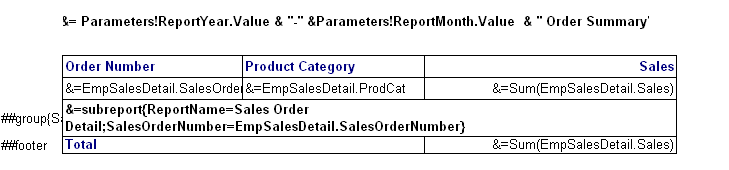

{} 

A sub-report can be embedded in a table item. The format is: &=subreport{ReportName=your report name; parameter1 name = parameter1 value; parameter2 name = parameter2 value; ...}

**A sub-report in a report definition** 

In the example, the name of sub-report is “Sales Order Detail”. It has one parameter, SalesOrderNumber. The value of the parameter is EmpSalesDetail.SalesOrderNumber.
### **Restrictions on Sub-Reports**
1. The sub-report should be designed with Aspose.Cells.ReportingServices Designer.
1. The sub-report can only be embedded in the table group row, and the group row cannot contain any elements except the sub-report. Embedding a sub-report in the table detail rows or footer rows is not allowed.
1. Currently, nesting more than one level is not supported. The sub-report can not contain an embedded report.

{} 
###### **This section includes the following topics:** 
- [Creating Table Item](/cells/reportingservices/creating-table-item-html/)
- [Add Sub Report Item](/cells/reportingservices/add-sub-report-item-html/)
