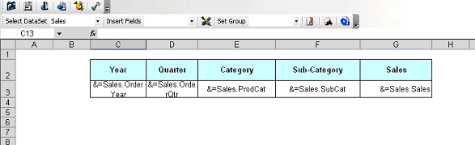
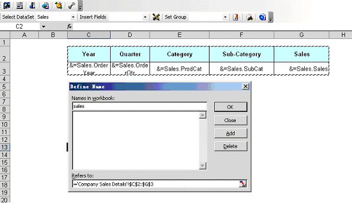
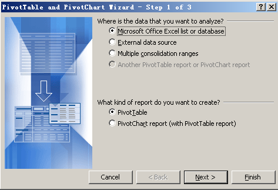
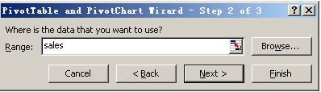
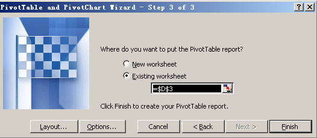
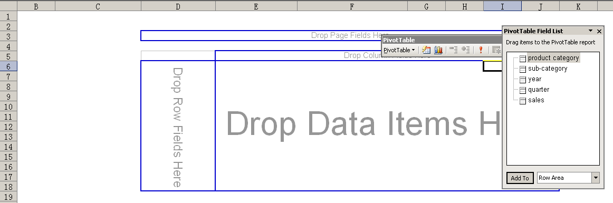
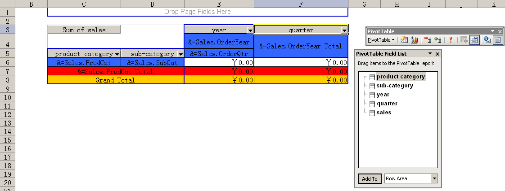
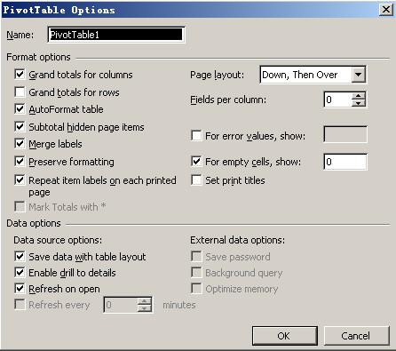
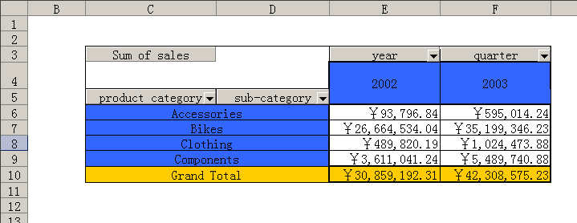

{} 

A *pivot table* is an interactive table that summarizes data and presents it in a meaningful way. SQL Server Reporting Services cannot export a report to Microsft Excel format while maintaining a pivot table. Report users have to manually create pivot tables every time they export a pivot table report from Reporting Services to Microsoft Excel. With Aspose.Cells for Reporting Services, you can design a pivot table once at report design time. Each time the report runs, Aspose.Cells for Reporting Services exports the report to Microsoft Excel and refresh the data into the pivot table.

{} 

To create a pivot table report:

1. Create a dataset as the data source for the pivot table.
   Below, we use the AdventureWorks sample database that ships with SQL Server Reporting Services 2005 and create a dataset named “sales".
   The SQL for the dataset is as follows: 

**SQL**



 SELECT  PC.Name AS ProdCat,

	    PS.Name AS SubCat,

	    DATEPART(yy, SOH.OrderDate) AS OrderYear,

	    'Q' + DATENAME(qq, SOH.OrderDate) AS OrderQtr,

         SUM(SOD.UnitPrice * SOD.OrderQty) AS Sales

FROM    Production.ProductSubcategory PS INNER JOIN

         Sales.SalesOrderHeader SOH INNER JOIN

         Sales.SalesOrderDetail SOD ON SOH.SalesOrderID = SOD.SalesOrderID INNER JOIN

         Production.Product P ON SOD.ProductID = P.ProductID ON PS.ProductSubcategoryID = P.ProductSubcategoryID INNER JOIN

         Production.ProductCategory PC ON PS.ProductCategoryID = PC.ProductCategoryID

WHERE   (SOH.OrderDate BETWEEN '1/1/2002' AND '12/31/2003')

GROUP BY  DATEPART(yy, SOH.OrderDate), PC.Name, PS.Name, 'Q' + DATENAME(qq, SOH.OrderDate), PS.ProductSubcategoryID



{} 

Please refer to [Data Sources and Queries](/cells/reportingservices/data-sources-and-queries/) to learn more about how to create a data source and dataset with Aspose.Cells.Report.Designer.

{} 

1. Create a table report according to the instruction in [Creating Tabular Report](/cells/reportingservices/creating-tabular-report/), as shown below.
   The table will be the data source for the pivot table. 

1. In Microsoft Excel, from the **Insert** menu, select **Name** and then **Define**.
1. Define a name as “sales”.
   The range of the name starts with the first cell of the header title and ends at the last cell of table data row as shown below. 

1. Click **OK** to finish.
1. Create a new sheet for the pivot table.
1. From the **Data** menu, select **PivotTable and PivotChart Report** to add a pivot table.
   A dialog is displayed.
1. Select **Microsoft Office Excel list or database** as a data source and **pivot table** as report type.
1. Click **Next** to continue. 

1. In the dialog box, enter “sales”, the name you defined above.
1. Click **Next** to continue. 

1. Click **Finish**. 

1. Design the pivot table in Excel. 

The designed pivot table is shown below. 

1. Right-click the pivot table and select **Table Options**.
1. Make sure that **Refresh on open** is selected. 

1. Save the report and publish it to Report Server.
1. Export the report from Report Server.
   The result is shown below. 

