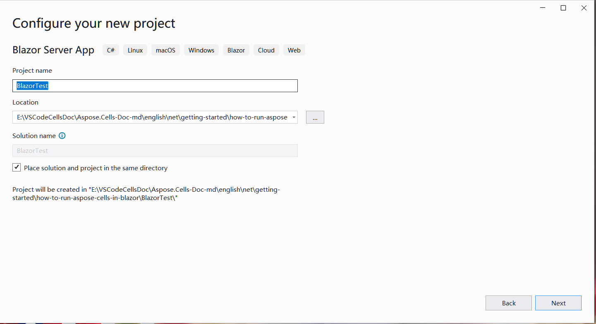
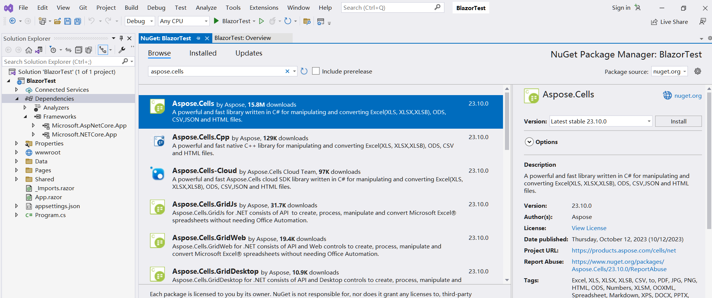

## Обзор

Для запуска Aspose.Cells в Blazor вам понадобятся платформы .NET6 (или более поздние версии), в сравнении с предыдущими платформами (.netcore31 или более ранними), важное отличие касается графической библиотеки. В этом официальном [документе от Microsoft](https://learn.microsoft.com/en-gb/dotnet/core/compatibility/core-libraries/6.0/system-drawing-common-windows-only) объясняется, что для версий .NET6 или позднее графическая библиотека "System.Drawing.Common" будет поддерживаться только в Windows, и дается рекомендации по замене графической библиотеки.

Для продукта Apose.Cells мы провели оценку и завершили миграцию графической библиотеки. Мы используем SkiaSharp вместо System.Drawing.Common в системах, отличных от Windows, как предложено в официальной документации от Microsoft. Обратите внимание, что это важное изменение начнет действовать в Aspose.Cells 22.10.1 или более поздних версиях для .Net6.

## Приложение Blazor Server с Aspose.Cells

В этом примере вы создадите простое приложение сервера Blazor, которое добавляет данные и графику, и отображает их в виде изображений на веб-странице. В процессе создания проекта вы можете настроить параметры в соответствии со своими потребностями. Например, если вы отметите опцию "Включить Docker", то приложение Blazor сможет быть собрано и запущено в Docker.

### Создание приложения сервера Blazor

Давайте используем инструмент VS2022 в качестве примера для создания первого приложения Blazor с Aspose.Cells, следуйте приведенным ниже шагам:
1. Выберите Файл -> Новый -> Проект и отфильтруйте ключевое слово 'blazer', чтобы выбрать соответствующий шаблон проекта.
<br>

1. Установите имя проекта 'BlazorTest' и выберите путь.
<br>

1. Настройте библиотеки и другие опции, используемые в проекте. Наконец, нажмите кнопку 'Создать', чтобы сгенерировать ваш первый проект blazer.
<br>

1. После входа в проект нажмите на 'Зависимости' в проекте и выберите 'Управление пакетами NuGet...', чтобы добавить библиотеку Aspose.Cells.
<br>

1. Введите ключевые слова для фильтрации и установите последнюю библиотеку Aspose.Cells. Одновременно будут установлены зависимые библиотеки, такие как SkiaSharp.
<br>

1. Дважды щелкните по файлу 'Index.razor', чтобы отредактировать и импортировать необходимую библиотеку. Добавьте некоторые данные и графику, и отобразите их в графику для отображения.
<br>

1. Скомпилируйте и запустите проект, и вы получите следующие результаты.
<br>


### Пример кода в приложении Blazor Server

В следующем примере кода приведен файл Index.razor:
```
@page "/"
@using SkiaSharp;
@using Aspose.Cells;
@using Aspose.Cells.Drawing;
@using Aspose.Cells.Rendering;


<PageTitle>Index</PageTitle>

<h1>Hello, world!</h1>

Welcome to your new app.

<SurveyPrompt Title="How is Blazor working for you?" />


@code
{
    private string imageSrc;

    public Index()
    {
        imageSrc = "data:image/png;base64, " + Convert.ToBase64String(CreateFile());
    }

    private byte[] CreateFile()
    {
        Workbook workbook = new Workbook();
        Worksheet sheet = workbook.Worksheets[0];
        sheet.Cells["A1"].Value = "test data for blazor";

        sheet.PageSetup.PrintGridlines = true;
        sheet.PageSetup.PrintArea = "A1:F20";

        ShapeCollection shapes = sheet.Shapes;

        //Add rectangle shape
        shapes.AddRectangle(1, 0, 1, 0, 100, 150);

        //Add line shape
        shapes.AddLine(8, 0, 1, 0, 100, 150);

        //Add oval shape
        shapes.AddOval(13, 0, 1, 0, 100, 150);

        using MemoryStream ms = new();

        SheetRender render = new SheetRender(sheet, new ImageOrPrintOptions());
        render.ToImage(0, ms);

        return ms.ToArray();
    }
}

```
