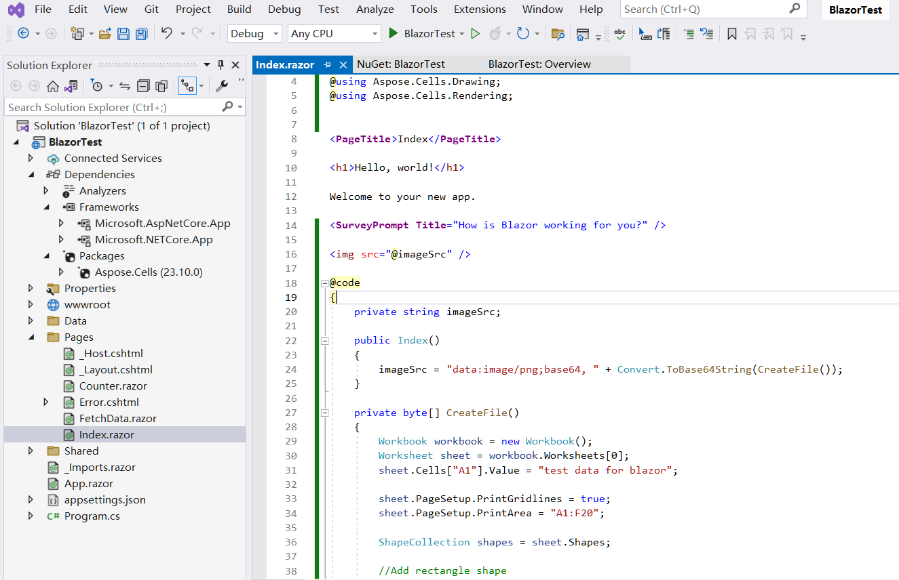

## Обзор

Blazor — это веб-фреймворк, разработанный Microsoft, позволяющий создавать интерактивные клиентские веб-приложения с помощью C# и .NET вместо JavaScript. Blazor существует в двух основных моделях хостинга: **Blazor WebAssembly** и **Blazor Server**. Вы можете использовать **Aspose.Cells for .NET** непосредственно в обеих моделях.

## Приложение Blazor WebAssembly с Aspose.Cells

Blazor WebAssembly работает на стороне клиента в браузере, используя WebAssembly. Она позволяет запускать приложения .NET непосредственно в браузере без зависимости от сервера для рендеринга. Начиная с **Aspose.Cells for .NET 25.1**, Aspose.Cells можно использовать в Blazor WebAssembly прямо. В этом примере вы создадите простое приложение Blazor WebAssembly с Aspose.Cells, отобразите Excel файл с текстом и фигурами в изображение PNG, а затем покажете изображение на странице.

### Создание приложения Blazor WebAssembly

Используем пример инструмента VS2022 для создания первого приложения Blazor WebAssembly с Aspose.Cells, следуйте шагам ниже:

1. Создайте новый проект с шаблоном **Blazor WebAssembly Standalone App**.

   

2. Выберите целевую платформу, рекомендуется .NET 8.0 или выше.

   

3. После создания проекта добавьте пакет Aspose.Cells в проект. Так как Aspose.Cells ссылается на SkiaSharp, для работы SkiaSharp в WebAssembly нужен пакет "SkiaSharp.Views.Blazor".

   ```
   <PackageReference Include="Aspose.Cells" Version="25.1.1" />
   <PackageReference Include="SkiaSharp.Views.Blazor" Version="3.116.1" />
   ```

   *Обратите внимание, версия добавляемого пакета "SkiaSharp.Views.Blazor" должна соответствовать версии "SkiaSharp", на которую ссылается Aspose.Cells for .NET. Версии Aspose.Cells for .NET и соответствующих им "SkiaSharp" описаны следующим образом:*

   | Aspose.Cells for .NET |                SkiaSharp                |
   | :-------------------: | :-------------------------------------: |
   |       = 25.1.1        |                 3.116.1                 |
   |       >=25.1.2        | 2.88.9 (net6.0, net8.0), 3.116.1 (net9.0) |

4. Перейдите в файл "Home.razor" в папке "Pages" проекта, напишите код, чтобы добавить данные и фигуры, и отрисовать их в изображение для отображения.

   

5. Щелкните правой кнопкой мыши по проекту и выберите "Публикация...", затем опубликуйте проект в папку с или без опции AOT.

   

6. После публикации выходные файлы будут находиться в папке `publish/wwwroot`. Эти файлы являются статическими (HTML, JS, CSS и т.д.), их можно разместить на хостинге:

   - **Локальный веб-сервер** (например, `dotnet serve`, `nginx`, или `Apache`).
   - **Облачный хостинг** (например, Azure, AWS, Netlify, GitHub Pages).

   Возьмем в пример `dotnet serve`:

   - Установите инструмент `dotnet-serve` (если еще не установлен):

     ```bash
     dotnet tool install -g dotnet-serve
     ```

   - Перейдите в опубликованную директорию `wwwroot`.

   - Запустите сервер:

     ```bash
     dotnet serve
     ```

7. Откройте браузер и перейдите по отображенному адресу (например, `http://localhost:1970`), изображение будет отображаться на странице.

   

### Пример кода в приложении Blazor WebAssembly

Следующий пример кода включен в файл Home.razor:

```cs
@page "/"
@using Aspose.Cells
@using Aspose.Cells.Drawing
@using Aspose.Cells.Rendering

<PageTitle>Home</PageTitle>

<h1>Aspose.Cells works in Blazor WebAssembly App</h1>

@if (imageSrc is not null)
{
    
}
else
{
    <p>Loading image...</p>
}

@code
{
    private string? imageSrc;

    protected override void OnInitialized()
    {
        imageSrc = "data:image/png;base64, " + Convert.ToBase64String(CreateFile());
    }

    private byte[] CreateFile()
    {
        Workbook workbook = new Workbook();
        Worksheet sheet = workbook.Worksheets[0];
        sheet.Cells["A1"].Value = "Aspose.Cells works in Blazor WebAssembly App!";

        sheet.PageSetup.PrintGridlines = true;
        sheet.PageSetup.PrintArea = "A1:F20";

        ShapeCollection shapes = sheet.Shapes;

        //Add rectangle shape
        shapes.AddRectangle(1, 0, 1, 0, 100, 150);

        //Add line shape
        shapes.AddLine(8, 0, 1, 0, 100, 150);

        //Add oval shape
        shapes.AddOval(13, 0, 1, 0, 100, 150);

        using MemoryStream ms = new();

        SheetRender render = new SheetRender(sheet, new ImageOrPrintOptions());
        render.ToImage(0, ms);

        return ms.ToArray();
    }
}
```

### Решение проблем

Currently(Jan 2025) there is a known issue of `dotnet` in the case that publishing a Blazor WebAssembly project which targets to net8.0 with .NET 9.0 SDK(.NET 9.0 SDK is installed and .NET 8.0 SDK is uninstalled if you upgraded Visual Studio to the version v17.12.x). For more info, check the link: <https://github.com/dotnet/runtime/issues/109951>.

```
System.PlatformNotSupportedException: PlatformNotSupported_HybridGlobalization, HashCode
   at System.Globalization.CompareInfo.GetHashCodeOfStringCore(ReadOnlySpan`1 , CompareOptions )
   at System.Globalization.CompareInfo.GetHashCode(ReadOnlySpan`1 , CompareOptions )
   at System.Globalization.CompareInfo.GetHashCode(String , CompareOptions )
   at System.CultureAwareComparer.GetHashCode(String )
   at System.StringComparer.GetHashCode(Object )
```

Если у вас ситуация, есть три варианта:

1. Переустановите .NET 8.0 SDK (если он был удален) и используйте файл "global.json" на уровне решения (в той же папке, что и .sln) для указания используемой SDK. Вот пример файла "global.json":

   ```
   {
     "sdk": {
       "version": "8.0.300",
       "rollForward": "latestFeature"
     }
   }
   ```


2. Обновите файл проекта для целевого уровня net9.0.

3. Update Visual Studio to the version v17.12.4.(The issue <https://github.com/dotnet/runtime/issues/109951> is fixed.(updated on Jan 15, 2025))

## Приложение Blazor Server с Aspose.Cells

В этом примере вы создадите простое приложение Blazor Server, которое добавляет данные и графику, а затем отображает их в виде изображений. В процессе создания проекта вы можете настроить параметры по своему усмотрению. Например, включив опцию "Enable Docker", приложение Blazor может быть построено и запущено в Docker..

### Создание приложения сервера Blazor

Возьмем в пример Visual Studio 2022 для создания первого приложения Blazor Server с Aspose.Cells, следуйте нижеуказанным шагам:
1. Выберите Файл -> Новый -> Проект и отфильтруйте ключевое слово 'blazer', чтобы выбрать соответствующий шаблон проекта.
<br>

1. Установите имя проекта 'BlazorTest' и выберите путь.
<br>

1. Настройте библиотеки и другие опции, используемые в проекте. Наконец, нажмите кнопку 'Создать', чтобы сгенерировать ваш первый проект blazer.
<br>

1. После входа в проект нажмите на 'Зависимости' в проекте и выберите 'Управление пакетами NuGet...', чтобы добавить библиотеку Aspose.Cells.
<br>

1. Введите ключевые слова для фильтрации и установите последнюю библиотеку Aspose.Cells. Одновременно будут установлены зависимые библиотеки, такие как SkiaSharp.
<br>

1. Дважды щелкните по файлу 'Index.razor', чтобы отредактировать и импортировать необходимую библиотеку. Добавьте некоторые данные и графику, и отобразите их в графику для отображения.
<br>

1. Скомпилируйте и запустите проект, и вы получите следующие результаты.
<br>


### Пример кода в приложении Blazor Server

В следующем примере кода приведен файл Index.razor:
```
@page "/"
@using SkiaSharp;
@using Aspose.Cells;
@using Aspose.Cells.Drawing;
@using Aspose.Cells.Rendering;


<PageTitle>Index</PageTitle>

<h1>Hello, world!</h1>

Welcome to your new app.

<SurveyPrompt Title="How is Blazor working for you?" />


@code
{
    private string imageSrc;

    public Index()
    {
        imageSrc = "data:image/png;base64, " + Convert.ToBase64String(CreateFile());
    }

    private byte[] CreateFile()
    {
        Workbook workbook = new Workbook();
        Worksheet sheet = workbook.Worksheets[0];
        sheet.Cells["A1"].Value = "test data for blazor";

        sheet.PageSetup.PrintGridlines = true;
        sheet.PageSetup.PrintArea = "A1:F20";

        ShapeCollection shapes = sheet.Shapes;

        //Add rectangle shape
        shapes.AddRectangle(1, 0, 1, 0, 100, 150);

        //Add line shape
        shapes.AddLine(8, 0, 1, 0, 100, 150);

        //Add oval shape
        shapes.AddOval(13, 0, 1, 0, 100, 150);

        using MemoryStream ms = new();

        SheetRender render = new SheetRender(sheet, new ImageOrPrintOptions());
        render.ToImage(0, ms);

        return ms.ToArray();
    }
}

```

