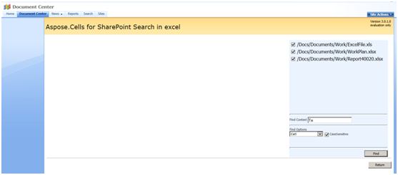
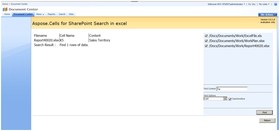

Aspose.Cells for SharePoint supports searches in documents stored in SharePoint sites. Aspose.Cells for Share Point supports the following input formats to preview documents:

- XLS – Microsoft Excel 97 - 2003
- XLSX – Office Open XML
- XLSM, XLTX, XLTM – Office Open XML
- XML - Microsoft Excel SpreadsheetML

To search in a document:

1. Select a document or folder you want to search.
1. Right-click and select **Search in Document with Aspose.Cells**. 
1. Set the search criteria. 
   The search results are displayed.

**The Search in Document option** 

**Set the search criteria** 

**Search results** 

