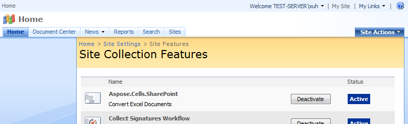

{} 

[During installation](/cells/sharepoint/installing-aspose-cells-for-sharepoint/), Aspose.Cells for SharePoint is [activated](/cells/sharepoint/deployment-and-activation/) for all selected site collections. After installation, use the **Site Actions** menu at the root web site of a site collection to activate and deactivate Aspose.Cells for SharePoint.

{} 
### **Activating Aspose.Cells for SharePoint on a site collection.**
**Activating Aspose.Cells** 

