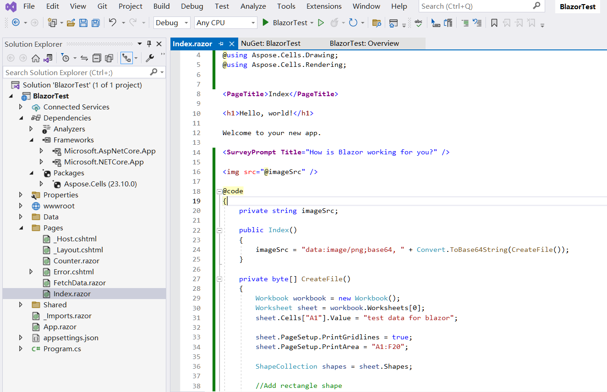

## Resumen

Blazor es un marco web desarrollado por Microsoft que permite a los desarrolladores construir aplicaciones web interactivas del lado del cliente usando C# y .NET en lugar de JavaScript. Blazor se presenta en dos modelos principales de alojamiento: **Blazor WebAssembly** y **Blazor Server**. Puedes usar **Aspose.Cells for .NET** directamente en ambos modelos.

## Aplicación Blazor WebAssembly con Aspose.Cells

Blazor WebAssembly se ejecuta en el cliente en el navegador usando WebAssembly. Permite a los desarrolladores ejecutar aplicaciones .NET directamente en el navegador sin depender de un servidor para renderizar. Desde **Aspose.Cells for .NET 25.1**, Aspose.Cells puede usarse directamente en la aplicación Blazor WebAssembly. En este ejemplo, crearás una aplicación Blazor WebAssembly sencilla con Aspose.Cells, renderizarás un archivo Excel con texto y formas en una imagen png, y luego mostrarás la imagen en una página.

### Crear aplicación Blazor WebAssembly

Vamos a usar la herramienta VS2022 como ejemplo para crear la primera aplicación Blazor WebAssembly con Aspose.Cells, sigue los pasos a continuación:

1. Crea un nuevo proyecto con la plantilla **Blazor WebAssembly Standalone App**.

   

2. Elige el marco de trabajo de destino, se recomienda .NET 8.0 o superior.

   

3. Después de crear el proyecto, añade el paquete Aspose.Cells al proyecto. Como Aspose.Cells hace referencia a SkiaSharp, para que SkiaSharp funcione en WebAssembly, es necesario el paquete "SkiaSharp.Views.Blazor".

   ```
   <PackageReference Include="Aspose.Cells" Version="25.1.1" />
   <PackageReference Include="SkiaSharp.Views.Blazor" Version="3.116.1" />
   ```

   *Por favor, tenga en cuenta que la versión del paquete añadido "SkiaSharp.Views.Blazor" debe corresponder con la versión de "SkiaSharp" referenciada por Aspose.Cells for .NET. Las versiones de Aspose.Cells for .NET y las versiones correspondientes de "SKiaSharp" referenciadas se describen a continuación:*

   | Aspose.Cells for .NET |                SkiaSharp                |
   | :-------------------: | :-------------------------------------: |
   |       = 25.1.1        |                 3.116.1                 |
   | >=25.1.2 | 2.88.9 (net6.0, net8.0), 3.116.1 (net9.0) |

4. Navega al archivo "Home.razor" en la carpeta "Pages" del proyecto, escribe código para añadir algunos datos y formas, y renderízalos en una imagen para su visualización.

   

5. Haz clic derecho en el proyecto y selecciona "Publicar...", luego publica el proyecto en una carpeta con o sin opción AOT.

   

6. Después de publicar, los archivos de salida estarán en la carpeta `publish/wwwroot`. Estos archivos son archivos estáticos (HTML, JS, CSS, etc.), por lo que se pueden alojar usando:

   - **Servidor Web Local** (p.ej., `dotnet serve`, `nginx` o `Apache`).
   - **Hospedaje en la Nube** (p.ej., Azure, AWS, Netlify, GitHub Pages).

   Tomemos como ejemplo `dotnet serve`:

   - Instala la herramienta `dotnet-serve` (si no está instalada):

     ```bash
     dotnet tool install -g dotnet-serve
     ```

   - Navega al directorio publicado `wwwroot`.

   - Inicia el servidor:

     ```bash
     dotnet serve
     ```

7. Abre tu navegador y visita la dirección mostrada (por ejemplo, `http://localhost:1970`), la imagen de salida se mostrará en la página.

   

### Código de ejemplo en la aplicación Blazor WebAssembly

El siguiente código de ejemplo está incluido en el archivo Home.razor:

```cs
@page "/"
@using Aspose.Cells
@using Aspose.Cells.Drawing
@using Aspose.Cells.Rendering

<PageTitle>Home</PageTitle>

<h1>Aspose.Cells works in Blazor WebAssembly App</h1>

@if (imageSrc is not null)
{
    
}
else
{
    <p>Loading image...</p>
}

@code
{
    private string? imageSrc;

    protected override void OnInitialized()
    {
        imageSrc = "data:image/png;base64, " + Convert.ToBase64String(CreateFile());
    }

    private byte[] CreateFile()
    {
        Workbook workbook = new Workbook();
        Worksheet sheet = workbook.Worksheets[0];
        sheet.Cells["A1"].Value = "Aspose.Cells works in Blazor WebAssembly App!";

        sheet.PageSetup.PrintGridlines = true;
        sheet.PageSetup.PrintArea = "A1:F20";

        ShapeCollection shapes = sheet.Shapes;

        //Add rectangle shape
        shapes.AddRectangle(1, 0, 1, 0, 100, 150);

        //Add line shape
        shapes.AddLine(8, 0, 1, 0, 100, 150);

        //Add oval shape
        shapes.AddOval(13, 0, 1, 0, 100, 150);

        using MemoryStream ms = new();

        SheetRender render = new SheetRender(sheet, new ImageOrPrintOptions());
        render.ToImage(0, ms);

        return ms.ToArray();
    }
}
```

### Solución de Problemas

Currently(Jan 2025) there is a known issue of `dotnet` in the case that publishing a Blazor WebAssembly project which targets to net8.0 with .NET 9.0 SDK(.NET 9.0 SDK is installed and .NET 8.0 SDK is uninstalled if you upgraded Visual Studio to the version v17.12.x). For more info, check the link: <https://github.com/dotnet/runtime/issues/109951>.

```
System.PlatformNotSupportedException: PlatformNotSupported_HybridGlobalization, HashCode
   at System.Globalization.CompareInfo.GetHashCodeOfStringCore(ReadOnlySpan`1 , CompareOptions )
   at System.Globalization.CompareInfo.GetHashCode(ReadOnlySpan`1 , CompareOptions )
   at System.Globalization.CompareInfo.GetHashCode(String , CompareOptions )
   at System.CultureAwareComparer.GetHashCode(String )
   at System.StringComparer.GetHashCode(Object )
```

Si este es su caso, hay tres opciones para elegir:

1. Reinstalar el SDK de .NET 8.0 (si fue desinstalado) y usar un archivo "global.json" a nivel de solución (mismo carpeta que el archivo .sln) para especificar el SDK utilizado. Aquí un ejemplo del archivo "global.json":

   ```
   {
     "sdk": {
       "version": "8.0.300",
       "rollForward": "latestFeature"
     }
   }
   ```


2. Actualizar el archivo del proyecto para apuntar a net9.0.

3. Update Visual Studio to the version v17.12.4.(The issue <https://github.com/dotnet/runtime/issues/109951> is fixed.(updated on Jan 15, 2025))

## Aplicación de Servidor Blazor con Aspose.Cells

En este ejemplo, crearás una aplicación Blazor Server sencilla que añade algunos datos y gráficos, y los renderiza en imágenes para mostrarlos en la página web. Durante el proceso de creación del proyecto, puedes configurar las opciones según tus necesidades. Por ejemplo, al marcar la opción "Enable Docker", la aplicación Blazor podrá construirse y ejecutarse en Docker.

### Crear Aplicación de Servidor Blazor

Usa la herramienta VS2022 como ejemplo para crear la primera aplicación Blazor Server con Aspose.Cells, sigue los pasos a continuación:
1. Seleccione Archivo -> Nuevo -> Proyecto y filtre usando la palabra clave de blazor para seleccionar la plantilla de proyecto correspondiente.
<br>

1. Establezca el nombre del proyecto en "BlazorTest" y seleccione la ruta.
<br>

1. Configure las bibliotecas y otras opciones utilizadas en el proyecto. Finalmente, haga clic en el botón "Crear" para generar su primer proyecto blazer.
<br>

1. Después de ingresar al proyecto, haga clic en "Dependencias" en el proyecto y seleccione "Administrar Paquetes NuGet..." para agregar la biblioteca Aspose.Cells.
<br>

1. Ingrese palabras clave para filtrar e instale la última biblioteca de Aspose.Cells. Al mismo tiempo se instalarán bibliotecas dependientes como SkiaSharp juntas.
<br>

1. Haga doble clic en el archivo "Index.razor" para editar e importar la biblioteca requerida. Agregue algunos datos y gráficos, y renderícelos en gráficos para mostrarlos.
<br>

1. Compile y ejecute el proyecto, y obtendrá los siguientes resultados.
<br>


### Código de Ejemplo en Aplicación de Servidor Blazor

El siguiente código de ejemplo está incluido en el archivo Index.razor:
```
@page "/"
@using SkiaSharp;
@using Aspose.Cells;
@using Aspose.Cells.Drawing;
@using Aspose.Cells.Rendering;


<PageTitle>Index</PageTitle>

<h1>Hello, world!</h1>

Welcome to your new app.

<SurveyPrompt Title="How is Blazor working for you?" />


@code
{
    private string imageSrc;

    public Index()
    {
        imageSrc = "data:image/png;base64, " + Convert.ToBase64String(CreateFile());
    }

    private byte[] CreateFile()
    {
        Workbook workbook = new Workbook();
        Worksheet sheet = workbook.Worksheets[0];
        sheet.Cells["A1"].Value = "test data for blazor";

        sheet.PageSetup.PrintGridlines = true;
        sheet.PageSetup.PrintArea = "A1:F20";

        ShapeCollection shapes = sheet.Shapes;

        //Add rectangle shape
        shapes.AddRectangle(1, 0, 1, 0, 100, 150);

        //Add line shape
        shapes.AddLine(8, 0, 1, 0, 100, 150);

        //Add oval shape
        shapes.AddOval(13, 0, 1, 0, 100, 150);

        using MemoryStream ms = new();

        SheetRender render = new SheetRender(sheet, new ImageOrPrintOptions());
        render.ToImage(0, ms);

        return ms.ToArray();
    }
}

```

