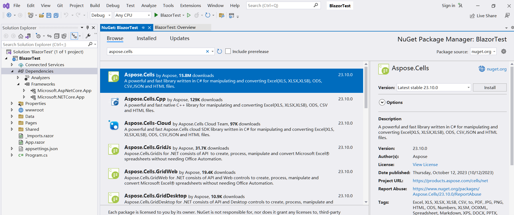

##  Översikt

 För att köra Aspose.Cells i Blazor behöver du .NET6 (eller senare) plattformar, jämför med tidigare plattformar (.netcore31 eller tidigare), en viktig skillnad handlar om grafikbiblioteket. I denna tjänsteman[Microsoft Dokument](https://learn.microsoft.com/en-gb/dotnet/core/compatibility/core-libraries/6.0/system-drawing-common-windows-only), förklarar det för .NET6 eller senare versioner att grafikbiblioteket "System.Drawing.Common" endast stöds på Windows, och ger rekommendationer för att ersätta grafikbiblioteket.

För produkten Apose.Cells har vi genomfört utvärderingen och har slutfört migreringen av grafikbiblioteket. Vi använder SkiaSharp istället för System.Drawing.Common i icke-Windows system, som föreslås i Microsoft:s officiella dokumentation. Observera att denna kritiska ändring kommer att träda i kraft Aspose.Cells 22.10.1 eller senare för .Net6.

##  Första Blazor-applikationen med Aspose.Cells

det här exemplet skapar du en enkel blazor-serverapplikation som lägger till en del data och grafik och renderar dem till bilder för att visas på webbsidan. Under processen att skapa projekt kan du konfigurera alternativ efter dina egna behov. Till exempel, när du markerar alternativet "Aktivera Docker" kan blazor-applikationen sedan byggas och köras i Docker.

###  Skapa den första Blazor-applikationen

Låt oss använda VS2022-verktyget som ett exempel för att skapa den första blazor-applikationen med Aspose.Cells, följ stegen nedan:
1. Välj Arkiv ->Nytt ->Projekt och filtrera med nyckelordet blazer för att välja motsvarande projektmall.
<br>

1. Ställ in projektnamnet till "BlazorTest" och välj sökvägen.
<br>

1. Konfigurera biblioteken och andra alternativ som används i projektet. Klicka slutligen på knappen "Skapa" för att skapa ditt första kavajprojekt.
<br>

1. När du har gått in i projektet, klicka på "Beroenden" under projektet och välj "Hantera NuGet-paket..." för att lägga till Aspose.Cells-biblioteket.
<br>

1. Ange nyckelord för filtrering och installera det senaste Aspose.Cells-biblioteket. Samtidigt beroende bibliotek som SkiaSharp kommer också att installeras tillsammans.
<br>

1. Dubbelklicka på filen "Index.razor" för att redigera och importera önskat bibliotek. Lägg till lite data och grafik och gör dem till grafik för visning.
<br>

1. Kompilera och kör projektet så får du följande resultat.
<br>


###  Exempelkod i First Blazor-applikationen

Följande exempelkod ingår i filen Index.razor:
```
@page "/"
@using SkiaSharp;
@using Aspose.Cells;
@using Aspose.Cells.Drawing;
@using Aspose.Cells.Rendering;


<PageTitle>Index</PageTitle>

<h1>Hello, world!</h1>

Welcome to your new app.

<SurveyPrompt Title="How is Blazor working for you?" />


@code
{
    private string imageSrc;

    public Index()
    {
        imageSrc = "data:image/png;base64, " + Convert.ToBase64String(CreateFile());
    }

    private byte[] CreateFile()
    {
        Workbook workbook = new Workbook();
        Worksheet sheet = workbook.Worksheets[0];
        sheet.Cells["A1"].Value = "test data for blazor";

        sheet.PageSetup.PrintGridlines = true;
        sheet.PageSetup.PrintArea = "A1:F20";

        ShapeCollection shapes = sheet.Shapes;

        //Add rectangle shape
        shapes.AddRectangle(1, 0, 1, 0, 100, 150);

        //Add line shape
        shapes.AddLine(8, 0, 1, 0, 100, 150);

        //Add oval shape
        shapes.AddOval(13, 0, 1, 0, 100, 150);

        using MemoryStream ms = new();

        SheetRender render = new SheetRender(sheet, new ImageOrPrintOptions());
        render.ToImage(0, ms);

        return ms.ToArray();
    }
}

```