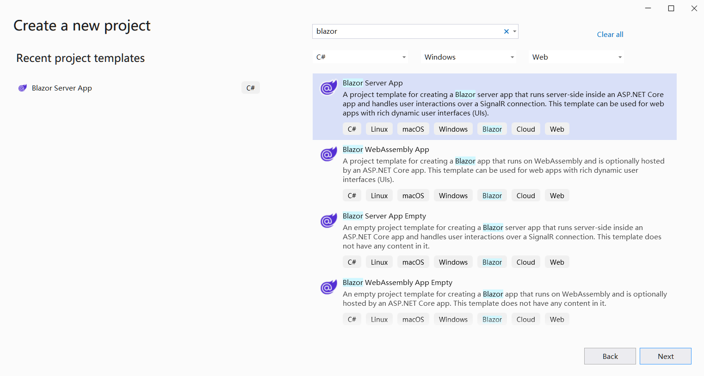

## Översikt

Blazor är ett webb-ramverk utvecklat av Microsoft som gör att utvecklare kan bygga interaktiva klientbaserade webbapplikationer med C# och .NET istället för JavaScript. Blazor finns i två primära värdmodeller: **Blazor WebAssembly** och **Blazor Server**. Du kan använda **Aspose.Cells for .NET** direkt i båda modellerna.

## Blazor WebAssembly-applikation med Aspose.Cells

Blazor WebAssembly körs klient-side i webbläsaren med hjälp av WebAssembly. Det tillåter utvecklare att köra .NET-applikationer direkt i webbläsaren utan att vara beroende av en server för rendering. Från **Aspose.Cells for .NET 25.1** kan Aspose.Cells användas direkt i Blazor WebAssembly-applikation. I detta exempel kommer du att skapa en enkel Blazor WebAssembly med Aspose.Cells, rendera en Excel-fil med text och former till en png-bild och visa bilden på en sida.

### Skapa en Blazor WebAssembly-applikation

Låt oss använda VS2022-verktyget som exempel för att skapa den första Blazor WebAssembly-appen med Aspose.Cells, följ stegen nedan:

1. Skapa ett nytt projekt med mallen **Blazor WebAssembly Standalone App**.

   

2. Välj må-framework, rekommenderat .NET 8.0 eller högre.

   

3. När projektet är skapat, lägg till Aspose.Cells-paketet till projektet. Eftersom Aspose.Cells refererar SkiaSharp, för att få SkiaSharp att fungera i WebAssembly, behövs paketet "SkiaSharp.Views.Blazor".

   ```
   <PackageReference Include="Aspose.Cells" Version="25.1.1" />
   <PackageReference Include="SkiaSharp.Views.Blazor" Version="3.116.1" />
   ```

   *Observera att versionen av det tillagda paketet "SkiaSharp.Views.Blazor" bör motsvara versionen av "SkiaSharp" som refereras av Aspose.Cells for .NET. Versionerna av Aspose.Cells for .NET och den motsvarande refererade "SkiaSharp"-versionen beskrivs som följer:*

   | Aspose.Cells for .NET |                SkiaSharp                |
   | :-------------------: | :-------------------------------------: |
   |       = 25.1.1        |                 3.116.1                 |
   |       >=25.1.2        | 2.88.9(net6.0, net8.0), 3.116.1(net9.0) |

4. Navigera till "Home.razor"-filen i "Pages"-mappen i projektet, skriv kod för att lägga till data och former och rendera till en bild för visning.

   

5. Högerklicka på projektet och välj "Publicera...", och publicera sedan projektet till mappen med eller utan AOT-alternativ.

   

6. Efter publicering kommer utdatafilerna att ligga i mappen `publish/wwwroot`. Dessa filer är statiska filer (HTML, JS, CSS osv.), så de kan hostas med:

   - **Lokal webbtjänst** (t.ex. `dotnet serve`, `nginx`, eller `Apache`).
   - **Molnhosting** (t.ex. Azure, AWS, Netlify, GitHub Pages).

   Låt oss ta `dotnet serve` som exempel:

   - Installera verktyget `dotnet-serve` (om det inte redan är installerat):

     ```bash
     dotnet tool install -g dotnet-serve
     ```

   - Navigera till den publicerade `wwwroot`-mappen.

   - Starta servern:

     ```bash
     dotnet serve
     ```

7. Öppna din webbläsare och besök den angivna adressen (t.ex. `http://localhost:1970`), utdata bilden kommer att visas på sidan.

   

### Exempel på kod i Blazor WebAssembly-applikation

Följande exempel på kod finns i filen Home.razor:

```cs
@page "/"
@using Aspose.Cells
@using Aspose.Cells.Drawing
@using Aspose.Cells.Rendering

<PageTitle>Home</PageTitle>

<h1>Aspose.Cells works in Blazor WebAssembly App</h1>

@if (imageSrc is not null)
{
    
}
else
{
    <p>Loading image...</p>
}

@code
{
    private string? imageSrc;

    protected override void OnInitialized()
    {
        imageSrc = "data:image/png;base64, " + Convert.ToBase64String(CreateFile());
    }

    private byte[] CreateFile()
    {
        Workbook workbook = new Workbook();
        Worksheet sheet = workbook.Worksheets[0];
        sheet.Cells["A1"].Value = "Aspose.Cells works in Blazor WebAssembly App!";

        sheet.PageSetup.PrintGridlines = true;
        sheet.PageSetup.PrintArea = "A1:F20";

        ShapeCollection shapes = sheet.Shapes;

        //Add rectangle shape
        shapes.AddRectangle(1, 0, 1, 0, 100, 150);

        //Add line shape
        shapes.AddLine(8, 0, 1, 0, 100, 150);

        //Add oval shape
        shapes.AddOval(13, 0, 1, 0, 100, 150);

        using MemoryStream ms = new();

        SheetRender render = new SheetRender(sheet, new ImageOrPrintOptions());
        render.ToImage(0, ms);

        return ms.ToArray();
    }
}
```

### Felavhjälpning

Currently(Jan 2025) there is a known issue of `dotnet` in the case that publishing a Blazor WebAssembly project which targets to net8.0 with .NET 9.0 SDK(.NET 9.0 SDK is installed and .NET 8.0 SDK is uninstalled if you upgraded Visual Studio to the version v17.12.x). For more info, check the link: <https://github.com/dotnet/runtime/issues/109951>.

```
System.PlatformNotSupportedException: PlatformNotSupported_HybridGlobalization, HashCode
   at System.Globalization.CompareInfo.GetHashCodeOfStringCore(ReadOnlySpan`1 , CompareOptions )
   at System.Globalization.CompareInfo.GetHashCode(ReadOnlySpan`1 , CompareOptions )
   at System.Globalization.CompareInfo.GetHashCode(String , CompareOptions )
   at System.CultureAwareComparer.GetHashCode(String )
   at System.StringComparer.GetHashCode(Object )
```

Om detta är fallet för dig, finns tre alternativ att välja mellan:

1. Installera om .NET 8.0 SDK (om det avinstallerades) och använd en "global.json"-fil på lösningsnivå (samma mapp som .sln-filen) för att specificera SDK-versionen. Här är ett exempel på "global.json"-filen:

   ```
   {
     "sdk": {
       "version": "8.0.300",
       "rollForward": "latestFeature"
     }
   }
   ```


2. Uppdatera projektfilen för att rikta in sig på net9.0.

3. Update Visual Studio to the version v17.12.4.(The issue <https://github.com/dotnet/runtime/issues/109951> is fixed.(updated on Jan 15, 2025))

## Blazor Server-applikation med Aspose.Cells

I detta exempel kommer du att skapa en enkel Blazor Server App som lägger till data och grafik, och renderar dem till bilder för att visas på webbsidan. Under projektets skapande kan du konfigurera alternativ efter eget behov. Till exempel, när du kryssar i "Enable Docker"-alternativet, kan applikationen byggas och köras i Docker..

### Skapa Blazor Server-applikation

Låt oss ta VS2022 som exempel för att skapa den första Blazor Server-appen med Aspose.Cells, följ stegen nedan:
1. Välj Fil ->Ny ->Projekt och filtrera med hjälp av nyckelordet blazer för att välja den motsvarande projektmallen.
<br>

1. Ange projektets namn till "BlazorTest" och välj sökvägen.
<br>

1. Konfigurera bibliotek och andra alternativ i projektet. Klicka sedan på "Skapa"-knappen för att generera ditt första blazer-projekt.
<br>

1. Efter att ha kommit in i projektet, klicka på "Beroenden" under projektet och välj "Hantera NuGet-paket..." för att lägga till Aspose.Cells-biblioteket.
<br>

1. Ange nyckelord för filtrering och installera det senaste Aspose.Cells-biblioteket. Samtidigt kommer beroende bibliotek som SkiaSharp också att installeras samtidigt.
<br>

1. Dubbelklicka på filen "Index.razor" för att redigera och importera det nödvändiga biblioteket. Lägg till lite data och grafik, och rendera dem till grafik för att visa.
<br>

1. Kompilera och kör projektet, och du kommer att få följande resultat.
<br>


### Exempelkod i Blazor Server-applikation

Följande exempelkod ingår i filen Index.razor:
```
@page "/"
@using SkiaSharp;
@using Aspose.Cells;
@using Aspose.Cells.Drawing;
@using Aspose.Cells.Rendering;


<PageTitle>Index</PageTitle>

<h1>Hello, world!</h1>

Welcome to your new app.

<SurveyPrompt Title="How is Blazor working for you?" />


@code
{
    private string imageSrc;

    public Index()
    {
        imageSrc = "data:image/png;base64, " + Convert.ToBase64String(CreateFile());
    }

    private byte[] CreateFile()
    {
        Workbook workbook = new Workbook();
        Worksheet sheet = workbook.Worksheets[0];
        sheet.Cells["A1"].Value = "test data for blazor";

        sheet.PageSetup.PrintGridlines = true;
        sheet.PageSetup.PrintArea = "A1:F20";

        ShapeCollection shapes = sheet.Shapes;

        //Add rectangle shape
        shapes.AddRectangle(1, 0, 1, 0, 100, 150);

        //Add line shape
        shapes.AddLine(8, 0, 1, 0, 100, 150);

        //Add oval shape
        shapes.AddOval(13, 0, 1, 0, 100, 150);

        using MemoryStream ms = new();

        SheetRender render = new SheetRender(sheet, new ImageOrPrintOptions());
        render.ToImage(0, ms);

        return ms.ToArray();
    }
}

```

